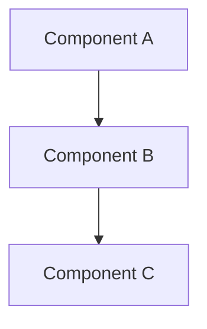

## System Context and Scope

## Component Responsibilities and Interfaces

## System Diagrams (Mermaid)

## Data and Control Flow

## Failure Modes and Mitigations

## Requirement Traceability

| requirement_id | design_element | notes |
| --- | --- | --- |

## References Consulted

- specs:
- adrs:
- workflows:

## ADR Links
