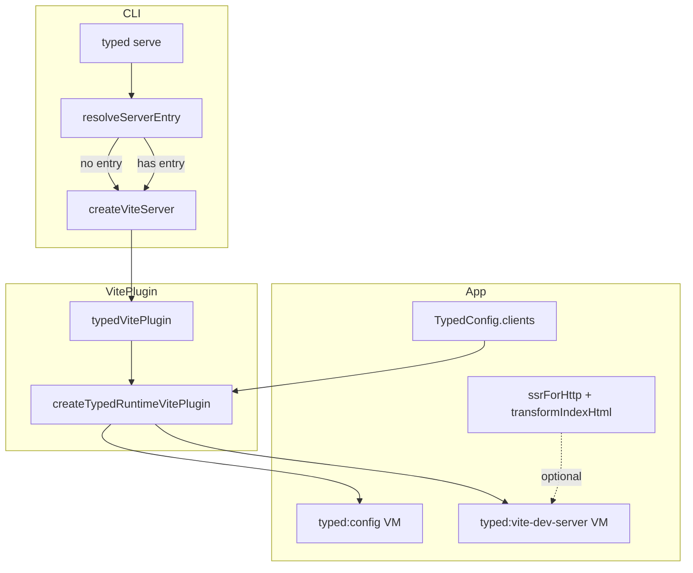

# Spec — CLI SPA + Vite Virtual Modules

## System Context and Scope

typed-smol CLI (`typed serve`) today requires a server entry. This spec adds SPA-only mode, configurable client directories (`clients`), runtime virtual modules (`typed:config`, `typed:vite-dev-server`), and moves/extends `ssrForHttp` into @typed/app with Vite `transformIndexHtml` integration.

**In scope**: packages/cli, packages/app, packages/vite-plugin, packages/ui
**Out of scope**: Build pipeline, preview server (can follow similar patterns later)

## Component Responsibilities and Interfaces

| Component | Responsibility |
| --------- | -------------- |
| **packages/cli** | Make server entry optional; when absent, start Vite SPA dev server only |
| **packages/app** | `TypedConfig.clients`; `createTypedRuntimeVitePlugin()` for `typed:config` + `typed:vite-dev-server`; `ssrForHttp` (moved from ui) with optional Vite integration |
| **packages/vite-plugin** | Register `createTypedRuntimeVitePlugin()` from @typed/app; wire `clients` into Vite config |
| **packages/ui** | Re-export `ssrForHttp` from @typed/app; keep `Link` |

## System Diagrams (Mermaid)

## Data and Control Flow

1. **SPA serve**: `typed serve` → `resolveServerEntry` returns `Option.none()` → `createViteServer` → `server.listen()` → no `ssrLoadModule`.
2. **Server serve**: `typed serve` → `resolveServerEntry` returns `Option.some(path)` → `createViteServer` → `server.listen()` → `ssrLoadModule(entry)`.
3. **typed:config**: Plugin stores config at `configResolved`; `load("typed:config")` returns `export default ${JSON.stringify(config)}`.
4. **typed:vite-dev-server**: Plugin stores `ViteDevServer` in `configureServer`; `load("typed:vite-dev-server")` returns getter that returns the stored reference (or `undefined`).
5. **ssrForHttp + Vite**: When caller provides `ViteDevServer`, after `renderToHtmlString` the handler calls `vite.transformIndexHtml(url, html)` before returning the response.

## Failure Modes and Mitigations

| Failure | Mitigation |
| ------- | ---------- |
| No index.html in clients dirs | Vite will fail at startup; document clients config in README |
| typed:config used before config loaded | Plugin loads at configResolved; always available when modules resolve |
| typed:vite-dev-server in production | Export undefined; callers must guard |

## Requirement Traceability

| requirement_id | design_element |
| -------------- | -------------- |
| FR-1 | CLI: resolveServerEntry returns Option; serve skips ssrLoadModule when none |
| FR-2 | TypedConfig.clients; resolveViteInlineConfig / plugin |
| FR-3 | createTypedRuntimeVitePlugin — typed:config |
| FR-4 | createTypedRuntimeVitePlugin — typed:vite-dev-server |
| FR-5 | ssrForHttp in app, optional transformIndexHtml integration |
| FR-6 | Plugin in app; vite-plugin imports and registers |
| FR-7 | ui re-exports ssrForHttp from app |

## References Consulted

- specs: (none)
- adrs: (none)
- workflows: 20260226-1400-cli-spa-vite-virtual-modules

## ADR Links

- (To be created if needed: clients config shape, virtual module naming)
