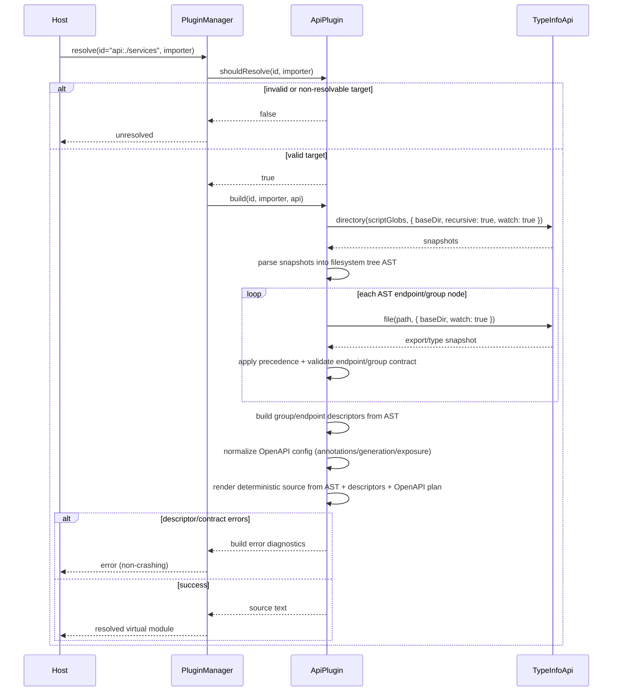

## System Context and Scope

This spec defines a synchronous companion virtual-module plugin that resolves `api:./<directory>` imports into generated `HttpApi` assembly and `HttpApiBuilder` wiring modules.

In scope:

- `api:` ID parsing and deterministic target-directory resolution.
- Filesystem convention discovery for API root, groups, endpoints, and companions.
- Directory-to-group mapping with support for parenthesized pathless directories.
- Structural contract validation via `TypeInfoApi` assignability targets.
- Deterministic source generation for API assembly + builder layer wiring.
- OpenAPI control conventions for generated specification metadata and exposure behavior.
- Router-style precedence model (in-file > sibling companion > directory-level companion).
- A mandatory two-phase compile pipeline: filesystem parsing to tree AST, then AST rendering to TypeScript source.
- Integration into `@typed/vite-plugin` as a first-class virtual-module companion to the router plugin.

Out of scope:

- Async plugin hooks.
- Runtime reflection-only construction that bypasses generated source.
- Full server runtime behavior (this spec only covers virtual module generation and type-safe assembly contracts).

## Supported Filesystem Structure (Concrete)

### Directory semantics

| pattern            | meaning                           | creates named `HttpApiGroup`                       | contributes inherited defaults |
| ------------------ | --------------------------------- | -------------------------------------------------- | ------------------------------ |
| `users/`           | normal API directory              | yes (`users` by default, override via `_group.ts`) | yes                            |
| `(internal)/`      | pathless organizational directory | no                                                 | yes                            |
| nested directories | hierarchical grouping             | yes unless parenthesized                           | yes                            |

### Supported file-role matrix

| pattern                      | role                    | required exports             | optional exports                                                                                  | behavior                                                               |
| ---------------------------- | ----------------------- | ---------------------------- | ------------------------------------------------------------------------------------------------- | ---------------------------------------------------------------------- |
| `_api.ts`                    | API root override       | none                         | `name`, `prefix`, `dependencies`, `middlewares`, `openapi`                                        | controls top-level API defaults and metadata                           |
| `_group.ts`                  | group override          | none                         | `name`, `prefix`, `dependencies`, `middlewares`, `openapi`                                        | controls current directory group defaults/metadata                     |
| `<endpoint>.ts`              | endpoint primary module | `route`, `method`, `handler` | `name`, `headers`, `body`, `error`, `success`, `dependencies`, `middlewares`, `prefix`, `openapi` | defines one endpoint contract and handler (direct or via typed helper) |
| `<endpoint>.name.ts`         | endpoint companion      | `default` (string)           | none                                                                                              | overrides endpoint name (otherwise filename slug)                      |
| `<endpoint>.dependencies.ts` | endpoint companion      | `default`                    | none                                                                                              | endpoint-level dependency additions/override                           |
| `<endpoint>.middlewares.ts`  | endpoint companion      | `default`                    | none                                                                                              | endpoint-level middleware additions/override                           |
| `<endpoint>.prefix.ts`       | endpoint companion      | `default` (string)           | none                                                                                              | endpoint path prefix override                                          |
| `<endpoint>.openapi.ts`      | endpoint companion      | `default`                    | none                                                                                              | endpoint OpenAPI metadata override                                     |
| `_dependencies.ts`           | directory companion     | `default`                    | none                                                                                              | inherited dependencies (ancestor -> leaf composition)                  |
| `_middlewares.ts`            | directory companion     | `default`                    | none                                                                                              | inherited middlewares (ancestor -> leaf composition)                   |
| `_prefix.ts`                 | directory companion     | `default` (string)           | none                                                                                              | inherited prefix composition                                           |
| `_openapi.ts`                | directory companion     | `default`                    | none                                                                                              | inherited OpenAPI metadata defaults                                    |

### Endpoint contract (primary file)

- `route` is required and must include `path`, `pathSchema`, and `querySchema` (all three required).
- `method` is required and must be a supported HTTP method literal.
- `handler` is required and receives `{ path, query, headers, body }` with type-safe decoded values.
- Optional `headers`, `body`, `error`, `success` mirror decoders/encoders used by `HttpServerRequest` and `HttpServerResponse`:
  - `headers` / `body` decode request inputs.
  - `error` / `success` encode response body payloads with structural type checking and coercion into `HttpServerResponse` (status + body); use `HttpApiSchema.status(code)` to annotate status codes.
  - **Required**: Structural type checking that handler return type is assignable to success schema and handler error type to error schema.
  - **Required**: All handler returns are coerced/encoded via success/error schemas into proper `HttpServerResponse` values (body + status code).
- Optional `name`, `dependencies`, `middlewares`, `prefix`, `openapi` may be provided in-file and override companions by precedence.

### Typed handler helper (concrete API)

- Provide a helper (working name: `defineApiHandler`) with curried shape:

```ts
export const handler = defineApiHandler(route, method, { headers?, body?, success?, error? })(
  ({ path, query, headers, body }) => Effect.succeed(...),
)
```

- Minimum helper guarantees:
  - infers `path` and `query` from `route.pathSchema` and `route.querySchema`.
  - infers `headers` and `body` from optional schema exports.
  - enforces handler output/error compatibility with `success` / `error` schemas at compile time.
- Handler receives decoded `{ path, query, headers, body }`; `error` / `success` schemas encode response payloads with annotated status codes via `HttpApiSchema.status(code)`.
- Generated endpoint contracts may use either:
  - direct `handler` function export, or
  - `handler` created via `defineApiHandler(...)`.

### OpenAPI configuration surface (Effect-backed)

The plugin only supports OpenAPI options that are present in the current Effect APIs in this repo (`effect@4.0.0-beta.4`), mapped as follows.

#### 1) Annotation controls (`OpenApi.annotations`)

Supported keys:

- `identifier`
- `title`
- `version`
- `description`
- `license`
- `summary`
- `deprecated`
- `externalDocs`
- `servers`
- `format`
- `override`
- `exclude`
- `transform`

Scope behavior:

- API scope (`_api.ts` / root in-file) maps to `HttpApi.annotate(...)`.
- Group scope (`_group.ts` / group in-file) maps to `HttpApiGroup.annotate(...)`.
- Endpoint scope (`<endpoint>.ts` / endpoint companions) maps to `HttpApiEndpoint.annotate(...)`.

#### 2) Spec generation controls (`OpenApi.fromApi`)

Supported keys:

- `additionalProperties?: boolean | JsonSchema.JsonSchema`

Scope behavior:

- Supported at API/root scope only.
- Group/endpoint usage is a typed diagnostic.

#### 3) Spec exposure controls (router routes)

Supported keys and mappings:

- `jsonPath?: \`/${string}\` | false`
  - maps to behavior equivalent to `HttpApiBuilder.layer(api, { openapiPath })`.
- `swaggerPath?: \`/${string}\` | false`
  - maps to behavior equivalent to `HttpApiSwagger.layer(api, { path })`.
- `scalar?: { path?: \`/${string}\`; source?: "inline" | "cdn"; version?: string; config?: HttpApiScalar.ScalarConfig } | false`
  - maps to behavior equivalent to:
    - `HttpApiScalar.layer(api, { path, scalar: config })` when `source` is `inline` or omitted,
    - `HttpApiScalar.layerCdn(api, { path, scalar: config, version })` when `source` is `cdn`.

Validation behavior:

- Invalid path shapes or invalid scope placement are typed diagnostics.
- Conflicting exposure routes (same path with different modes) are deterministic diagnostics.

### Precedence and composition rules

1. in-file endpoint exports (`<endpoint>.ts`) have highest precedence.
2. sibling endpoint companions (`<endpoint>.*.ts`) are next.
3. directory companions (`_*.ts`) are lowest and compose ancestor -> leaf.
4. unsupported reserved companion names are diagnostics (not ignored silently).

### Concrete example

```text
src/apis/
  _api.ts
  _openapi.ts
  users/
    _group.ts
    _middlewares.ts
    list.ts
    list.openapi.ts
    by-id.ts
  (internal)/
    audits/
      _prefix.ts
      list.ts
```

- Named groups: `users`, `audits` (not `internal`).
- `users/list.ts` gets precedence chain: in-file -> `list.openapi.ts` -> `users/_openapi.ts` -> `src/apis/_openapi.ts`.
- `audits/list.ts` inherits `(internal)` defaults without creating an `internal` group in the API surface.

## Component Responsibilities and Interfaces

### 1) Api Virtual Module Plugin

- Proposed factory: `createHttpApiVirtualModulePlugin(options?)`.
- Implements `VirtualModulePlugin` with:
  - `shouldResolve(id, importer)` -> boolean.
  - `build(id, importer, api)` -> source string or structured build error.
- Owns top-level orchestration and non-crashing error/result behavior.

### 2) Api Target Resolver

- Parses `api:<relativeDirectory>` IDs.
- Normalizes `api:foo` -> `api:./foo`.
- Validates path segments and under-base constraints using same resolver model as router plugin.
- Rejects escape paths deterministically.

### 3) Candidate Discovery and Role Classifier

- Uses `TypeInfoApi.directory()` with recursive script globs and watch descriptors.
- Classifies files into roles:
  - API root override (`_api.ts`) (optional),
  - group override (`_group.ts`) (optional),
  - endpoint leaf modules (regular script files not matching companion patterns),
  - sibling companions (`<endpoint>.name.ts`, `.dependencies.ts`, `.middlewares.ts`, `.prefix.ts`, `.openapi.ts`),
  - directory companions (`_dependencies.ts`, `_middlewares.ts`, `_prefix.ts`, `_openapi.ts`).
- Applies deterministic stable ordering by normalized relative path.

### 4) Filesystem Tree AST Parser

- Converts discovered role-classified artifacts into a deterministic tree AST:
  - `ApiRootNode`,
  - `GroupNode`,
  - `PathlessDirectoryNode`,
  - `EndpointNode`,
  - `ConventionNode` (in-file/sibling/directory).
- Preserves lexical and hierarchical ordering as explicit node metadata.
- AST is the canonical handoff into precedence resolution, validation, and rendering.

### 5) Convention Resolver and Precedence Engine

- Applies router-style precedence:
  1. in-file exports,
  2. sibling companions,
  3. directory companions (ancestor-to-leaf).
- Operates on AST nodes (not raw file list traversal) to keep parse and resolve phases separated.
- Supports endpoint defaults/overrides:
  - name (default filename slug),
  - dependencies,
  - middlewares,
  - prefixes,
  - OpenAPI metadata.
- Supports group defaults/overrides through `_group.ts`.

### 6) Directory-to-Group Planner

- Converts directory hierarchy into `HttpApiGroup` hierarchy.
- Parenthesized pathless directories (for example `(admin-internal)`) are structural only:
  - do not create visible group names,
  - still contribute inherited companion/default layers.
- Produces deterministic `GroupDescriptor[]` and `EndpointDescriptor[]`.

### 7) Endpoint Contract Validator

- Validates required endpoint contract fields:
  - route (path + pathSchema + querySchema),
  - HTTP method,
  - handler implementation.
- Optional exports `headers`, `body`, `error`, `success` mirror HttpApiEndpoint options and HttpServerRequest decoders.
- **Structural type checking** (when typeTargets available): handler return type assignable to success schema; handler error type assignable to error schema. Produces diagnostics (e.g. AVM-TC-001) on mismatch.
- **Response coercion**: handler returns are encoded via success/error schemas into `HttpServerResponse` (Effect HttpApi layer handles encoding when success/error are passed to HttpApiEndpoint).
- Enforces deterministic collision diagnostics for duplicate endpoint IDs or incompatible method/path mappings.

### 8) Type Target Resolver (`resolveHttpApiTypeTargets`)

- Program-scans imports to resolve structural targets for assignability checks.
- Initial target set includes (minimum):
  - `HttpApi`,
  - `HttpApiGroup`,
  - `HttpApiEndpoint`,
  - `HttpApiBuilder.Handlers`.
- Passes targets into `createTypeInfoApiSession({ typeTargets })`.

### 9) Source Generator

- Consumes normalized AST + resolved descriptors as canonical input.
- Emits generated module with:
  - assembled API definition (`api` export),
  - builder wiring exports (group layers and combined layer),
  - optional OpenAPI configuration exports.
- Guarantees deterministic import order, descriptor order, and generation output for stable snapshots.

### 10) Diagnostic Catalog

- Centralized diagnostic IDs/messages for:
  - ID parsing/path resolution issues,
  - missing/invalid required exports,
  - precedence conflicts,
  - group/endpoint ambiguity,
  - unsupported convention placements,
  - structural type-assignability failures.

### 11) Vite Plugin Integration Surface

- `@typed/vite-plugin` exposes explicit HttpApi VM options (for example `apiVmOptions`) alongside `routerVmOptions`.
- `typedVitePlugin` registers both VM plugins in deterministic order within shared `PluginManager`.
- Integration keeps a single `virtualModulesVitePlugin` resolver path and shared `createTypeInfoApiSession`.
- Supports combined router + api virtual-module usage in the same Vite project.

### 12) Typed Handler Helper Surface

- Provide a helper runtime export (working name: `defineApiHandler`) from the HttpApi plugin package surface.
- Helper contract is curried: `(route, method, schemas?) -> (handler) -> typed handler`, where `schemas` is `{ headers?, body?, success?, error? }`.
- Context: handler receives `{ path, query, headers, body }` with type-safe decoding from route/headers/body schemas.
- Response: `error` / `success` schemas encode body payloads into `HttpServerResponse`; use `HttpApiSchema.status(code)` to annotate status codes.
- **Structural type checking**: handler return must be assignable to success schema Type; handler error must be assignable to error schema Type. Reject mismatches at compile time (helper) and via plugin diagnostics (endpoint modules).

### 13) OpenAPI Config Mapper and Exposure Planner

- Normalizes OpenAPI config from in-file/sibling/directory layers into explicit scopes:
  - annotations,
  - generation options,
  - exposure options.
- Enforces scope rules:
  - annotations allowed at API/group/endpoint,
  - generation (`additionalProperties`) allowed at API scope only,
  - exposure routes allowed at API scope only.
- Maps normalized config to Effect-backed runtime surfaces:
  - `OpenApi.annotations`,
  - `OpenApi.fromApi(..., { additionalProperties })`,
  - `HttpApiBuilder.layer({ openapiPath })`,
  - `HttpApiSwagger.layer({ path })`,
  - `HttpApiScalar.layer/layerCdn(...)`.

## System Diagrams (Mermaid)

```mermaid
flowchart LR
  Host[TS Host Adapter] --> PM[PluginManager first-match]
  PM --> AP[HttpApi Virtual Module Plugin]

  AP --> TR[Api Target Resolver]
  AP --> CD[Candidate Discovery]
  AP --> AST[Filesystem Tree AST Parser]
  AP --> CR[Convention Resolver]
  AP --> OA[OpenAPI Config Mapper]
  AP --> GP[Group Planner]
  AP --> EV[Endpoint Validator]
  AP --> SG[Source Generator]
  AP --> DG[Diagnostic Catalog]
  VP[@typed/vite-plugin Integration] --> PM

  CD --> TIA[TypeInfoApi file/directory]
  AST --> CR
  CR --> OA
  OA --> SG
  EV --> TIA
  CR --> TIA

  TIA --> TT[resolveHttpApiTypeTargets]

  SG --> OUT[Generated module exports]
  DG --> ERR[Structured diagnostics]
```



## Data and Control Flow

1. Host requests resolution of `api:<directory>` import.
2. Plugin parses and resolves target directory under importer base.
3. Candidate files are discovered with recursive script globs.
4. Discovery output is parsed into deterministic filesystem tree AST nodes.
5. Convention resolver applies precedence for each endpoint/group concern using AST context.
6. Group planner maps directories to named groups, skipping parenthesized pathless directories.
7. Endpoint validator enforces required contract and `Schema.TaggedRequest` schema conventions.
8. OpenAPI config mapper normalizes annotation/generation/exposure options with scope checks.
9. Structural assignability checks run against `typeTargets`-backed `assignableTo`.
10. Source generator renders deterministic API + builder wiring exports from AST + descriptors + OpenAPI plan.
11. Vite integration uses shared manager wiring so `api:` and `router:` virtual modules resolve together.
12. Plugin returns source or structured diagnostics; host remains non-crashing.

## Failure Modes and Mitigations

- Invalid `api:` ID or escaped path:
  - Mitigation: deterministic path diagnostic and unresolved/error result.
- No valid API/endpoint contracts discovered:
  - Mitigation: explicit "no valid API descriptors" diagnostic.
- Missing required endpoint contract exports:
  - Mitigation: per-file contract diagnostics with rule IDs.
- Invalid schema exports (e.g. non-Schema values for headers/body/error/success):
  - Mitigation: optional schema validation; malformed exports surface at runtime.
- Duplicate endpoint name or method/path ambiguity:
  - Mitigation: deterministic ambiguity diagnostics and file conflict references.
- Precedence conflicts across in-file/sibling/directory conventions:
  - Mitigation: explicit precedence conflict diagnostics; generated output uses canonical precedence order only when non-conflicting.
- Missing type targets for structural checks:
  - Mitigation: explicit degraded-validation diagnostics with recommendation to enable target resolution.
- OpenAPI metadata collisions:
  - Mitigation: deterministic merge rules + collision diagnostics where overrides conflict.
- Unsupported OpenAPI annotation key or invalid annotation shape:
  - Mitigation: strict OpenAPI key whitelist and type validation mapped to Effect `OpenApi.annotations`.
- OpenAPI generation option used at invalid scope (for example endpoint-level `additionalProperties`):
  - Mitigation: scope-aware diagnostics with allowed-scope hint in error text.
- OpenAPI exposure route conflicts (`jsonPath`/`swaggerPath`/`scalar.path` overlap):
  - Mitigation: deterministic route-conflict diagnostics and no-source emission on collision.
- AST parse inconsistency (same input snapshot yielding divergent tree):
  - Mitigation: canonical AST node ordering + snapshot-based parser tests.
- Vite integration option mismatch or plugin-order drift:
  - Mitigation: explicit `typedVitePlugin` option contract and integration tests asserting registration order and resolvability.
- Unsupported reserved companion names:
  - Mitigation: explicit diagnostics for unknown reserved filename patterns (no silent ignore).
- Handler helper loses type precision (`any` leakage) or allows incompatible shapes:
  - Mitigation: compile-time helper contract tests (positive + negative) for context inference and return/error compatibility.

## Requirement Traceability

| requirement_id | design_element                                                 | notes                                                                                             |
| -------------- | -------------------------------------------------------------- | ------------------------------------------------------------------------------------------------- |
| FR-1           | Api Target Resolver                                            | `api:` parsing and importer-relative path resolution.                                             |
| FR-2           | Candidate Discovery and Role Classifier                        | Script file discovery and deterministic filtering.                                                |
| FR-3           | Convention Resolver                                            | Optional `_api.ts` root override handling.                                                        |
| FR-4           | Directory-to-Group Planner                                     | Default named group mapping + pathless parenthesized dirs.                                        |
| FR-5           | Convention Resolver / Group Planner                            | `_group.ts` overrides for group metadata and concerns.                                            |
| FR-6           | Endpoint Contract Validator                                    | Required endpoint contract fields and checks.                                                     |
| FR-7           | Endpoint Contract Validator                                    | Optional headers/body/error/success schema exports.                                               |
| FR-8           | Convention Resolver                                            | Endpoint name default + override behavior.                                                        |
| FR-9           | Group Planner + Convention Resolver                            | Group-level `HttpApiGroup` capability mapping.                                                    |
| FR-10          | Convention Resolver + Source Generator                         | Handler wiring conventions (`handle`, `handleRaw`).                                               |
| FR-11          | Convention Resolver                                            | In-file > sibling > directory precedence and ancestor-to-leaf composition.                        |
| FR-12          | Convention Resolver / Source Generator                         | Security/middleware helper compatibility surfaces.                                                |
| FR-13          | OpenAPI Config Mapper and Exposure Planner                     | Effect-backed annotation controls through conventions/options.                                    |
| FR-14          | Source Generator                                               | Export assembled API and builder wiring artifacts.                                                |
| FR-15          | Type Target Resolver + Endpoint Validator                      | Structural assignability checks via `TypeInfoApi` targets.                                        |
| FR-16          | Diagnostic Catalog                                             | Stable diagnostic IDs/messages for contract and convention failures.                              |
| FR-17          | Candidate Discovery / Endpoint Validator                       | Watch descriptor registration for invalidation/rebuild.                                           |
| FR-18          | Api Virtual Module Plugin                                      | Explicit unresolved/error outcomes without crashes.                                               |
| FR-19          | Api Virtual Module Plugin                                      | Optional emitted-source type-check mode parity.                                                   |
| FR-20          | Filesystem Tree AST Parser                                     | Mandatory parse-to-AST boundary before rendering.                                                 |
| FR-21          | Source Generator                                               | Rendering consumes AST as canonical input.                                                        |
| FR-22          | Vite Plugin Integration Surface                                | First-class `@typed/vite-plugin` integration and option wiring.                                   |
| FR-23          | Candidate Discovery + Convention Resolver + Diagnostic Catalog | Explicit supported file-role matrix and diagnostics for unsupported reserved companion names.     |
| FR-24          | Typed Handler Helper Surface + Endpoint Contract Validator     | Curried helper contract with compile-time inference for handler context and schema compatibility. |
| FR-25          | OpenAPI Config Mapper and Exposure Planner                     | Effect-backed OpenAPI option matrix for annotations/generation/exposure.                          |
| NFR-1          | all components                                                 | End-to-end synchronous execution path.                                                            |
| NFR-2          | Discovery + Resolver + Generator                               | Deterministic ordering and generated output stability.                                            |
| NFR-3          | Plugin + Diagnostic Catalog                                    | Non-crashing structured error behavior.                                                           |
| NFR-4          | Target Resolver + ordering                                     | Cross-platform path normalization.                                                                |
| NFR-5          | Plugin integration boundary                                    | First-match manager compatibility.                                                                |
| NFR-6          | Type Target Resolver + Validator                               | Auditable structural validation behavior/fallback policy.                                         |
| NFR-7          | Convention Resolver                                            | Single-source convention routing and collision enforcement.                                       |
| NFR-8          | Source Generator                                               | Unstable API isolation via generated adapter surface.                                             |
| NFR-9          | Conventions + diagnostics                                      | Convenience without reducing type safety.                                                         |
| NFR-10         | AST Parser + Source Generator                                  | Explicit, testable separation between parse and render phases.                                    |

## References Consulted

- specs:
  - `.docs/specs/virtual-modules/spec.md`
  - `.docs/specs/router-virtual-module-plugin/spec.md`
  - `.docs/specs/httpapi-virtual-module-plugin/requirements.md`
- adrs:
  - `.docs/adrs/20260220-2245-virtual-modules-sync-core-and-loaders.md`
  - `.docs/adrs/20260221-1745-router-virtual-module-discovery-and-composition-contract.md`
- workflows:
  - `.docs/workflows/20260223-0043-httpapi-virtual-module-design/01-brainstorming.md`
  - `.docs/workflows/20260223-0043-httpapi-virtual-module-design/02-research.md`
- code:
  - `packages/vite-plugin/src/index.ts`
  - `packages/app/src/RouterVirtualModulePlugin.ts`
  - `node_modules/.pnpm/effect@4.0.0-beta.4/node_modules/effect/src/unstable/httpapi/OpenApi.ts`
  - `node_modules/.pnpm/effect@4.0.0-beta.4/node_modules/effect/src/unstable/httpapi/HttpApiBuilder.ts`
  - `node_modules/.pnpm/effect@4.0.0-beta.4/node_modules/effect/src/unstable/httpapi/HttpApiSwagger.ts`
  - `node_modules/.pnpm/effect@4.0.0-beta.4/node_modules/effect/src/unstable/httpapi/HttpApiScalar.ts`

## ADR Links

- `.docs/adrs/20260220-2245-virtual-modules-sync-core-and-loaders.md`
- `.docs/adrs/20260221-1745-router-virtual-module-discovery-and-composition-contract.md`
- `.docs/adrs/20260223-0043-httpapi-virtual-module-filesystem-contract.md`
