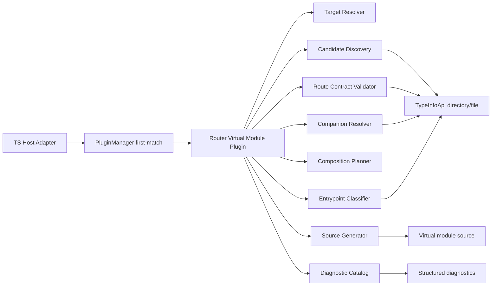
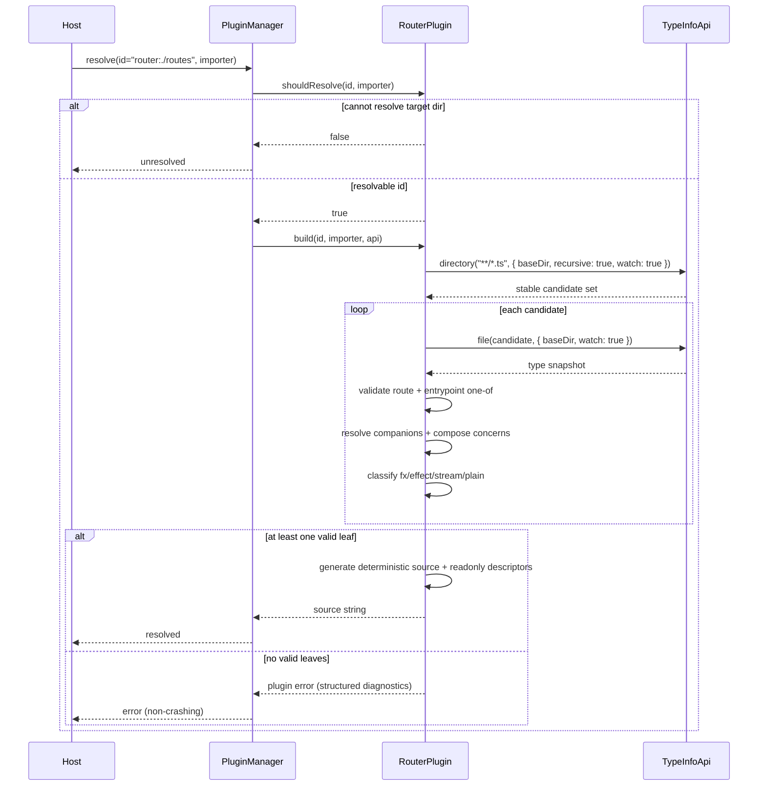

## System Context and Scope

This spec defines a synchronous `@typed/virtual-modules` plugin that resolves `router:./<directory>` imports into generated route-assembly modules for `@typed/router`.

In scope:

- Resolve `router:./<directory>` relative to importer path.
- Discover route candidates from regular `*.ts` files (no `*.route.ts` convention).
- Validate route modules with `TypeInfoApi`:
  - `route` must be compatible with `Route.Any`,
  - exactly one of `handler`, `template`, `default`.
- Support hierarchical optional concerns via companion files:
  - sibling: `*.guard.ts`, `*.dependencies.ts`, `*.layout.ts`, `*.catch.ts`,
  - directory-level: `_guard.ts`, `_dependencies.ts`, `_layout.ts`, `_catch.ts`.
- Classify entrypoints as `fx | effect | stream | plain` and generate optimized code that pre-lifts plain values into `Fx`.
- Preserve deterministic composition aligned with `Matcher`: ancestor->leaf guard/dependencies/layout/catch behavior.
- Emit structured diagnostics and deterministic output ordering.

Out of scope:

- Async plugin hooks or async type inspection.
- Runtime-only classification/wrapping logic replacing generation-time normalization.
- Non-TypeScript host environments.

## Component Responsibilities and Interfaces

### 1) Router Virtual Module Plugin

- `name`: stable plugin identifier.
- `shouldResolve(id, importer)`:
  - returns `true` for `router:` IDs with valid relative directory syntax.
  - may return `false` (unresolved) when target directory cannot be resolved from importer context.
- `build(id, importer, api)`:
  - synchronous discovery, validation, classification, composition, and source generation.

### 2) Target Resolver

- Parses `router:<directory>` or `router:./<directory>` IDs (`./` prefix optional).
- Resolves and normalizes absolute target directory using importer as base.
- Enforces path normalization and under-base checks.

### 3) Candidate Discovery

- Queries `TypeInfoApi.directory("**/*.ts", { baseDir, recursive: true, watch: true })`.
- Filters out companion-only files from leaf candidacy:
  - `*.guard.ts`, `*.dependencies.ts`, `*.layout.ts`, `*.catch.ts`,
  - `_guard.ts`, `_dependencies.ts`, `_layout.ts`, `_catch.ts`.
- Produces stable-sorted candidate file list.

### 4) Route Contract Validator

- For each candidate file, queries `TypeInfoApi.file(...)`.
- Validates:
  - `route` export exists and is assignable to `Route.Any`.
  - exactly one of `handler`, `template`, `default` is present.
- Emits typed diagnostics for violations.

### 5) Companion Resolver

- Resolves companion modules for each valid leaf:
  - sibling concerns by basename,
  - directory concerns from root ancestor to leaf directory.
- Validates each companion export shape.

### 6) Composition Planner

- Computes effective concern stacks per leaf route:
  - `guard`: logical AND in ancestor->leaf order.
  - `dependencies`: ancestor->leaf concatenation.
  - `layout`: ancestor outermost, leaf innermost.
  - `catch`: ancestor outermost, leaf innermost.

### 7) Entrypoint Classifier

- Classifies selected entrypoint as one of:
  - `fx`,
  - `effect`,
  - `stream`,
  - `plain`.
- Classification is deterministic from TypeInfo snapshots and rule precedence.

### 8) Source Generator

- Emits deterministic route-assembly source equivalent to `Matcher.match(...)` construction.
- Pre-lifts plain values to `Fx` in generated code (compile-time optimization).
- Emits readonly descriptor metadata compatible with `as const` inference.

### 9) Diagnostic Catalog

- Centralizes rule IDs, messages, and file context for:
  - route contract errors,
  - one-of entrypoint violations,
  - companion shape errors,
  - ambiguous route definitions,
  - unclassifiable entrypoint kinds.

## System Diagrams (Mermaid)

## Data and Control Flow

1. Host calls plugin manager with `(id, importer)`.
2. Plugin `shouldResolve` gates on `router:` syntax and target path resolvability.
3. `build` discovers regular `*.ts` candidates via `TypeInfoApi.directory`.
4. Candidates are validated by `TypeInfoApi.file` contract checks.
5. Companion concerns are resolved (sibling + directory hierarchy) and validated.
6. Concerns are composed in ancestor->leaf order with `Matcher`-compatible semantics.
7. Entrypoints are classified (`fx/effect/stream/plain`).
8. Source is generated with deterministic ordering and plain-value pre-lifting.
9. Plugin manager returns `resolved`, `unresolved`, or `error` outcomes to host.

## Failure Modes and Mitigations

- Invalid `router:` ID syntax:
  - Mitigation: unresolved with deterministic parser behavior.
- Target directory cannot be resolved:
  - Mitigation: unresolved in `shouldResolve`.
- Missing/incompatible `route` export:
  - Mitigation: structured diagnostic with file path + rule ID.
- Invalid entrypoint one-of contract:
  - Mitigation: structured diagnostic and file-level rejection.
- Invalid companion export shapes:
  - Mitigation: companion rule diagnostics.
- Ambiguous route definitions:
  - Mitigation: deterministic ambiguity detection + explicit diagnostic.
- Unclassifiable entrypoint kind:
  - Mitigation: classification error diagnostic (no host crash).
- Non-deterministic output drift:
  - Mitigation: stable sort keys + golden-source tests.

## Requirement Traceability

| requirement_id | design_element | notes |
| -------------- | -------------- | ----- |
| FR-1 | Router Virtual Module Plugin, Target Resolver | `router:./<directory>` resolution through synchronous plugin contract |
| FR-2 | Candidate Discovery, Route Contract Validator | regular `*.ts` discovery + type-driven leaf validation |
| FR-3 | Route Contract Validator | one-of `handler/template/default` enforcement |
| FR-4 | Companion Resolver | sibling companion support |
| FR-5 | Companion Resolver | directory companion support |
| FR-6 | Composition Planner | ancestor->leaf composition policy |
| FR-7 | Entrypoint Classifier, Source Generator | normalize `template/default` into canonical handler path |
| FR-8 | Composition Planner, Source Generator | `Matcher.match(...)`-equivalent behavior |
| FR-9 | Diagnostic Catalog | typed diagnostics for contract violations |
| FR-10 | Source Generator | readonly descriptor metadata (`as const`) |
| FR-11 | Target Resolver, Candidate Discovery, Source Generator | deterministic path/order behavior |
| FR-12 | Router Virtual Module Plugin, Target Resolver | explicit unresolved policy for non-resolvable target |
| FR-13 | Entrypoint Classifier | TypeInfo-driven runtime-kind classification |
| FR-14 | Source Generator | generation-time lifting of plain values into `Fx` |
| NFR-1 | all components | fully synchronous pipeline |
| NFR-2 | Candidate Discovery, Composition Planner, Source Generator | deterministic behavior per filesystem snapshot |
| NFR-3 | Diagnostic Catalog | explicit, non-crashing error outcomes |
| NFR-4 | Source Generator | stable output for incremental workflows |
| NFR-5 | Target Resolver, Candidate Discovery | cross-platform path normalization |
| NFR-6 | Router Virtual Module Plugin | first-match manager compatibility |
| NFR-7 | Candidate Discovery, Route Contract Validator | per-build query reuse/memoization |
| NFR-8 | Companion Resolver, Diagnostic Catalog | canonical naming and ambiguity prevention |
| NFR-9 | Route Contract Validator, Entrypoint Classifier | deterministic TypeInfo validation/classification errors |

## Testing Strategy

### Test Type Taxonomy

- unit:
  - target parsing/path normalization,
  - leaf and companion validation,
  - entrypoint classification,
  - generation/lifting behavior.
- integration:
  - manager outcome behavior (`resolved|unresolved|error`),
  - TypeInfoApi-driven discovery and validation.
- golden:
  - deterministic source ordering/stability snapshots.
- e2e:
  - nested route fixture with hierarchical companions and mixed entrypoint kinds.

### Critical Path Scenarios

| ts_id | scenario | maps_to_fr_nfr | maps_to_ac | blocking |
| ----- | -------- | -------------- | ---------- | -------- |
| TS-1 | `router:./routes` resolves synchronously via manager | FR-1, NFR-1, NFR-6 | AC-1 | yes |
| TS-2 | regular `*.ts` discovery only accepts TypeInfo-valid route leaves in stable order | FR-2, FR-11, NFR-2, NFR-5, NFR-9 | AC-2, AC-10 | yes |
| TS-3 | invalid route contract or invalid one-of entrypoint yields structured diagnostics | FR-3, FR-9, FR-13, NFR-3, NFR-9 | AC-3, AC-7 | yes |
| TS-4 | sibling + directory companions compose exactly ancestor->leaf | FR-4, FR-5, FR-6 | AC-4 | yes |
| TS-5 | `fx/effect/stream/plain` classification chooses correct generated normalization path | FR-7, FR-13, FR-14, NFR-9 | AC-5, AC-11 | yes |
| TS-6 | unchanged inputs generate semantically identical output | FR-8, FR-11, NFR-4 | AC-6 | no |
| TS-7 | readonly descriptor metadata preserves literal inference | FR-10 | AC-8 | no |
| TS-8 | unresolvable target directory returns unresolved, no crash | FR-12, NFR-3 | AC-9 | yes |
| TS-9 | ambiguous route definitions produce deterministic diagnostics | FR-9, NFR-8 | AC-7 | yes |

### Coverage Targets

- Blocking TS scenario pass target: 100% (`TS-1`, `TS-2`, `TS-3`, `TS-4`, `TS-5`, `TS-8`, `TS-9`).
- Golden determinism pass target: 100% (`TS-6`).
- Core plugin code coverage target: >= 90% line, >= 85% branch.

### Dependency Readiness Matrix

| dependency | status | unblock_action |
| ---------- | ------ | -------------- |
| `typescript@5.9.x` | ready | none |
| `@typed/virtual-modules` core (`PluginManager`, `TypeInfoApi`) | ready | none |
| `@typed/router` matcher runtime | ready | none |
| cross-platform CI path matrix | partial | add Windows CI job for path/ordering tests |
| deterministic golden snapshot harness | partial | add canonical source normalizer + snapshot comparer |
| nested companion fixture generator | partial | add fixture builder for deep ancestor/leaf composition |

### Acceptance Failure Policy

- Any blocking TS-* failure blocks release for this scope.
- Failing scenario must record violated FR/NFR/AC IDs before fixes.
- After fix, rerun failed TS-* plus affected blocking TS-* set.
- If a blocking scenario depends on an incomplete dependency, unblock dependency first and re-run.

## Memory Lifecycle and Governance

- Canonical durable behavior lives in this spec and its linked `requirements.md`.
- Workflow notes remain transient under `.docs/workflows/20260221-1705-router-virtual-module-brainstorm/`.
- Promote lessons to `.docs/_meta/memory/` only after implementation validates blocking TS-* scenarios.
- Keep single source of truth for route discovery/composition contracts in this spec + linked ADR.

## References Consulted

- specs:
  - `.docs/specs/router-virtual-module-plugin/requirements.md`
  - `.docs/specs/virtual-modules/spec.md`
  - `.docs/specs/virtual-modules/requirements.md`
- adrs:
  - `.docs/adrs/20260220-2245-virtual-modules-sync-core-and-loaders.md`
- workflows:
  - `.docs/workflows/20260221-1705-router-virtual-module-brainstorm/01-brainstorming.md`
  - `.docs/workflows/20260221-1705-router-virtual-module-brainstorm/02-research.md`
  - `.docs/workflows/20260221-1705-router-virtual-module-brainstorm/memory/episodes.md`

## ADR Links

- `.docs/adrs/20260220-2245-virtual-modules-sync-core-and-loaders.md`
- `.docs/adrs/20260221-1745-router-virtual-module-discovery-and-composition-contract.md`
