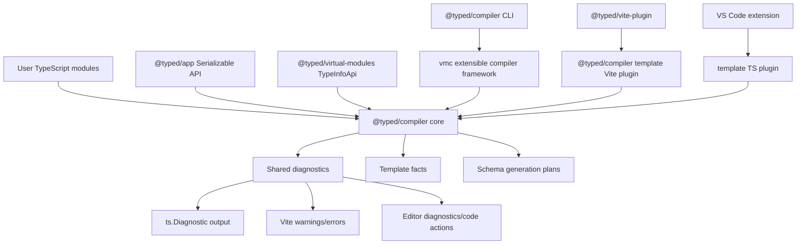
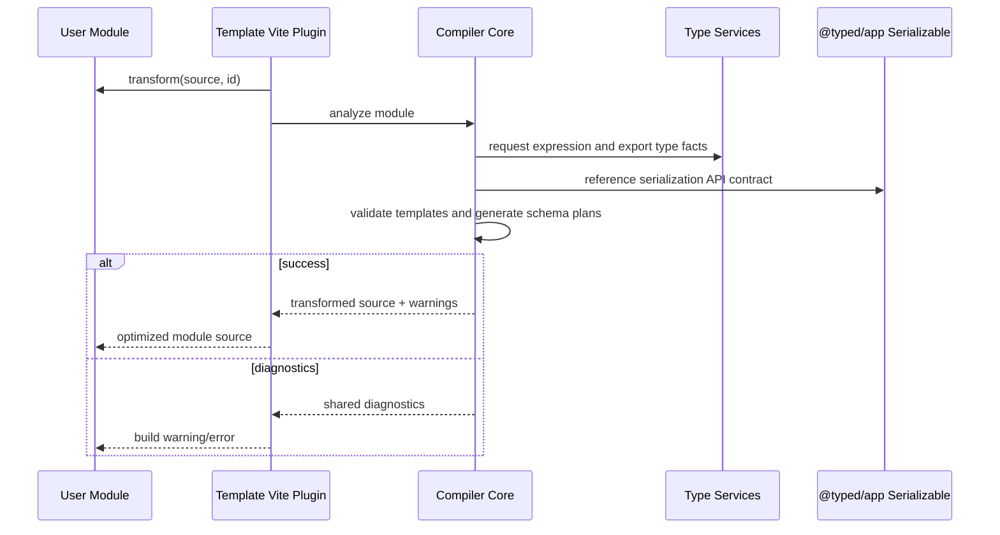

# Specification - Serializable Template Tooling

Status: proposed

## System Context and Scope

Typed is extending its compiler surface from template/runtime analysis into a coordinated build, CLI, and editor toolchain.

This spec covers:

- `@typed/app` serialization APIs for compiler/runtime boundaries.
- Type-directed Effect Schema generation when explicit user schemas are absent.
- Shared compiler diagnostics across CLI, Vite, TypeScript plugin, and VS Code.
- `@typed/compiler` CLI behavior that wraps `vmc`.
- `vmc` extension points so it can act as an extensible TypeScript compiler framework.
- Direct user-module template transforms through a template Vite plugin.
- Template editor diagnostics via the TS plugin and VS Code extension.

Out of scope:

- Replacing `@typed/virtual-modules-compiler`.
- Replacing TypeScript's type system or requiring a TypeScript fork.
- Emitting compiled templates primarily as virtual modules.
- Filesystem routing.
- Production marketplace packaging for the VS Code extension.

## Component Responsibilities and Interfaces

### `@typed/compiler` Core

`@typed/compiler` owns semantic compiler facts and host-neutral diagnostics.

Core modules:

- `compiler-diagnostics`: shared diagnostic model, span mapping, related information, and optional fix metadata.
- `template-module-analysis`: scans TypeScript source files for `html` tagged templates and maps template parts to source spans and expression nodes.
- `template-diagnostics`: validates parsed template structure, attributes, properties, events, spreads, `.data`, and component/template invocation surfaces.
- `schema-generation`: converts TypeScript `TypeNode` facts into Effect Schema generation plans.
- `template-transform`: transforms user modules directly from TypeScript source to optimized runtime code.
- `host-adapters`: thin adapters for CLI, Vite, TS plugin, and VS Code.

The compiler core must stay host-neutral. It must not import Vite, VS Code, or tsserver host APIs in semantic modules.

### Shared Diagnostic Model

Compiler diagnostics are the canonical format.

Conceptual shape:

```ts
export interface TypedCompilerDiagnostic {
  readonly code: string;
  readonly severity: "error" | "warning" | "suggestion" | "message";
  readonly message: string;
  readonly source: "compiler" | "app" | "vmc" | "vite" | "ts-plugin" | "vscode";
  readonly fileName?: string;
  readonly span?: SourceSpan;
  readonly related?: readonly DiagnosticRelatedInfo[];
  readonly fix?: DiagnosticFix;
}
```

Host adapters convert this model to:

- `ts.Diagnostic` for CLI, `vmc`, and TypeScript plugin.
- Vite errors/warnings for build transforms.
- VS Code diagnostics and code actions.
- Existing `VirtualModuleDiagnostic` where virtual-module integration still requires it.

### `@typed/app` Serialization API

`@typed/app` owns the public runtime serialization API.

Conceptual exports:

```ts
export namespace Serializable {
  export interface Descriptor<A, I = unknown> {
    readonly schema: Schema.Codec<A, I, any, any> | Schema.Top;
    readonly id?: string;
  }

  export const schema: <A, I>(
    schema: Schema.Codec<A, I, any, any> | Schema.Top,
    options?: { readonly id?: string },
  ) => Descriptor<A, I>;

  export const generated: <A>(
    id: string,
    plan: GeneratedSchemaPlan,
  ) => Descriptor<A>;
}
```

Rules:

- User-provided schemas are preferred because they are precise and avoid generation work.
- Missing user schemas trigger type-directed generation.
- Unsupported values fail closed with shared diagnostics.
- Runtime APIs are public and stable; compiler-only planning data remains in `@typed/compiler`.

### Type-Directed Schema Generation

`@typed/compiler` consumes TypeScript type facts, starting from the existing `TypeNode` model in `@typed/virtual-modules`.

Supported first tranche:

- primitives: string, number, boolean, bigint, null, undefined;
- literals;
- readonly object properties;
- optional object properties;
- arrays;
- tuples;
- simple unions;
- record/index signatures with string or number keys;
- references to user-provided `Serializable.schema(...)` descriptors.

Rejected first tranche:

- functions;
- arbitrary class instances;
- symbols;
- promises/effects/fibers as values;
- unresolved generic type parameters;
- recursive object graphs unless explicitly supported later;
- `any` and broad `unknown` without a user schema.

Schema generation returns a plan, not ad hoc emitted strings. Host emitters choose how to materialize that plan.

### `vmc` As Extensible Compiler Framework

`@typed/virtual-modules-compiler` keeps existing `vmc` behavior and gains framework extension hooks.

Conceptual host extension:

```ts
export interface VmcCompilerExtension {
  readonly name: string;
  readonly typeTargetSpecs?: readonly TypeTargetSpec[];
  beforeProgramCreate?(context: VmcProgramContext): void;
  transformSource?(input: VmcSourceTransformInput): VmcSourceTransformResult;
  diagnostics?(context: VmcProgramContext): readonly TypedCompilerDiagnostic[];
}
```

Requirements:

- Existing virtual-module host adapters continue to work.
- Extensions can participate in normal compile, build mode, and watch mode.
- Extensions receive shared TypeScript service access.
- Extensions emit shared diagnostics.
- Direct source transforms are available without forcing transforms through virtual modules.

### `@typed/compiler` CLI

`@typed/compiler` provides a CLI that wraps the extensible `vmc` framework.

Conceptual command:

```text
typed-compiler [tsc/vmc-compatible args]
```

Behavior:

- delegates TypeScript compile/build/watch orchestration to `vmc`;
- installs Typed compiler extensions for template transforms and serialization diagnostics;
- reports shared diagnostics using TypeScript formatting;
- supports `--noEmit`, `--build`, and `--watch` through the same underlying framework.

### Template Vite Plugin

`@typed/compiler` exposes a Vite plugin for direct user-module transforms.

Conceptual API:

```ts
export interface TypedTemplateVitePluginOptions {
  readonly include?: readonly string[];
  readonly exclude?: readonly string[];
  readonly diagnostics?: "error" | "warn";
}

export function typedTemplateVitePlugin(options?: TypedTemplateVitePluginOptions): Plugin;
```

Behavior:

- runs in Vite's `transform` hook;
- detects modules that import/use `@typed/template` `html`;
- analyzes tagged templates with source spans and expression type facts when available;
- emits optimized code in the user module;
- emits shared diagnostics through Vite;
- does not represent compiled templates as virtual modules.

### `@typed/vite-plugin` Integration

`typedVitePlugin()` installs the template plugin by default.

Ordering:

1. native tsconfig path shim;
2. template user-module transform plugin;
3. virtual-module Vite plugin;
4. vavite integration when configured;
5. analyzer/compression plugins.

The direct transform runs before normal virtual-module loading so user source is optimized before Rollup/Vite module graph execution.

### Template TS Plugin Diagnostics

The TS plugin runs the shared compiler diagnostic engine over normal TypeScript files.

Responsibilities:

- create/reuse TypeScript service facts;
- call `@typed/compiler` diagnostics for `html` tagged templates;
- append compiler diagnostics to semantic diagnostics;
- keep virtual-module diagnostics and template diagnostics in one host adapter without duplicating semantic logic.

### VS Code Extension

The VS Code extension stays UX-focused.

Responsibilities:

- configure the TypeScript plugin through VS Code's TypeScript extension API;
- surface diagnostics produced by the TS plugin;
- provide code actions only when compiler diagnostics include fix metadata;
- keep virtual-module navigation/preview behavior intact.

## System Diagrams (Mermaid)





## Data and Control Flow

### Build/CLI Flow

1. User invokes `@typed/compiler` CLI.
2. CLI parses `tsc`/`vmc`-compatible arguments.
3. CLI loads `vmc` compiler framework with Typed compiler extension installed.
4. `vmc` creates TypeScript program/build/watch infrastructure.
5. Compiler extension analyzes user source modules.
6. Extension generates template diagnostics, serialization diagnostics, and direct source transforms.
7. `vmc` emits TypeScript diagnostics and transformed output.

### Vite Flow

1. `typedVitePlugin()` registers `typedTemplateVitePlugin()`.
2. Vite calls `transform(code, id)` for user TypeScript modules.
3. Template plugin skips files outside include/exclude or without `html` usage.
4. Plugin calls compiler core.
5. Compiler core uses TypeScript facts when available.
6. Plugin returns transformed code or emits diagnostics.

### Editor Flow

1. TypeScript plugin initializes with project config.
2. Plugin obtains/reuses TypeScript language service program.
3. On semantic diagnostics, plugin calls compiler diagnostic engine for the source file.
4. Compiler diagnostics are converted into `ts.Diagnostic`.
5. VS Code receives diagnostics from TypeScript and optionally exposes code actions from fix metadata.

## Failure Modes and Mitigations

| failure | impact | mitigation |
| --- | --- | --- |
| Host diagnostics drift | CLI/Vite/editor disagree | Shared diagnostic engine and shared fixture snapshots across hosts. |
| Type facts unavailable in Vite | Schema generation or template validation incomplete | Degrade to syntax-only diagnostics with explicit "type facts unavailable" diagnostic when needed. |
| Type-directed schema generation hits unsupported type | Unsafe serialization risk | Fail closed with unsupported-type diagnostic and span. |
| User schema has incompatible type | Runtime mismatch | Type-check descriptor against target type and emit diagnostic. |
| Direct transform changes runtime behavior | Template regressions | Equivalence tests compare interpreted and transformed output for representative templates. |
| `vmc` extension hook breaks current virtual modules | Existing apps fail | Keep existing APIs compatible and run focused virtual-module suites after each tranche. |
| TS plugin cannot affect `tsc` build | Editor-only false confidence | Build correctness enforced by `@typed/compiler` CLI and Vite plugin. |
| VS Code extension recomputes diagnostics differently | Editor drift | VS Code must consume/configure TS plugin and avoid separate semantic checks. |

## Requirement Traceability

| requirement_id | design_element | notes |
| --- | --- | --- |
| FR-01 | Shared Diagnostic Model | Canonical diagnostic format and host adapters. |
| FR-02 | `@typed/app` Serialization API | Public runtime serialization contract. |
| FR-03 | Type-Directed Schema Generation | `TypeNode` to schema plan support and rejections. |
| FR-04 | Common TypeScript Service Layer | TypeInfoApi reuse and `vmc` framework access. |
| FR-05 | `vmc` As Extensible Compiler Framework | Compiler extension hooks. |
| FR-06 | `@typed/compiler` CLI | CLI wraps `vmc` compile/build/watch. |
| FR-07 | Template Vite Plugin | Direct user-module transforms. |
| FR-08 | `@typed/vite-plugin` Integration | Default plugin registration and ordering. |
| FR-09 | Template TS Plugin Diagnostics | Shared diagnostics appended to semantic diagnostics. |
| FR-10 | VS Code Integration | Configure/cooperate with TS plugin; code actions from fixes. |
| NFR-01 | Shared Diagnostic Model and host snapshots | Consistency gate. |
| NFR-02 | Type-Directed Schema Generation | Fail-closed serialization. |
| NFR-03 | Existing virtual-module compatibility | `vmc` compatibility and focused suites. |
| NFR-04 | Testing Strategy | Property/equivalence tests. |
| NFR-05 | Compiler Core and host adapters | DRY, readable, scalable architecture. |

## References Consulted

- specs:
  - `.docs/specs/virtual-modules/spec.md`
  - `.docs/specs/virtual-module-artifact-store/spec.md`
  - `.docs/specs/typed-config/spec.md`
  - `.docs/specs/typed-framework-starter/spec.md`
- adrs:
  - `.docs/adrs/20260521-2320-runtime-template-compiler-boundaries.md`
  - `.docs/adrs/20260516-1643-typed-framework-virtual-module-first.md`
  - `.docs/adrs/20260515-2018-virtual-module-artifact-store.md`
- workflows:
  - `.docs/workflows/20260522-2104-serializable-template-tooling/intent.md`
  - `.docs/workflows/20260522-2104-serializable-template-tooling/scope.md`
  - `.docs/workflows/20260522-2104-serializable-template-tooling/02-research.md`
  - `.docs/workflows/20260522-2104-serializable-template-tooling/requirements.md`
- Effect skills:
  - `.cursor/skills/effect-skill-router/SKILL.md`
  - `.cursor/skills/effect-module-schema/SKILL.md`
  - `.cursor/skills/effect-facet-schema-composition/SKILL.md`
  - `.cursor/skills/effect-facet-schema-encoding/SKILL.md`

## ADR Links

- `.docs/adrs/20260522-2124-compiler-direct-transforms-and-extensible-vmc.md`

