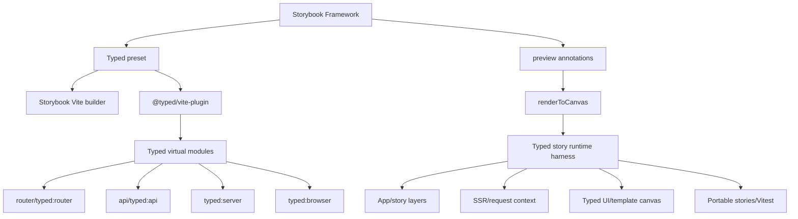
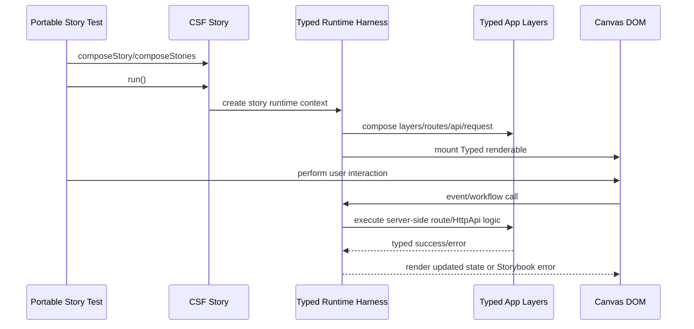

# Spec — Storybook Framework Integration

Status: approved on 2026-05-22.

## System Context and Scope

This spec defines a first-party Typed Storybook framework integration. The integration is a Storybook framework package, not just a renderer adapter. It must support plain Typed component/template stories and one server-aware story workflow that can exercise UI with real Typed server-side code.

In scope:

- `@typed/storybook` package shape and public Storybook entrypoints.
- Vite builder integration through `@typed/vite-plugin`.
- Typed renderer lifecycle for canvas rendering.
- Typed story runtime harness for router, navigation, request, app layers, config, env, SSR, and HttpApi-backed stories.
- Portable story support for Vitest and Storybook's `composeStories`/`run()` model.
- First vertical fixture proving UI plus server-side code in one story/test.

Out of scope:

- Broad visual regression service integration.
- Storybook addon panels.
- Static Storybook server emulation for private runtime features.
- Hidden filesystem routing or local `typed:*` module shims.

## Component Responsibilities and Interfaces

### 1) Storybook Framework Package

Package: `@typed/storybook`.

Required exports:

- `.`: public types and portable-story helpers.
- `./preset`: Storybook preset hooks.
- `./preview.js`: preview annotations, including `renderToCanvas`.
- `./testing`: Typed-specific test setup helpers if Storybook's main framework export should stay renderer-focused.
- `./package.json`: package metadata for Storybook resolution.

The package depends on Storybook's framework contract and should re-export Typed story types:

- `StorybookConfig`
- `Meta`
- `StoryObj`
- `Preview`
- `StoryContext`
- `TypedRenderer`

### 2) Framework Preset

The preset owns Storybook integration points:

- selects Vite builder;
- declares the Typed renderer;
- adds `@typed/vite-plugin` during `viteFinal`;
- preserves user-provided `viteFinal` behavior by composing rather than replacing it;
- accepts framework options for Typed config path, server story mode, and optional Vite plugin overrides.

### 3) Typed Renderer

The renderer owns canvas lifecycle:

- converts story results into Typed renderables or effects;
- mounts into Storybook's canvas root;
- installs browser render services, navigation/router defaults, IDs, and render queues;
- reports typed failures through Storybook's `showError`;
- interrupts runtime fibers on unmount.

The old `@typed/storybook` `renderToCanvas` model is kept as a lifecycle reference, but its service setup must be updated to current `@typed/app`, `@typed/template`, and `@typed/ui` surfaces.

### 4) Story Runtime Harness

The runtime harness is the first server-aware execution model.

Responsibilities:

- create a per-story Typed runtime context;
- compose app layers with story-provided layers;
- provide router/navigation state;
- provide request URL/context for SSR and route stories;
- expose an in-memory server surface for HttpApi or route-handler calls;
- keep error and service typing explicit in public helper types where practical;
- isolate story state across story runs and portable tests.

Working public helper shape:

```ts
export const withTypedApp = defineTypedStoryRuntime({
  routes,
  api,
  layers,
  url,
});
```

The exact API is not final. Specification approval only commits to the responsibilities and typed boundary, not this name.

### 5) Server Execution Models

The first tranche uses the runtime harness first. The design still records three models:

| model | role | decision |
| ----- | ---- | -------- |
| In-memory runtime harness | default first tranche | Accepted for initial implementation because it is deterministic, fast, CI-friendly, and compatible with portable stories. |
| Storybook dev-server middleware | later fidelity layer | Deferred until the runtime API is proven. |
| Real local Typed HTTP server | acceptance or smoke layer | Deferred for first tranche; useful for future e2e validation. |

### 6) Fixture App

Use a small fixture app before RealWorld. It must include:

- one Typed component/template story;
- one route or SSR story;
- one server-backed interaction story;
- one HttpApi or route-handler-backed workflow;
- no local `declare module "typed:*"` shims.

RealWorld should become a follow-up fixture after the smaller fixture proves the architecture.

## System Diagrams (Mermaid)





## Data and Control Flow

1. Storybook loads `@typed/storybook` as the project framework.
2. The Typed preset installs Storybook's Vite builder and appends `typedVitePlugin()`.
3. Story imports resolve Typed virtual modules through the same resolver path as app code.
4. Plain stories render through `renderToCanvas` with browser defaults.
5. Server-aware stories call Typed story runtime helpers or decorators.
6. The harness composes story layers, app layers, router/navigation state, and request context.
7. Interaction tests run through Storybook's story pipeline and invoke real Typed server-side code through the harness.
8. Failures surface as Storybook render errors and test failures with typed diagnostics where available.

## Failure Modes and Mitigations

- Storybook Vite config drops Typed virtual modules:
  - Mitigation: preset-owned `typedVitePlugin()` insertion and integration tests.
- User `viteFinal` overrides Typed plugins:
  - Mitigation: compose final config and assert plugin presence.
- Server-backed stories leak state between runs:
  - Mitigation: per-story runtime scope and teardown in renderer/test helpers.
- Runtime harness diverges from real server behavior:
  - Mitigation: keep harness built from `@typed/app` runtime pieces and add later real-server smoke coverage.
- Static Storybook build cannot run private server features:
  - Mitigation: label server-backed runtime mode as development/test capability unless pre-rendered support is explicitly added.
- Local fixture shims hide compiler gaps:
  - Mitigation: acceptance criteria reject `declare module "typed:*"` in fixtures.
- Effect errors collapse to `unknown`:
  - Mitigation: public helpers carry typed layer/service/error boundaries where practical.

## Requirement Traceability

| requirement_id | design_element | notes |
| -------------- | -------------- | ----- |
| FR-1 | Storybook Framework Package | First-party `@typed/storybook` package. |
| FR-2 | Storybook Framework Package, Framework Preset, Typed Renderer | Required framework/preset/preview/renderer/testing exports. |
| FR-3 | Framework Preset | `typedVitePlugin()` is installed through Storybook Vite config. |
| FR-4 | Typed Renderer | Plain component/template stories do not require server setup. |
| FR-5 | Story Runtime Harness | UI interactions can call real server-side Typed logic. |
| FR-6 | Story Runtime Harness | Router, navigation, layers, request, config, env context. |
| FR-7 | Storybook Framework Package, Story Runtime Harness | Portable story execution support. |
| FR-8 | Framework Preset, Fixture App | No local `typed:*` shims; virtual modules go through framework tooling. |
| FR-9 | Story Runtime Harness | Typed author-facing server-story API. |
| FR-10 | Fixture App | One server-backed fixture story. |
| FR-11 | Server Execution Models | Three models compared and first-tranche choice recorded. |
| FR-12 | Typed Renderer | Old implementation is keep/replace/discard input. |
| NFR-1 | public helper types | Inference and type safety over casts/wrappers. |
| NFR-2 | Story Runtime Harness | Explicit Effect error/service boundaries where practical. |
| NFR-3 | Fixture App | One vertical workflow first. |
| NFR-4 | Story Runtime Harness, Testing Strategy | Deterministic CI and portable tests. |
| NFR-5 | Framework Preset | Storybook does not own routing. |
| NFR-6 | Framework Preset | Compatible with current Vite/virtual-module architecture. |
| NFR-7 | Server Execution Models | Dev/test vs static Storybook behavior is explicit. |
| NFR-8 | Testing Strategy | Traceability maintained through planning. |

## References Consulted

- specs:
  - `.docs/specs/router-virtual-module-plugin/spec.md`
  - `.docs/specs/httpapi-virtual-module-plugin/spec.md`
  - `.docs/specs/typed-config/spec.md`
- adrs:
  - `.docs/adrs/20260516-1643-typed-framework-virtual-module-first.md`
  - `.docs/adrs/20260516-1643-vavite-backed-typed-http-server.md`
- workflows:
  - `.docs/workflows/20260522-2049-storybook-framework-integration/intent.md`
  - `.docs/workflows/20260522-2049-storybook-framework-integration/scope.md`
  - `.docs/workflows/20260522-2049-storybook-framework-integration/02-research.md`
  - `.docs/workflows/20260522-2049-storybook-framework-integration/requirements.md`
- external:
  - https://storybook.js.org/docs/contribute/framework
  - https://storybook.js.org/docs/api/portable-stories/portable-stories-vitest
  - https://storybook.js.org/docs/get-started/frameworks/nextjs-vite/
  - https://storybook.js.org/docs/builders/vite

## ADR Links

- `.docs/adrs/20260522-2058-storybook-runtime-harness-first.md`
