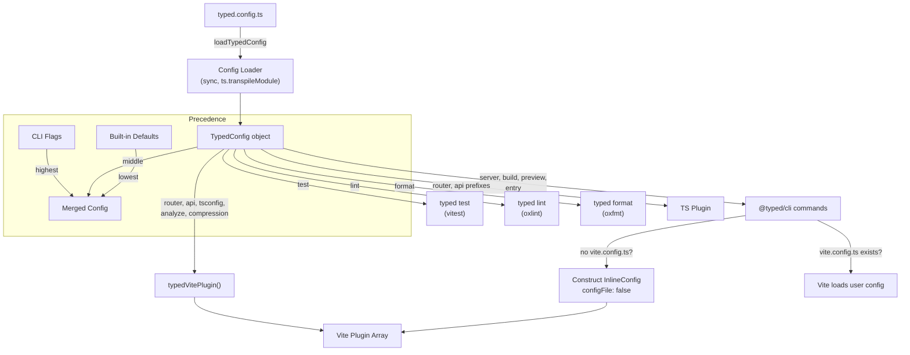

# Specification — `typed.config.ts`

## System Context and Scope

`typed.config.ts` is the single configuration file for typed-smol projects. It replaces the need for `vite.config.ts`, `vitest.config.ts`, `vmc.config.ts`, `.oxlintrc.json`, and `.oxfmtrc.json` while remaining optional (sane defaults for everything).

### Scope Boundaries

**In scope**: build-time/tooling configuration — VM plugin options, TypeScript setup, dev/build/preview/test defaults, lint rules, format preferences.

**Out of scope**: runtime application config (host, port, disableListenLog) — these remain in `server.ts`.

## Architecture



## Component Responsibilities

### 1. `TypedConfig` Interface (`@typed/app`)

Canonical config type. All fields optional. Sections:

| Section         | Purpose                               | Consumers              |
| --------------- | ------------------------------------- | ---------------------- |
| `entry`         | Server entry file path                | CLI                    |
| `router`        | Router VM plugin prefix               | Vite plugin, TS plugin |
| `api`           | HttpApi VM plugin prefix + pathPrefix | Vite plugin, TS plugin |
| `tsconfig`      | tsconfig.json path                    | Vite plugin, TS plugin |
| `tsconfigPaths` | Path alias resolution                 | Vite plugin            |
| `server`        | Dev server defaults                   | CLI `serve`            |
| `build`         | Build defaults                        | CLI `build`            |
| `preview`       | Preview server defaults               | CLI `preview`          |
| `test`          | Vitest defaults                       | CLI `test`             |
| `lint`          | Oxlint defaults                       | CLI `lint`             |
| `format`        | Oxfmt defaults                        | CLI `format`           |
| `analyze`       | Bundle analyzer                       | Vite plugin            |
| `compression`   | Build compression                     | Vite plugin            |
| `warnOnError`   | VM error warnings                     | Vite plugin            |

### 2. `defineConfig()` Helper (`@typed/app`)

Identity function providing type inference:

```typescript
export function defineConfig(config: TypedConfig): TypedConfig {
  return config;
}
```

### 3. `loadTypedConfig()` (`@typed/app`)

Synchronous config file loader. Extends `VmcConfigLoader` pattern.

**Signature**:

```typescript
interface LoadTypedConfigOptions {
  readonly projectRoot: string;
  readonly ts?: typeof import("typescript");
  readonly configPath?: string;
}

type LoadTypedConfigResult =
  | { readonly status: "not-found" }
  | { readonly status: "loaded"; readonly path: string; readonly config: TypedConfig }
  | { readonly status: "error"; readonly path?: string; readonly message: string };

function loadTypedConfig(options: LoadTypedConfigOptions): LoadTypedConfigResult;
```

**Discovery**: looks for `typed.config.ts` in `projectRoot`. No fallback to `vmc.config.ts`.

**Loading**: `ts.transpileModule()` → CJS eval via `vm.runInThisContext` (same as existing `VmcConfigLoader`). Normalizes `default` exports. Validates shape.

### 4. CLI Commands (`@typed/cli`)

#### Existing commands (modified): `serve`, `build`, `preview`, `run`

Each command gains config-file awareness:

1. Call `loadTypedConfig({ projectRoot })`.
2. Merge: CLI flags > `typed.config.ts` section > built-in defaults.
3. Check for `vite.config.ts` existence:
   - **Exists**: pass as `configFile` (current behavior).
   - **Missing**: construct `InlineConfig` with `configFile: false`, inject `typedVitePlugin(opts)`.

#### New: `typed test`

Wraps vitest via `createVitest('test', cliOptions, viteOverrides)` from `vitest/node`.

- `test` section from config → vitest `test` options.
- Reuses the same optional-vite-config logic for `viteOverrides`.
- When `vitest.config.ts` exists, passes it as the config file to vitest.
- When absent, constructs config from `typed.config.ts`.
- CLI flags: `--watch`, `--coverage`, `--reporter <name>`, `--environment <env>`, plus positional file filters.
- Built-in defaults: `include: ["src/**/*.{test,spec}.ts"]`, `typecheck: { enabled: true }`.

#### New: `typed lint`

Spawns `oxlint` as a child process with arguments constructed from config.

- `lint` section from config → oxlint CLI arguments.
- When `.oxlintrc.json` / `oxlint.config.ts` exists, passes `--config <path>`.
- When absent, constructs `--rule`, `--category`, `--plugin` flags from config.
- CLI flags: `--fix`, `--rule <name>=<level>`, `--category <name>=<level>`, plus positional file targets.
- Built-in defaults: `categories: { correctness: "warn", suspicious: "warn" }`, include: `["src/"]`.

#### New: `typed format`

Spawns `oxfmt` as a child process with arguments constructed from config.

- `format` section from config → oxfmt CLI arguments.
- When `.oxfmtrc.json` exists, oxfmt auto-discovers it (no special handling needed).
- When absent, constructs `--print-width`, `--tab-width`, etc. from config.
- CLI flags: `--check`, `--print-width <n>`, plus positional file targets.
- Built-in defaults: oxfmt's own Prettier-compatible defaults.

### 5. Vite Plugin Integration (`@typed/vite-plugin`)

`typedVitePlugin()` (zero-arg) auto-discovers `typed.config.ts`:

```typescript
export function typedVitePlugin(options?: TypedVitePluginOptions): Plugin[] {
  // If no explicit options provided, try loading from typed.config.ts
  const config = options ? undefined : loadTypedConfig({ projectRoot: process.cwd() });
  const resolvedOptions = mergePluginOptions(options, config);
  // ... rest of plugin setup
}
```

Explicit `TypedVitePluginOptions` passed to `typedVitePlugin(opts)` take full precedence — config file is not loaded when explicit options are provided.

### 6. TS Plugin Integration

TS plugin calls `loadTypedConfig({ projectRoot, ts })` at initialization. Extracts `router.prefix` and `api.prefix` to configure VM plugins. If config is not found, uses built-in defaults (same prefixes as before: `router:` and `api:`).

`vmc.config.ts` is no longer read. `VmcConfigLoader` and `VmcResolverLoader` remain in `@typed/virtual-modules` for any external consumers but are not used by the TS plugin.

## Data Flow

### Config Resolution (CLI)

```
1. Parse CLI flags
2. loadTypedConfig(projectRoot) → TypedConfig | not-found
3. For each option:
   a. CLI flag set?         → use flag value
   b. typed.config.ts set?  → use config value
   c. neither?              → use built-in default
4. Check vite.config.ts existence
5. Construct InlineConfig (with or without configFile)
6. Pass to Vite / Vitest / oxlint / oxfmt
```

### Config Resolution (Vite Plugin)

```
1. typedVitePlugin() called
2. No explicit options? → loadTypedConfig(cwd)
3. Extract: router, api, tsconfig, tsconfigPaths, analyze, compression, warnOnError
4. Build plugin array (tsconfig paths, virtual modules, analyzer, compression)
```

## Failure Modes and Mitigations

| Failure                                      | Impact                                            | Mitigation                                                                                                    |
| -------------------------------------------- | ------------------------------------------------- | ------------------------------------------------------------------------------------------------------------- |
| `typed.config.ts` has syntax error           | Config load fails                                 | Return `{ status: "error", message }`. CLI prints actionable error. All tools fall back to built-in defaults. |
| `typed.config.ts` imports unavailable module | `ts.transpileModule` succeeds but CJS eval throws | Caught by try/catch in loader. Same error status returned.                                                    |
| `typed.config.ts` exports wrong shape        | Invalid config                                    | Loader validates top-level shape and returns error with details.                                              |
| `oxlint` not installed                       | `typed lint` fails                                | CLI checks for binary availability before spawning. Prints "install oxlint" message.                          |
| `oxfmt` not installed                        | `typed format` fails                              | Same: check binary, print install instructions.                                                               |
| `vitest` not installed                       | `typed test` fails                                | Import fails at runtime; CLI catches and prints install instructions.                                         |

## Requirement Traceability

| Requirement | Design Element                                                                  |
| ----------- | ------------------------------------------------------------------------------- |
| FR-1        | `TypedConfig` interface + `defineConfig()` in `@typed/app`                      |
| FR-2        | `loadTypedConfig()` discovery logic                                             |
| FR-3        | `loadTypedConfig()` using `ts.transpileModule` + CJS eval                       |
| FR-4        | CLI merge logic: flags > config > defaults                                      |
| FR-5        | CLI `vite.config.ts` existence check + `configFile: false` path                 |
| FR-6        | `typedVitePlugin()` zero-arg auto-discovery                                     |
| FR-7        | TS plugin calls `loadTypedConfig()` exclusively                                 |
| FR-8        | `typed test` command using `createVitest` from `vitest/node`                    |
| FR-9        | `typed lint` command spawning `oxlint`                                          |
| FR-10       | `typed format` command spawning `oxfmt`                                         |
| FR-11       | Explicit options override; absent config uses defaults; `vmc.config.ts` removed |
| NFR-1       | Sync `loadTypedConfig()` using `ts.transpileModule`                             |
| NFR-2       | No new deps for loading; `oxlint`/`oxfmt` as peer deps for their commands       |
| NFR-3       | `defineConfig()` with full inference                                            |
| NFR-4       | Empty `defineConfig({})` valid; no config file also valid                       |
| NFR-5       | Single `TypedConfig` type consumed everywhere                                   |
| NFR-6       | CLI passes unknown flags to underlying tools                                    |

## References

- `.docs/specs/typed-config/requirements.md`
- `.docs/workflows/20260225-2100-typed-config-unification/01-brainstorming.md`
- `.docs/workflows/20260225-2100-typed-config-unification/02-research.md`
- `packages/virtual-modules/src/VmcConfigLoader.ts` (pattern reference for sync TS config loading)
- Astro `create-vite.ts` pattern (framework-managed Vite config)
