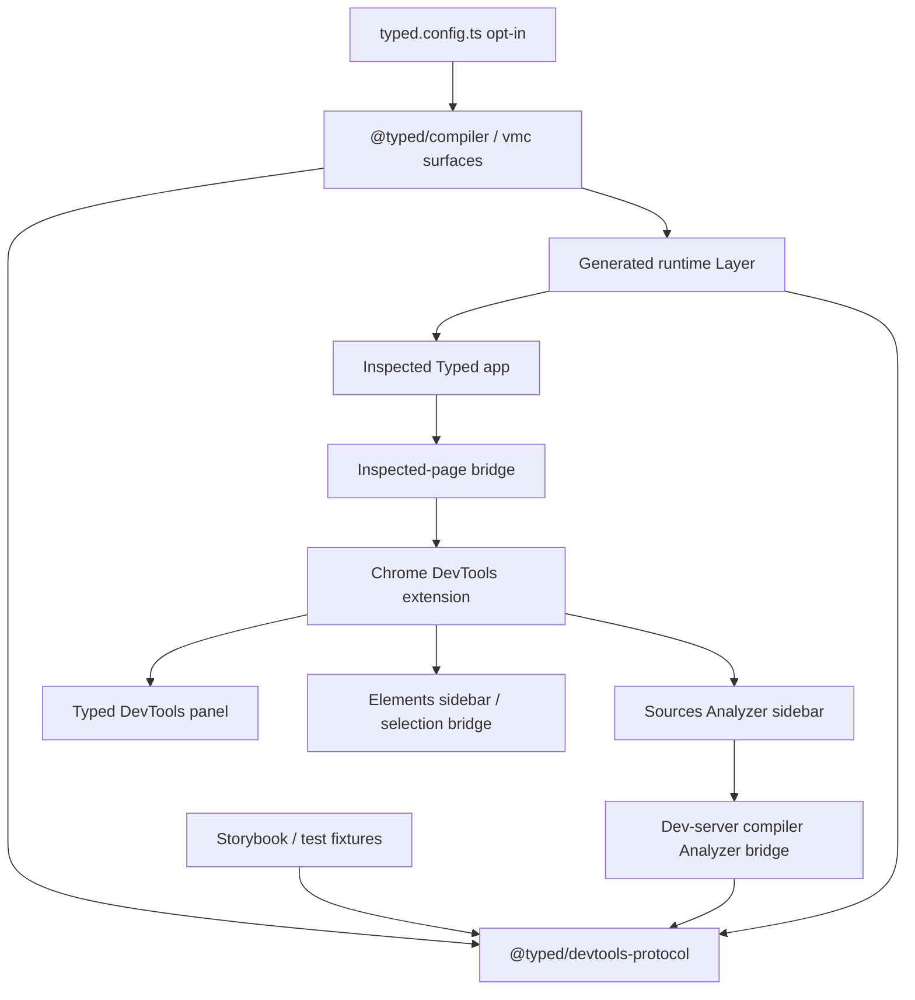
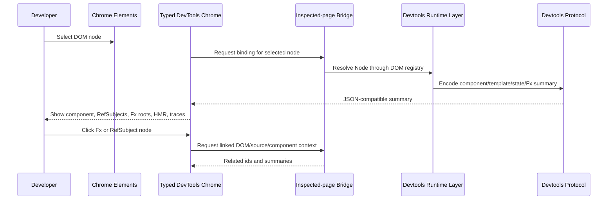
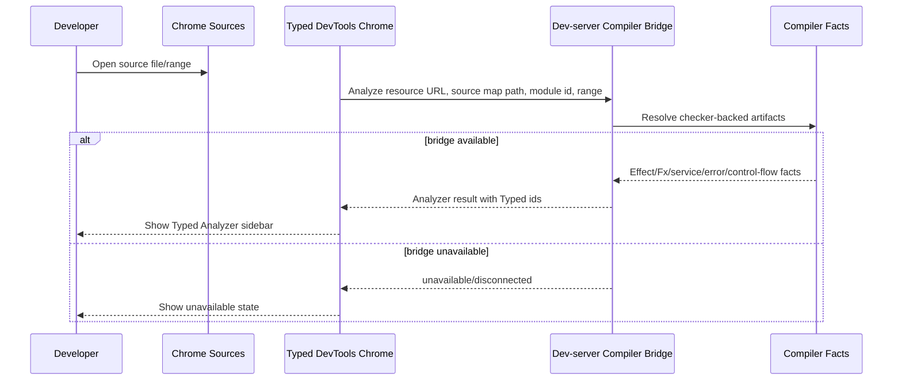

# Specification - Typed DevTools

Status: approved on 2026-05-23.

## System Context and Scope

Typed DevTools provides developer tooling for inspecting Typed applications through Chrome DevTools, Storybook fixtures, and future editor/CLI clients. The system is centered on a host-neutral protocol package and opt-in compiler/runtime instrumentation.

In scope:

- `@typed/devtools-protocol` as the shared schema, id, event, fixture, capability, and redaction contract.
- `effect/unstable/rpc` RPC groups as the communication protocol between DevTools clients, runtime bridge, dev-server/compiler bridge, and fixtures.
- Runtime instrumentation for Components, DOM/template mounts, `Fx`, `RefSubject`, Navigation, HMR facts, and OTEL trace correlation.
- Chrome DevTools panel integration, plus Elements and Sources sidebars.
- A Typed dev-server/compiler bridge for on-demand source-file Analyzer results.
- Storybook/protocol fixtures that render DevTools facts without Chrome APIs.
- Type-safety, type-inference, high-quality code, and semantic-preservation tests throughout.

Out of scope for the first implementation plan:

- Browser-only AST Analyzer approximation.
- Production-on-by-default instrumentation.
- A full semantic-diff UI inspired by `effect-analyzer`.
- VS Code, CLI, or remote collector clients beyond protocol compatibility.
- Replacing OpenTelemetry or Effect observability models.

## Component Responsibilities and Interfaces

### `@typed/devtools-protocol`

Owns the single source of truth for cross-package DevTools contracts.

Responsibilities:

- Branded or otherwise opaque Typed ids:
  - `ComponentId`
  - `TemplateHash`
  - `TemplatePartId`
  - `DomBindingId`
  - `FxNodeId`
  - `RefSubjectId`
  - `HmrBoundaryId`
  - `NavigationEventId`
  - `SourceLocationId`
  - OTEL `traceId` and `spanId`
- Protocol lanes:
  - compiler facts
  - runtime reactive events
  - DOM/component correlation
  - HMR facts
  - Navigation events
  - OTEL trace correlation
  - source Analyzer requests/results
- Version and capability negotiation.
- Schema/codecs for extension, bridge, dev-server, Storybook, and fixture boundaries.
- `effect/unstable/rpc` `Rpc.make(...)` and `RpcGroup.make(...)` definitions for request/response and streaming communication.
- Serialization and redaction helpers for values, errors, attributes, events, and summaries.
- Fixture builders for tests and Storybook.

Interface shape:

```ts
import { Rpc, RpcGroup, RpcSchema } from "effect/unstable/rpc";
import { Schema } from "effect";

export class TypedDevtoolsRpcs extends RpcGroup.make(
  Rpc.make("Handshake", {
    payload: {
      clientId: DevtoolsClientId,
      supportedVersions: Schema.Array(DevtoolsProtocolVersion),
    },
    success: HandshakeResult,
  }),
  Rpc.make("SubscribeRuntimeEvents", {
    payload: RuntimeSubscriptionRequest,
    success: RuntimeEvent,
    stream: true,
  }),
  Rpc.make("ResolveDomBinding", {
    payload: DomBindingRequest,
    success: DomBindingResult,
  }),
  Rpc.make("AnalyzeSource", {
    payload: SourceAnalyzerRequest,
    success: SourceAnalyzerResult,
  }),
) {}
```

Concrete implementation can refine this shape, but the communication contract must remain RPC-group based. All hosts must import the same protocol types and RPC groups instead of redeclaring local message shapes.

RPC transport mapping:

- Chrome panel to inspected-page bridge: adapter over Chrome extension messaging and/or content-script `window.postMessage`; the adapter implements the shared RPC group.
- Chrome panel to dev-server/compiler Analyzer bridge: HTTP or WebSocket RPC protocol where available.
- Runtime bridge to fixtures/tests: in-process or no-serialization RPC test transport.
- Storybook fixtures: protocol fixtures and RPC handlers without Chrome APIs.

Because `effect/unstable/rpc` is unstable, direct usage is isolated inside `@typed/devtools-protocol` and thin transport adapters. Compiler/runtime packages consume Typed protocol exports and generated clients/handlers, not ad-hoc unstable RPC internals.

### Compiler Instrumentation

Compiler surfaces emit static facts that make runtime events navigable.

Responsibilities:

- Assign stable component ids and source locations for inferred components.
- Preserve module id, source span, template hash, template node path, and template part metadata.
- Emit HMR eligibility and rejection facts without conflating template optimization with state-preserving HMR.
- Emit component-to-RefSubject and component-to-Fx-root ownership where inferable.
- Feed source Analyzer requests through the same compiler/typechecker facts used by Vite, `vmc`, and virtual-module hosts.

The compiler must align with existing direct-transform and `vmc` extension boundaries. It should reuse artifact-store and diagnostic contracts where durable cross-host reuse is needed.

### Runtime Instrumentation Layer

Runtime instrumentation is globally opt-in and then automatic for supported surfaces.

Responsibilities:

- Provide a runtime `Layer` generated/exposed through compiler/plugin surfaces when enabled in `typed.config.ts`.
- Allow explicit app composition of the same `Layer`.
- Register an inspected-page bridge and runtime event bus.
- Serve runtime bridge handlers for the shared DevTools RPC group.
- Capture component/template mount and unmount events.
- Maintain a dev-only DOM registry, primarily a `WeakMap<Node, TypedDomBinding>` or equivalent.
- Capture `RefSubject` snapshots, updates, version, subscriber count, service id, owner id, and bounded history.
- Capture component-owned Fx roots, RefSubject-derived streams, and arbitrary instrumented Fx values.
- Preserve `Fx` laziness, sharing, interruption, scope cleanup, error/success semantics, and service requirements.
- Attach Typed ids to OTEL spans instead of creating a separate trace model.

The runtime layer must be omitted, tree-shaken, or no-op in production unless explicitly forced for diagnostics.

### Dev-Server/Compiler Analyzer Bridge

The Analyzer bridge provides checker-backed source-file analysis on demand.

Responsibilities:

- Accept source Analyzer requests keyed by DevTools resource URL, source map original path, module id, line/column, and compiler artifact version when available.
- Expose Analyzer operations through the shared DevTools RPC group.
- Return static Effect/Fx/service/error/control-flow/layer facts using compiler/typechecker artifacts.
- Cache by file content hash, source map identity, compiler artifact version, and analysis options.
- Return a structured unavailable state when the bridge is missing or stale.

The Chrome extension must not perform first-tranche browser-only AST approximation.

### Chrome DevTools Extension

`@typed/devtools-chrome` is a protocol client, not the owner of protocol semantics.

Responsibilities:

- Define the MV3 extension manifest, `devtools_page`, panel page, content script, and injected page bridge.
- Use generated or inferred RPC clients from `@typed/devtools-protocol` for extension-to-runtime and extension-to-dev-server communication.
- Create a Typed DevTools panel with focused views:
  - Components/Templates
  - Fx graph and timeline
  - RefSubject state
  - HMR status
  - Navigation
  - OTEL traces
  - Analyzer results
- Integrate with Elements through a sidebar or selection bridge.
- Integrate with Sources through an on-demand Typed Analyzer sidebar.
- Use `chrome.devtools.inspectedWindow.eval` only to request JSON-compatible ids and summaries from the inspected page.
- Tolerate MV3 service-worker shutdown, page reload, DevTools reload, bridge reconnects, and missed transient state.

Chrome APIs stay behind this package boundary. Compiler/runtime packages must not import Chrome APIs.

### Storybook and Fixture Consumers

Storybook and test fixtures consume `@typed/devtools-protocol` directly.

Responsibilities:

- Render protocol fixtures without Chrome APIs.
- Prove protocol payloads, analyzer facts, runtime events, and trace correlations are host-neutral.
- Provide deterministic fixtures for early UI acceptance before the full Chrome extension is complete.

## System Diagrams (Mermaid)







## Data and Control Flow

1. Developer enables DevTools in `typed.config.ts`.
2. Typed compiler/plugin surfaces expose or generate the runtime instrumentation `Layer`.
3. App code either receives the generated wiring or explicitly composes the `Layer`.
4. Compiler instrumentation emits static facts:
   - component ids
   - source locations
   - template hashes and template part paths
   - HMR eligibility/rejection facts
   - ownership links where inferable
5. Runtime instrumentation emits live facts:
   - component/template lifecycle
   - DOM bindings
   - `RefSubject` snapshots/updates
   - `Fx` graph/events/lifetimes
   - Navigation events
   - OTEL span correlation metadata
6. The inspected-page bridge serializes only protocol summaries and ids.
7. The Chrome panel and sidebars consume protocol events and provide deep links across DOM, component, source, Fx, RefSubject, HMR, Navigation, and traces.
8. The Sources sidebar requests Analyzer results from the dev-server/compiler bridge on demand.
9. Storybook and tests consume fixtures from the same protocol package.

## Failure Modes and Mitigations

| failure_mode | mitigation |
| ------------ | ---------- |
| DevTools instrumentation accidentally ships in production | Default disabled; production builds omit/tree-shake/no-op unless explicit diagnostic mode is enabled. |
| Chrome service worker loses session state | Treat service worker as transient; keep correctness in page bridge, panel state, explicit storage, and reconnect protocol. |
| DOM node cannot be correlated | Return an unbound result with nearby source/template facts when available; do not scrape fragile selectors as truth. |
| `data-typed-*` leaks sensitive ids | Treat attributes as optional dev-only inspection aids; registry remains the correctness path. |
| Runtime wrappers alter `Fx` semantics | Require semantic-preservation tests for laziness, sharing, interruption, scope cleanup, success/error, and services. |
| RefSubject value contains secrets or huge/cyclic data | Apply protocol serialization limits and redaction before crossing the bridge. |
| Analyzer bridge unavailable | Show unavailable/disconnected state; do not fabricate browser-only approximate analysis. |
| Source maps are missing or stale | Fall back to generated resource/module identity and mark precision as degraded. |
| HMR status conflates optimization and state preservation | Maintain separate protocol facts and UI labels for template optimization vs stateful HMR eligibility. |
| OTEL spans lack Typed metadata | Render canonical OTEL trace data and mark Typed correlation as unavailable. |
| Protocol shape drifts across packages | Import all cross-package contracts from `@typed/devtools-protocol`; add type tests for invalid local redeclarations. |
| RPC API changes upstream | Isolate `effect/unstable/rpc` usage behind `@typed/devtools-protocol` and thin adapters; keep compiler/runtime code dependent on Typed protocol exports. |

## Memory and Retention Design

Runtime and panel memory are development-session caches, not durable application state.

- Runtime keeps bounded event buffers for `Fx`, `RefSubject`, Navigation, HMR, and trace correlation.
- Panel keeps UI selection and recent event state across bridge reconnects where possible.
- Dev-server Analyzer caches by content hash, source map identity, artifact version, and options.
- Long-term durable facts belong in compiler artifacts, virtual-module artifact manifests, test fixtures, specs, and ADRs.
- Value payload retention must respect redaction and size limits before data leaves the inspected page.

## Requirement Traceability

| requirement_id | design_element | notes |
| -------------- | -------------- | ----- |
| FR-1, FR-2, FR-40, FR-43 through FR-45, NFR-1, NFR-2, NFR-17, NFR-18 | `@typed/devtools-protocol` | Host-neutral source of truth for ids, schemas, RPC groups, fixtures, capability negotiation, and transport adapters. |
| FR-3, FR-5 through FR-10, NFR-3, NFR-4, NFR-13 | Runtime instrumentation Layer | Opt-in through config, explicit Layer composition supported, automatic capture once enabled. |
| FR-11 through FR-18, NFR-7 | DOM/component correlation | Compiler metadata plus runtime WeakMap registry; Elements selection resolves to component/template/state/Fx facts. |
| FR-19 through FR-24, NFR-3 through NFR-6 | Fx and RefSubject instrumentation | Component-owned first path plus arbitrary Fx capture, bounded and redacted state/value summaries. |
| FR-25, FR-26 | HMR inspection | Separate template optimization from state-preserving HMR and expose structured rejection reasons. |
| FR-27 | Navigation inspection | Use `@typed/navigation` as canonical source for app navigation timeline. |
| FR-28, FR-29 | OTEL trace correlation | Preserve OpenTelemetry trace/span identity and attach Typed ids. |
| FR-30, FR-31, FR-38, FR-39, NFR-9, NFR-12 | Chrome extension | DevTools panel, Elements sidebar/bridge, reconnection, JSON-compatible summaries, dense debugging UI. |
| FR-32 through FR-37, NFR-8, NFR-14 | Sources Analyzer | On-demand bridge-backed source analysis; unavailable state when bridge is missing. |
| FR-41, FR-42, NFR-15, NFR-16 | Type safety and quality | Inference-first public APIs, validation at untrusted boundaries, no duplicated protocol shapes. |
| NFR-10, NFR-11 | Planning and verification | Implementation tasks must map to requirements and include semantic-preservation tests. |

## Testing Strategy

See `.docs/specs/typed-devtools/testing-strategy.md`.

## References Consulted

- specs:
  - `.docs/specs/typed-framework-starter/spec.md`
  - `.docs/specs/virtual-modules/spec.md`
  - `.docs/specs/virtual-module-artifact-store/spec.md`
- adrs:
  - `.docs/adrs/20260515-2018-virtual-module-artifact-store.md`
  - `.docs/adrs/20260516-1643-typed-framework-virtual-module-first.md`
  - `.docs/adrs/20260521-2320-runtime-template-compiler-boundaries.md`
  - `.docs/adrs/20260522-2124-compiler-direct-transforms-and-extensible-vmc.md`
- workflows:
  - `.docs/workflows/20260523-1548-developer-tooling-chrome-extension/intent.md`
  - `.docs/workflows/20260523-1548-developer-tooling-chrome-extension/scope.md`
  - `.docs/workflows/20260523-1548-developer-tooling-chrome-extension/02-research.md`
  - `.docs/workflows/20260523-1548-developer-tooling-chrome-extension/requirements.md`
- external:
  - Chrome DevTools extension docs: `https://developer.chrome.com/docs/extensions/how-to/devtools/extend-devtools`
  - Chrome `devtools.panels` API: `https://developer.chrome.com/docs/extensions/reference/api/devtools/panels`
  - Chrome `devtools.inspectedWindow` API: `https://developer.chrome.com/docs/extensions/reference/api/devtools/inspectedWindow`
  - OpenTelemetry trace API: `https://opentelemetry.io/docs/specs/otel/trace/api`
  - `jagreehal/effect-analyzer`: `https://github.com/jagreehal/effect-analyzer`
  - Effect `effect/unstable/rpc` skill references:
    - `.cursor/skills/effect-module-unstable-rpc/SKILL.md`
    - `.cursor/skills/effect-facet-unstable-rpc-rpc/references/api-reference.md`
    - `.cursor/skills/effect-facet-unstable-rpc-rpcgroup/references/api-reference.md`
    - `.cursor/skills/effect-facet-unstable-rpc-rpcclient/references/api-reference.md`
    - `.cursor/skills/effect-facet-unstable-rpc-rpcserver/references/api-reference.md`
    - `.cursor/skills/effect-facet-unstable-rpc-rpcserialization/references/api-reference.md`
  - Effect RPC docs via Context7: `/effect-ts/effect`, `packages/rpc/README.md`

## ADR Links

- `.docs/adrs/20260523-1703-typed-devtools-protocol-boundaries.md`
