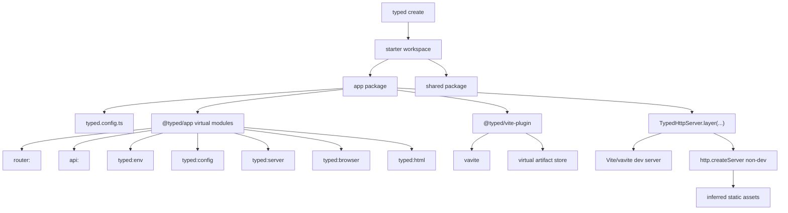
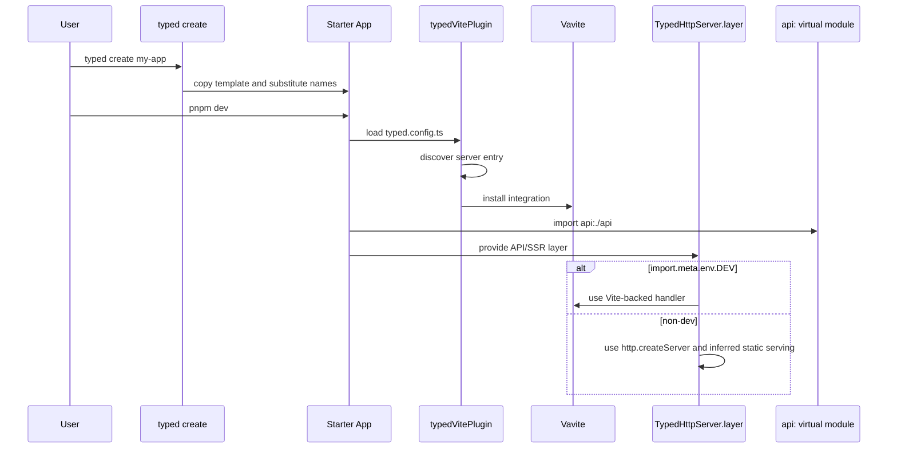

# Specification - Typed Framework Starter

Status: approved on 2026-05-16 by human.

## System Context and Scope

Typed's framework starter turns the existing package set into a coherent application framework surface:

- `@typed/app` owns framework virtual modules and server helpers.
- `@typed/vite-plugin` owns Vite integration, including automatic `vavite` activation when a server entry is discovered.
- `@typed/cli` owns `typed create` and framework command ergonomics.
- The starter workspace proves a minimal multi-package app with one SSR + hydrated application path.

In scope:

- `typed create` scaffold command.
- A minimal multi-package starter.
- SSR, CSR, and multi-page app-mode configuration shape with minimal default config.
- `typed:env` and `typed:config` virtual modules.
- `typed:server`, `typed:browser`, and `typed:html` virtual modules.
- `TypedHttpServer.layer(...)`.
- Vavite-backed dev server integration through `@typed/vite-plugin`.
- Inferred non-dev static serving.
- SSL support for provided certs and generated dev certs.
- Future extension path for SSG and incremental SSG.

Out of scope:

- Actual filesystem routing.
- Publishing packages.
- Multiple starter variants.
- Authentication, database, deployment adapters, and full SSG/incremental SSG implementation.

## Component Responsibilities and Interfaces

### `@typed/cli`

- Adds `typed create <name>`.
- Copies the maintained starter template into a new workspace.
- Applies package-name substitutions.
- Leaves package installation to the generated workspace scripts unless requirements later demand auto-install.
- Uses existing `typed serve`, `typed build`, `typed preview`, `typed test`, `typed lint`, and `typed format` command families for generated scripts.

### Starter Workspace

The starter is minimal but multi-package:

- app package: SSR + hydrated application, Vite entrypoints, typed config, router/API/env/config virtual imports.
- shared package: small shared domain/schema module used by both UI and API code.

The starter's primary path is SSR + hydration. CSR and MPA support are represented in config/spec/test coverage so the framework shape is ready without adding multiple starter variants.

### `@typed/app` Virtual Modules

`@typed/app` registers four first-party framework virtual-module plugins:

- router plugin: existing `router:` behavior.
- HttpApi plugin: existing `api:` behavior.
- Environment plugin: new `typed:env` virtual module.
- Config plugin: new `typed:config` virtual module.
- Server plugin: new `typed:server` virtual module.
- Browser plugin: new `typed:browser` virtual module.
- HTML plugin: new `typed:html` virtual module.

`typed:env` generates named exports from environment entries. Conceptually:

```ts
Object.entries(process.env)
  .map(([key, value]) => `export const ${key} = ${JSON.stringify(value)}`)
  .join("\n");
```

The implementation must validate export names before emitting source. Invalid JavaScript identifiers must fail clearly or be normalized by a documented rule; the implementation plan must choose the exact policy before code execution.

`typed:config` exports the computed config loaded from `typed.config.ts`. It must reflect the same resolved config semantics used by `@typed/vite-plugin` and `@typed/cli`, not a second divergent loader.

`typed:server` generates server entrypoint helpers. It accepts query parameters for multiple API modules and multiple router modules:

```ts
import { run } from "typed:server?api=./api&routes=./routes1&routes=./routes2";
```

The generated `run` helper composes the referenced HttpApi and router virtual modules into one server build. `typed:server` also supports companion files analogous to router and HttpApi companions; the exact companion matrix is finalized in planning but must cover deterministic server assembly concerns such as layers, middleware, HTML template selection, server config, and error handling.

`typed:browser` generates browser entrypoint helpers:

```ts
import { run } from "typed:browser?routes=*";
```

It accepts route query parameters and convention selectors. It also supports companion files analogous to route/API companions for browser entrypoint concerns such as hydration root, client layers, navigation setup, and browser-only providers.

`typed:html` references Vite-compatible HTML files:

```ts
import { html } from "typed:html?path=./index.html";
```

It makes the same `.html` files and transformations used by Vite dev servers available to server-side rendering during production builds. In dev, it should align with Vite HTML transformation behavior. In production, it should reference the built/transformed equivalent without depending on Vite dev middleware.

### `@typed/app` Typed HTTP Server

`@typed/app` exposes `TypedHttpServer.layer(...)`.

Conceptual API:

```ts
TypedHttpServer.layer({
  host,
  port,
  ssl,
  appMode,
});
```

Server behavior:

- dev: `import.meta.env.DEV` selects the vavite-backed Vite dev server.
- non-dev: uses `http.createServer()` through the Typed server helper.
- static assets: inferred from `typed.config.ts`, app mode, Vite build output, and starter conventions.
- provided SSL: `ssl: { key, cert }` uses explicit certificate paths.
- generated SSL: `ssl: true` writes dev certs under `node_modules/.typed/certs/`.

Generated `api:` modules consume `TypedHttpServer.layer(...)` or a thin helper built on it rather than directly selecting `NodeHttpServer.layer(http.createServer, ...)`.

### `@typed/vite-plugin`

`typedVitePlugin()` continues to register framework virtual-module plugins through `createTypedViteResolver`.

New behavior:

- Discovers a server entry from `typed.config.ts` and established conventions.
- Automatically installs vavite integration when a server entry is present.
- Keeps vavite wiring behind the Typed preset so generated apps do not hand-author server-side Vite plumbing.
- Preserves existing router and HttpApi plugin ordering.

### App Modes

Typed app modes:

- SSR: server renders HTML and hydrates on the client.
- CSR: client-only application output.
- MPA: multiple HTML/application entrypoints.
- SSG: future mode only in this tranche.
- incremental SSG: future mode only in this tranche.

SSR is implemented by the starter. CSR and MPA must be represented in config shape and tests/docs enough to prevent spec churn. SSG and incremental SSG are reserved extension points.

## System Diagrams (Mermaid)





## Data and Control Flow

1. `typed create <name>` creates the workspace from the starter.
2. Generated `typed.config.ts` defines the server entry, app mode defaults, and relevant build/tooling defaults.
3. `typedVitePlugin()` loads computed config and registers router, HttpApi, env, and config virtual plugins.
4. When a server entry exists, `typedVitePlugin()` installs vavite.
5. App/server code imports generated surfaces explicitly:
   - `router:...`
   - `api:...`
   - `typed:env`
   - `typed:config`
   - `typed:server`
   - `typed:browser`
   - `typed:html`
6. `TypedHttpServer.layer(...)` provides the server layer.
7. Dev mode uses the vavite-backed Vite server.
8. Non-dev mode uses `http.createServer()` and inferred static serving.

## Failure Modes and Mitigations

| Failure | Impact | Mitigation |
| ------- | ------ | ---------- |
| server entry not discovered | vavite not installed; SSR/API dev path unavailable | fail clearly in `typed serve` when framework app mode requires a server entry |
| vavite incompatible with current Vite/Node baseline | dev server path broken | research before implementation; isolate vavite behind `@typed/vite-plugin` |
| non-dev static assets missing | production-like server returns missing files | infer paths from build output and fail clearly with checked diagnostics |
| generated cert cannot be written | HTTPS dev startup fails | write under `node_modules/.typed/certs/`; surface permission/path errors |
| provided SSL paths invalid | HTTPS startup fails | validate `key` and `cert` before server launch |
| env virtual module receives invalid env key names | invalid generated JavaScript | validate export identifiers and fail clearly or use a documented normalization policy |
| server/browser/html virtual module query is invalid | generated entrypoint cannot be constructed | parse query parameters strictly and emit clear diagnostics |
| companion file collision or invalid shape | nondeterministic entrypoint assembly | reuse router/HttpApi-style convention diagnostics and stable ordering |
| Vite HTML transform cannot be reproduced in non-dev | SSR output diverges between dev and production | use Vite build artifacts or a recorded transform plan rather than dev middleware |
| env/config virtual modules drift from runtime config | inconsistent behavior | source both from shared typed config/env resolution helpers |
| filesystem routing sneaks in | framework loses composability | enforce via spec/ADR and tests/docs reviews |

## Requirement Traceability

| requirement_id | design_element | notes |
| -------------- | -------------- | ----- |
| FR-1, FR-2, FR-34 | `@typed/cli`, Starter Workspace | `typed create` produces the minimal multi-package starter. |
| FR-3, FR-4, FR-33 | App Modes | SSR is primary; CSR/MPA supported by shape; SSG future extension. |
| FR-5 | Starter Workspace | Starter exercises all required framework surfaces. |
| FR-6, NFR-1 | ADR: virtual-module first | No actual filesystem routing. |
| FR-7, FR-8, FR-9, FR-10 | `@typed/app` Virtual Modules | Defines `typed:env` and `typed:config`. |
| FR-11, FR-12, FR-13, FR-14 | `typed:server` | Server entrypoint generation from APIs, routes, and companions. |
| FR-15, FR-16, FR-17 | `typed:browser` | Browser entrypoint generation from routes and companions. |
| FR-18, FR-19 | `typed:html` | Vite-aligned HTML references for SSR production builds. |
| FR-20, FR-21, FR-22, NFR-2 | `@typed/vite-plugin`, vavite | One Vite-backed dev server. |
| FR-23, FR-24, FR-25 | `TypedHttpServer.layer(...)` | Dev/non-dev split and static replacement. |
| FR-26, FR-27, FR-28, NFR-4, NFR-5 | `TypedHttpServer.layer(...)` | Server helper API and inferred static serving. |
| FR-29, FR-30, FR-31 | SSL handling | Provided and generated certs. |
| FR-32 | Generated `api:` modules | Generated modules delegate server choice. |
| NFR-3 | Non-dev server flow | No Vite middleware dependency outside dev. |
| NFR-6 | Starter Workspace | Keep starter minimal. |
| NFR-7 | Virtual modules | Artifact-model participation and clear diagnostics. |
| NFR-8 | Planning traceability | Requirements map to plan tasks before execution. |
| NFR-9 | App Modes | Minimal config but inspectable mode behavior. |

## References Consulted

- specs:
  - `.docs/specs/typed-config/spec.md`
  - `.docs/specs/router-virtual-module-plugin/spec.md`
  - `.docs/specs/httpapi-virtual-module-plugin/spec.md`
  - `.docs/specs/virtual-module-artifact-store/spec.md`
- adrs:
  - `.docs/adrs/20260221-1745-router-virtual-module-discovery-and-composition-contract.md`
  - `.docs/adrs/20260223-0043-httpapi-virtual-module-filesystem-contract.md`
  - `.docs/adrs/20260515-2018-virtual-module-artifact-store.md`
- workflows:
  - `.docs/workflows/20260516-1600-typed-framework-starter/intent.md`
  - `.docs/workflows/20260516-1600-typed-framework-starter/scope.md`
  - `.docs/workflows/20260516-1600-typed-framework-starter/requirements.md`
- code:
  - `packages/app/src/internal/emitHttpApiSource.ts`
  - `packages/cli/src/commands/serve.ts`
  - `packages/vite-plugin/src/index.ts`
  - `packages/ui/src/HttpRouter.ts`
- external:
  - Vite SSR/framework API docs
  - `cyco130/vavite` README
  - SvelteKit and Next.js routing/create-app docs

## ADR Links

- `.docs/adrs/20260516-1643-typed-framework-virtual-module-first.md`
- `.docs/adrs/20260516-1643-vavite-backed-typed-http-server.md`
