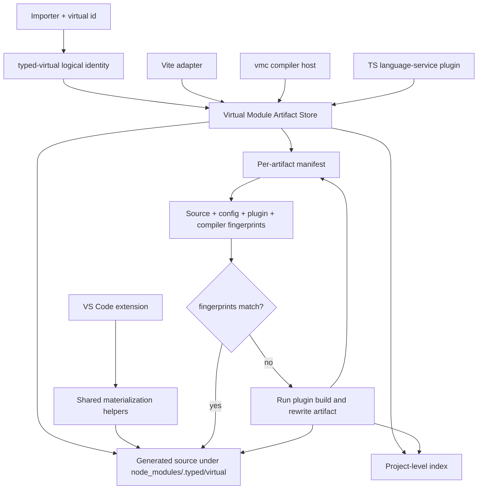
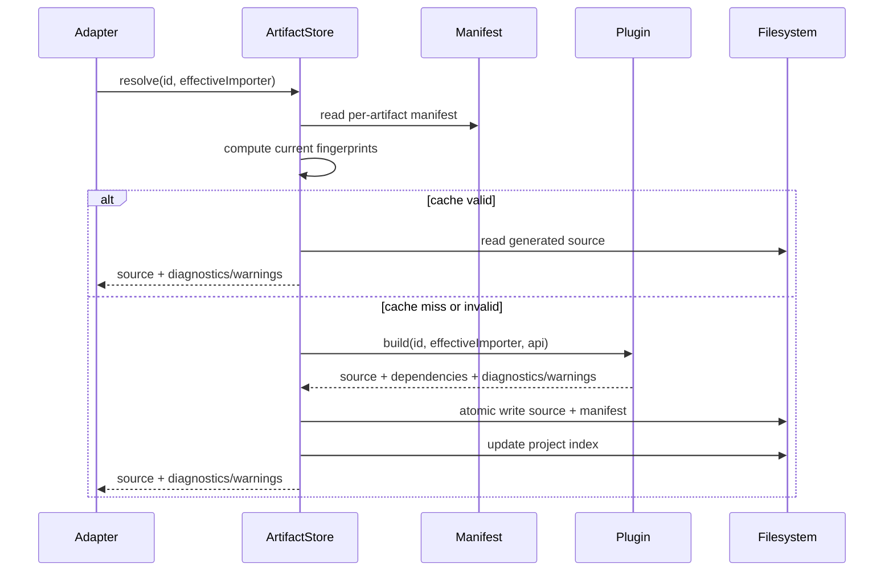

# Specification — Virtual Module Artifact Store

## System Context and Scope

The virtual module artifact store is the shared generated-artifact substrate for `@typed/virtual-modules`. It preserves `typed-virtual://` as the portable logical identity for virtual modules while materializing generated source and cache metadata under `node_modules/.typed/virtual`.

This specification covers the first compiler-substrate tranche approved in `.docs/workflows/20260515-2018-typed-framework-evolution/requirements.md`. Higher-level framework plugins (`@typed/app` router, HTTP API, Environment, type-config, and create-app) must treat this artifact store as the stable core interface before adding new generated surfaces.

In scope:

- Logical virtual identity to physical artifact mapping.
- Per-artifact manifests and project-level index.
- Source/config/plugin/compiler fingerprints for cache validity.
- Atomic writes and last-valid-writer-wins concurrency.
- Persistent cache behavior and explicit cleanup.
- Shared use by Vite, vmc, TS plugin, and VS Code.
- Consistent diagnostic/warning storage and surfacing.

Out of scope:

- App-level router or HTTP API behavior beyond consuming the artifact store.
- Environment variable or typed config virtual module design.
- Async plugin hooks.
- Distributed or remote cache protocol.

## Component Responsibilities and Interfaces

### Logical Identity

`typed-virtual://` remains the stable logical identity for virtual modules. Logical identities are portable and are the primary identity used in manifests, diagnostics, editor metadata, and plugin-facing APIs.

Plugin `build(id, importer, api)` calls continue to receive the real effective importer and virtual module id. Plugins do not receive physical artifact paths as their core identity input.

### Physical Artifact Root

The default physical root is:

```text
node_modules/.typed/virtual
```

The artifact root contains generated source files, per-artifact manifests, and a project-level index. Normal dev/build/typecheck flows do not prune this directory automatically.

Cleanup is serialized by a sibling lock outside the deleted tree:

```text
node_modules/.typed/virtual.cleanup.lock
```

Both artifact materialization and explicit cleanup acquire this lock. This prevents cleanup from deleting active writer locks or partially written generated artifacts.

### Per-Artifact Manifest

Each generated artifact has a manifest written atomically alongside the generated source. The manifest is the cache-validity authority for that artifact.

Required fields:

- manifest schema version
- logical identity (`typed-virtual://...`)
- virtual id
- effective importer
- plugin name
- physical generated source path
- generated source hash
- source input fingerprints
- plugin fingerprints
- compiler fingerprints
- dependency descriptors
- diagnostics
- warnings
- created/updated metadata for debugging only

Diagnostics and warnings are stored in the manifest. Separate diagnostic sidecar files are not required for v1.

### Project-Level Index

The project-level index maps logical identities to artifact manifest paths and summary metadata. It exists for discovery, debugging, and explicit cleanup. Cache validity still comes from the per-artifact manifest.

The index is best-effort rebuildable from per-artifact manifests. A missing or corrupt index must not invalidate otherwise valid per-artifact manifests.

### Fingerprints

Cache validity is content-addressed. Timestamp and watch events can trigger checks but do not prove correctness.

Required fingerprint inputs:

- source file content hashes for all source/dependency inputs recorded by the TypeInfo API dependency descriptors
- explicit virtual module plugin config hash
- resolved plugin module file hash
- plugin package/version metadata when available
- TypeScript version
- full parsed `tsconfig`
- generated source hash

If a fingerprint cannot be computed, the manifest records the reason and the artifact is not reusable as a cache hit unless the relevant requirement explicitly permits a fallback.

### Artifact Store API

The store exposes synchronous operations compatible with the existing virtual module core:

- resolve logical identity from `id` and effective importer
- read a manifest by logical identity
- validate cache entry against current fingerprints
- materialize generated source and manifest atomically
- update project-level index
- surface diagnostics/warnings from build or manifest validation
- explicitly clean/prune generated artifacts

The public `@typed/virtual-modules` surface includes:

- `createVirtualArtifactStore(options)`
- `VirtualArtifactStore.clean(): CleanVirtualArtifactsResult`
- `materializeVirtualFile(...)`
- `rewriteSourceForPreviewLocation(...)`

`clean()` removes `node_modules/.typed/virtual` and returns whether that root existed. It is intentionally explicit; invalidation, rebuild, build, and typecheck paths must not call it.

Adapters may keep process-local hot caches, but those caches are accelerators over the manifest contract, not the correctness boundary.

### Adapter Integration

Vite, vmc, and the TypeScript plugin consume the artifact store. VS Code consumes the shared core materialization path and remains a future artifact-store fingerprint/cache integration target.

- Vite resolves and loads virtual modules through the artifact store instead of recomputing incompatible in-memory source for the same identity.
- vmc uses the artifact store through the compiler-host adapter and keeps watch-mode adapter lifetime compatible with persistent invalidation.
- The TypeScript plugin uses the artifact store through the language-service adapter.
- VS Code uses the same core materialization path and no longer owns separate normal-case disk preview logic.

Implementation notes:

- vmc and the TypeScript plugin rebuild package `dist` outputs before tests that execute compiled entrypoints.
- TypeScript plugin source fingerprints include language-service snapshots when available so editor state does not silently reuse disk-only hashes.
- If resolver/config inputs drift from the startup resolver state, the TypeScript plugin fails closed instead of writing stale resolver output under current fingerprints.
- Diagnostics and warnings in manifests describe successful materializations. Failed plugin-build diagnostic-only manifests remain deferred to a separate diagnostic-artifact design because there is no generated source to materialize.
- VS Code currently shares the normal materialization/rewrite helper path. Full VS Code artifact-store fingerprint integration remains future work because the extension does not yet own the same compiler/config fingerprint contract as vmc and the TypeScript plugin.

## System Diagrams (Mermaid)





## Data and Control Flow

1. An adapter receives a virtual module request with `id` and importer.
2. The adapter resolves the effective importer. For virtual-to-virtual imports, this walks back to the root real-file importer.
3. The artifact store computes the logical `typed-virtual://` identity.
4. The store reads the per-artifact manifest if present.
5. The store computes current source/config/plugin/compiler fingerprints.
6. If fingerprints match and generated source exists with the recorded hash, the store returns a cache hit.
7. If fingerprints do not match, source is missing, or the manifest is invalid, the store runs the plugin build.
8. The store acquires the cleanup lock, artifact lock, and project-index lock before writing.
9. The store writes generated source and manifest using atomic replacement.
10. The store updates the project-level index.
11. The adapter surfaces returned source and diagnostics through its normal host mechanism.

Explicit cleanup flow:

1. A caller invokes `VirtualArtifactStore.clean()`.
2. The store acquires `node_modules/.typed/virtual.cleanup.lock`.
3. The store removes `node_modules/.typed/virtual`.
4. The store returns `{ removed, rootPath }`.

## Failure Modes and Mitigations

| failure                              | impact                                                                  | mitigation                                                                                                                              |
| ------------------------------------ | ----------------------------------------------------------------------- | --------------------------------------------------------------------------------------------------------------------------------------- |
| Corrupt per-artifact manifest        | Cache entry cannot be trusted                                           | Treat as cache miss, rebuild, emit clear diagnostic if rebuild fails.                                                                   |
| Corrupt project-level index          | Discovery/cleanup degraded                                              | Rebuild index from per-artifact manifests or continue without index; do not invalidate valid artifacts.                                 |
| Missing generated source             | Manifest cannot be used                                                 | Treat as cache miss and rebuild.                                                                                                        |
| Generated source hash mismatch       | Possible partial write or external edit                                 | Treat as invalid; rebuild with atomic write.                                                                                            |
| Plugin fingerprint unavailable       | Unsafe cache reuse                                                      | Mark entry non-reusable unless explicitly allowed by a future compatibility rule.                                                       |
| Concurrent writers                   | Last write wins could overwrite another valid artifact                  | Atomic writes and manifest validation ensure readers only observe complete valid entries.                                               |
| Cleanup races active materialization | Generated source, manifests, or writer locks could be deleted mid-write | Serialize `clean()` and `materialize()` through `node_modules/.typed/virtual.cleanup.lock`, which is outside the deleted artifact root. |
| Watch event missed                   | Stale cache risk                                                        | Fingerprint validation on read remains authoritative.                                                                                   |
| Regex import rewrite misses syntax   | Broken generated source                                                 | Replace regex-only behavior with robust module-specifier handling or explicitly documented unsupported syntax.                          |

## Requirement Traceability

| requirement_id | design_element                             | notes                                                |
| -------------- | ------------------------------------------ | ---------------------------------------------------- |
| FR-1           | Logical Identity                           | Keeps `typed-virtual://` stable.                     |
| FR-2           | Physical Artifact Root                     | Defaults to `node_modules/.typed/virtual`.           |
| FR-3           | Per-Artifact Manifest, Project-Level Index | Manifest/cache protocol.                             |
| FR-4           | Project-Level Index                        | Both manifest layers.                                |
| FR-5           | Per-Artifact Manifest                      | Diagnostics and warnings stored in manifest.         |
| FR-6           | Fingerprints                               | Cache reuse validity.                                |
| FR-7           | Fingerprints                               | Plugin implementation/config/package identity.       |
| FR-8           | Fingerprints                               | TypeScript version and parsed tsconfig.              |
| FR-9           | Adapter Integration                        | Shared contract for Vite, vmc, TS plugin, VS Code.   |
| FR-10          | Artifact Store API                         | Atomic writes and last-valid-writer-wins.            |
| FR-11          | Physical Artifact Root                     | Persistent cache behavior.                           |
| FR-12          | Data and Control Flow                      | Virtual-to-virtual import handling.                  |
| FR-13          | Adapter Integration, Failure Modes         | Consistent diagnostics.                              |
| FR-14          | Artifact Store API, Project-Level Index    | Explicit clean/prune tooling.                        |
| NFR-1          | Fingerprints                               | Content-addressed correctness.                       |
| NFR-2          | Per-Artifact Manifest, Project-Level Index | Deterministic and inspectable metadata.              |
| NFR-3          | Artifact Store API                         | Atomic disk writes.                                  |
| NFR-4          | Artifact Store API                         | Cross-process local development safety.              |
| NFR-5          | Adapter Integration                        | Reduced recomputation across surfaces.               |
| NFR-6          | Logical Identity                           | Avoid physical path dependency in plugin APIs.       |
| NFR-7          | Failure Modes                              | Robust module specifier handling.                    |
| NFR-8          | Failure Modes                              | Fail clearly on corrupt/stale/missing artifacts.     |
| NFR-9          | Testing Strategy                           | Regression coverage before higher-level plugin work. |

## References Consulted

- specs:
  - `.docs/specs/virtual-modules/spec.md`
  - `.docs/specs/typed-config/spec.md`
- adrs:
  - `.docs/adrs/20260220-2245-virtual-modules-sync-core-and-loaders.md`
- workflows:
  - `.docs/workflows/20260515-2018-typed-framework-evolution/intent.md`
  - `.docs/workflows/20260515-2018-typed-framework-evolution/scope.md`
  - `.docs/workflows/20260515-2018-typed-framework-evolution/01-brainstorming.md`
  - `.docs/workflows/20260515-2018-typed-framework-evolution/02-research.md`
  - `.docs/workflows/20260515-2018-typed-framework-evolution/requirements.md`

## ADR Links

- `.docs/adrs/20260515-2018-virtual-module-artifact-store.md`
