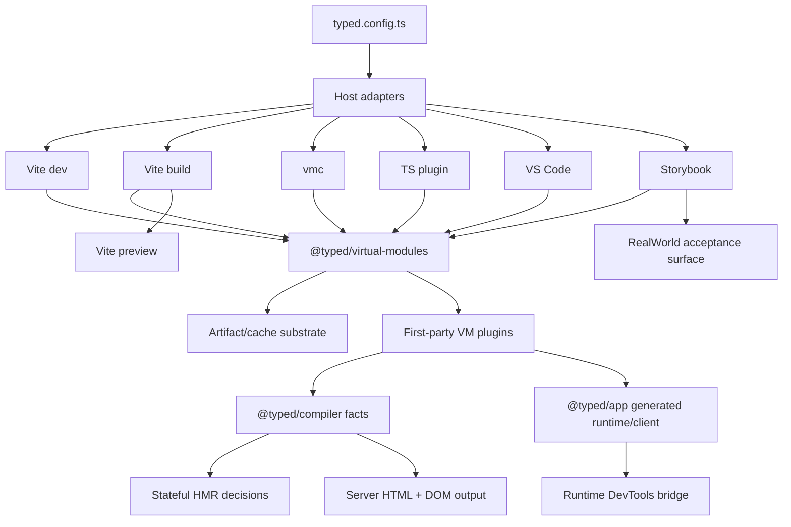
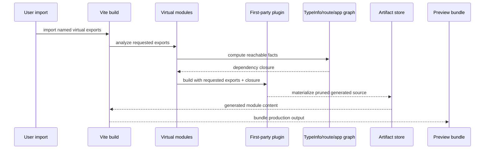

# Specification - Virtual Modules Release Slice

Status: proposed

## System Context and Scope

This spec defines the release slice that turns the current virtual-module work into a reviewable PR. It does not replace the canonical virtual-module, artifact-store, config, Storybook, DevTools, or compiler specs. It coordinates them into one acceptance path for dev, build, preview, `vmc`, TypeScript language service, VS Code, Storybook, and RealWorld.

The slice has four hard boundaries:

1. Generated HttpApi client output uses the raw Effect `HttpApiClient` surface. `TypedClient` wrappers are removed.
2. Production virtual-module output is import-precise by combined dependency closure: requested exports, plugin-declared internal dependencies, and TypeInfo/route/app graph reachability.
3. VS Code and the TypeScript plugin consume the shared virtual-module artifact/cache substrate for generated content and dependency invalidation.
4. Storybook, DevTools, compiler/HMR, and RealWorld prove the same generated app/runtime/client path used by application dev/build/preview.

Out of scope:

- Replacing Effect HttpApi.
- Filesystem routing or generated route files outside virtual modules.
- Parallel Storybook runtime paths.
- DevTools UI polish before live capability proof.
- TypeScript 7-only APIs as a dependency for this release.

## Component Responsibilities and Interfaces

| component | release-slice responsibility |
| --------- | ---------------------------- |
| `@typed/virtual-modules` | Requested-export analysis, combined dependency closure, virtual identity, dependency descriptors, and artifact/cache contract. |
| `@typed/virtual-modules-compiler` / `vmc` | TypeScript compiler-host/typecheck/output adapter role. This does not move into `@typed/compiler`. |
| `@typed/compiler` | Static app/template facts, optimized server HTML and DOM output, HMR eligibility/rejection facts, and DevTools correlation facts. |
| `@typed/app` | App runtime composition, generated `typed:browser`, generated raw HttpApi virtual modules, and RealWorld runtime path. |
| `@typed/vite-plugin` | Vite dev/build/preview adaptation, Typed config loading, and production requested-export propagation. |
| `@typed/virtual-modules-ts-plugin` | TypeScript language-service adaptation, hover/diagnostics/definition support, and bounded hot paths. |
| `@typed/virtual-modules-vscode` | VS Code tree/preview/definition presentation backed by shared resolver/artifact/cache substrate. |
| `@typed/storybook` | Storybook framework/preset/renderer/runtime harness consuming the same generated app/runtime/client contracts as apps. |
| `@typed/devtools-*` | Host-neutral protocol, live runtime/compiler facts, and explicit unavailable states for unwired capabilities. |

### Virtual Module Core

`@typed/virtual-modules` owns logical identity, plugin dispatch, requested-export analysis, dependency descriptors, and the artifact/cache contract. It exposes one production build context that every first-party plugin consumes.

Required production context:

```ts
interface ProductionVirtualModuleContext {
  readonly requestedExports: VirtualModuleRequestedExports
  readonly closure: VirtualModuleDependencyClosure
}

type VirtualModuleDependencyClosure =
  | { readonly kind: "all"; readonly reason: string }
  | {
      readonly kind: "partial"
      readonly requested: ReadonlySet<string>
      readonly pluginDeclared: ReadonlySet<string>
      readonly typeInfoReachable: ReadonlySet<string>
      readonly routeOrAppReachable: ReadonlySet<string>
    }
```

The exact runtime type can differ, but the semantics must stay shared: output includes only requested exports and the dependency closure needed to make them type-check and execute.

### First-Party Virtual Module Plugins

Each first-party plugin maps the shared closure contract into its generated output. A plugin may fail closed to all-output only when the analyzer proves the import shape is unsafe to prune, such as side-effect imports, default imports, `export *`, computed namespace access, or escaped namespace values.

Plugins must not use Rollup tree-shaking as the correctness boundary.

### HttpApi Generated Client

`@typed/app` owns HttpApi generated source. Client-mode output exposes:

- `Api`
- `Client`
- `makeClient`
- `makeClientWith`
- direct raw helper types required to preserve `HttpApiClient.ForApi<typeof Api, E, R>`

Client-mode output must not expose `TypedClient`, `TypedClientInput`, `TypedRawClient`, `makeTypedClient`, `makeTypedClientWith`, `makeTypedClientFromRaw`, `OptionalEndpoint`, or generated mapped endpoint wrappers.

Generated code type-checks against the installed Effect declarations used by `@typed/app`.

### Host Adapters

Vite, `vmc`, TypeScript plugin, and VS Code are host adapters over the same logical virtual identities and artifact/cache substrate.

- Vite dev may request all exports for fidelity and debugging.
- Vite build passes requested-export and closure context.
- Vite preview runs the production output.
- `vmc` and TypeScript plugin use the same generated content and dependency descriptors as Vite.
- VS Code uses shared generated content and fingerprints for virtual tree, preview, and go-to-definition. VS Code-only state is presentation cache only.

### Configuration

`typed.config.ts` is the product-level source for framework behavior. Host-specific files may adapt or override host-only behavior, but equivalent app/server/build/preview/storybook virtual-module options must derive from the Typed config model.

### Compiler, HMR, And Templates

`@typed/compiler` owns static facts and optimized template output. It emits:

- module participation facts;
- route/app graph participation;
- template dependency and output facts;
- DevTools source correlation facts;
- HMR eligibility and rejection facts.

Stateful HMR preserves runtime state only when compiler facts prove stable identity and compatible boundaries. Otherwise it reloads or resets.

### DevTools

DevTools uses the host-neutral protocol and runtime bridge. Panels advertise only live wired capabilities. Missing runtime/compiler/analyzer capabilities produce explicit unavailable states.

### Storybook

`@typed/storybook` consumes the same generated app/runtime/client/virtual-module contracts as app surfaces. It must not maintain a parallel runtime or fixture-only proof path for release acceptance.

### RealWorld

`examples/realworld` is the flagship compliance fixture. It is the final integration target for raw client output, production import precision, Vite dev/build/preview, HMR, DevTools, Storybook, and type-check behavior.

## System Diagrams (Mermaid)





## Data and Control Flow

1. Host adapter loads Typed config and resolves virtual-module plugin options.
2. Host adapter resolves a virtual id and importer through the shared virtual-module manager.
3. In dev mode, the adapter may request all exports for inspectability and HMR fidelity.
4. In production build, the adapter analyzes the importing source and passes requested exports to the virtual-module core.
5. The virtual-module core combines requested exports with plugin-declared internals and graph reachability.
6. The plugin emits only required source, helpers, imports, diagnostics, and dependency descriptors.
7. The artifact store materializes generated source and manifest with fingerprints.
8. Vite preview, `vmc`, TS plugin, VS Code, Storybook, and RealWorld consume the same logical generated content.
9. Compiler facts feed HMR decisions, template output, and DevTools source/runtime correlation.
10. Tests and acceptance gates compare generated output, type behavior, runtime behavior, and live tooling behavior.

## Failure Modes and Mitigations

| failure | impact | mitigation |
| ------- | ------ | ---------- |
| Unanalyzable import shape | Unsafe production pruning | Fail closed to all exports with a recorded reason and test-covered fallback. |
| Plugin emits broad output in production | Server-only or stale unsafe code enters graph | Plugin-level pruning tests and generated-source scans. |
| `TypedClient` wrapper remains | Generic endpoint parameters or channels are erased | Generated source, artifact, RealWorld, and Storybook scans block release. |
| Effect HttpApi API drift | Generated code compiles against guessed APIs | Type-check generated output against installed Effect declarations. |
| Stale artifact reused | Editors/builds see removed or incorrect generated code | Dependency-complete fingerprints and fail-closed cache reuse. |
| VS Code owns independent compiler truth | Preview/tree/definition drift from TS plugin/Vite | Shared resolver/artifact path; VS Code caches are presentation-only. |
| Storybook uses fixture-only data | Surface appears stable without proving app runtime path | Storybook gates must consume generated contracts and live DevTools states. |
| Compiler overclaims HMR safety | State is preserved across incompatible code | HMR eligibility facts fail closed; rejected boundaries reset/reload. |
| DevTools panel overclaims capability | Users see misleading inspection state | Capability negotiation and explicit unavailable states. |

## Requirement Traceability

| requirement_id | design_element | notes |
| -------------- | -------------- | ----- |
| FR-1, FR-17 | Host Adapters, RealWorld | Cross-surface consistency and final integration fixture. |
| FR-2, FR-3 | Virtual Module Core, First-Party Plugins | Shared combined closure contract for production output. |
| FR-4, FR-5, FR-6, FR-18 | HttpApi Generated Client | Raw Effect client surface and stale artifact rejection. |
| FR-7, FR-8, FR-9 | Host Adapters | Shared cache/artifact substrate and editor stability. |
| FR-10 | Configuration | `typed.config.ts` canonical source. |
| FR-11, FR-12 | Storybook, DevTools | Same generated contracts and live/unavailable panel behavior. |
| FR-13, FR-14, FR-15, FR-16 | Compiler, HMR, Templates, DevTools | Compiler facts, optimized output, HMR safety, inspectability. |
| NFR-1 | HttpApi Generated Client, First-Party Plugins | Type safety blocks release. |
| NFR-2 | Virtual Module Core | Import precision is correctness. |
| NFR-3, NFR-4 | Host Adapters, Artifact Store | Dependency-complete invalidation and hot-path instrumentation. |
| NFR-5, NFR-9 | Component Boundaries | Simplification and reviewable sequencing. |
| NFR-6 | Storybook | Measured reliability gates. |
| NFR-7 | Compiler, Templates | Executable proof for optimization claims. |
| NFR-8 | DevTools | Explicit unavailable states. |
| NFR-10 | Memory Design | Workflow memory only until execution proof. |

## Memory Design

Workflow-local memory remains under `.docs/workflows/20260525-1843-virtual-modules-pr-reduction/memory/`. Candidate durable memories are promoted only after execution produces tests, logs, or generated-output evidence. Planning must link tasks to the evidence that makes a memory promotable.

## References Consulted

- specs:
  - `.docs/specs/virtual-modules/spec.md`
  - `.docs/specs/virtual-module-artifact-store/spec.md`
  - `.docs/specs/httpapi-virtual-module-plugin/spec.md`
  - `.docs/specs/typed-config/spec.md`
  - `.docs/specs/storybook-framework-integration/spec.md`
  - `.docs/specs/typed-devtools/spec.md`
- adrs:
  - `.docs/adrs/20260515-2018-virtual-module-artifact-store.md`
  - `.docs/adrs/20260516-1318-httpapi-generated-source-effect-source-of-truth.md`
  - `.docs/adrs/20260516-1643-typed-framework-virtual-module-first.md`
  - `.docs/adrs/20260521-2320-runtime-template-compiler-boundaries.md`
  - `.docs/adrs/20260523-1703-typed-devtools-protocol-boundaries.md`
  - `.docs/adrs/20260524-runtime-cohesion-ownership-boundaries.md`
- workflows:
  - `.docs/workflows/20260525-1843-virtual-modules-pr-reduction/intent.md`
  - `.docs/workflows/20260525-1843-virtual-modules-pr-reduction/scope.md`
  - `.docs/workflows/20260525-1843-virtual-modules-pr-reduction/02-research.md`
  - `.docs/workflows/20260525-1843-virtual-modules-pr-reduction/requirements.md`

## ADR Links

- `.docs/adrs/20260525-1956-virtual-module-production-closure.md`
- `.docs/adrs/20260525-1956-httpapi-raw-client-surface.md`
