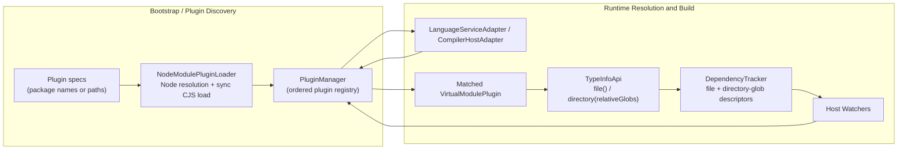
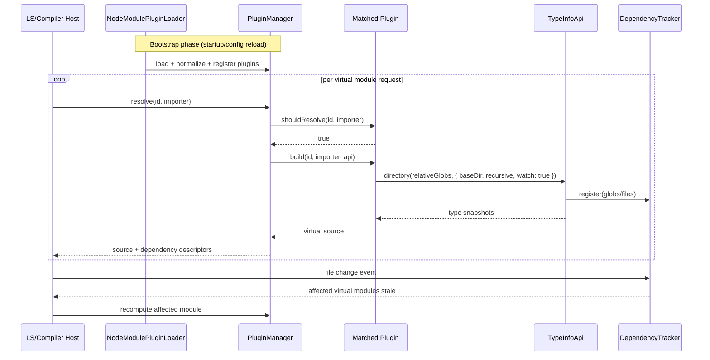

## System Context and Scope

`@typed/virtual-modules` provides a synchronous core for virtual module resolution and source generation in TypeScript-centric workflows. It targets two integration surfaces:

1. Editor workflows through TypeScript Language Service plugin adapters.
2. `tsc`-like type-checking workflows through compiler-host adapters.

Out of scope for v1:

- Async plugin hooks.
- Emit pipeline customization.
- Non-TypeScript host environments.

## Component Responsibilities and Interfaces

### 1) Core Plugin Contract

- `VirtualModulePlugin`:
  - `name: string`
  - `shouldResolve(id: string, importer: string): boolean`
  - `build(id: string, importer: string, api: TypeInfoApi): string`
- All hooks are synchronous.

### 2) Plugin Manager

- Stores ordered plugins.
- Resolution algorithm:
  1. Iterate plugins in registration order.
  2. First plugin returning `true` from `shouldResolve` wins.
  3. Invoke `build` on winner and return normalized virtual module result.
  4. If none matches, return `unresolved`.
- Exposes deterministic error outcomes for plugin exceptions and invalid outputs.

### 3) Type Information API

- Provides rich JSON-like snapshots for plugin author ergonomics.
- Provides path-scoped query operations using relative paths with explicit base resolution:
  - `file(relativePath, options)`
  - `directory(relativeGlobs, options)` where `relativeGlobs` is a string or array of strings
- Snapshot payload exposes a stable discriminated union for type structure, including:
  - `primitive`,
  - `literal`,
  - `union`,
  - `intersection`,
  - `object`/record,
  - `array`,
  - `tuple`,
  - `function` signature,
  - `reference` (generic / alias),
  - `any` / `unknown` / `never`.
- Each snapshot node includes:
  - `kind` (discriminant),
  - human-readable `text`,
  - optional declaration metadata (`symbol`, declaration kind/text, docs),
  - nested nodes where applicable (union members, intersection members, tuple elements, object properties, function parameters/return type, type arguments).
- Path query options include:
  - `baseDir`: explicit base directory for relative path resolution.
  - `recursive`: directory-glob flag for full subtree vs immediate-scope matches.
  - `watch`: register file/directory dependency for recomputation invalidation.
- Directory-glob semantics:
  - globs are resolved relative to `baseDir`.
  - results are de-duplicated and returned in stable sorted order.
  - in non-recursive mode, deep matches are filtered out from final results.
- Supports cacheable lookups keyed by module/importer/program-context identity plus query path/options. Repeated `file()` calls for the same resolved path within a single TypeInfo API session return the cached snapshot (NFR-3 / AC-7); a new session gets a fresh cache.

### 4) Filesystem Plugin Loader

- `NodeModulePluginLoader` resolves plugin specs using Node module resolution semantics.
- Supported input forms:
  - package names (resolved from provided base path),
  - explicit paths.
- Loading policy:
  - synchronous CommonJS loading for filesystem-resolved modules,
  - preloaded plugin objects accepted for ESM-first workflows.
- Normalizes exports (`default` or named object) into `VirtualModulePlugin`.
- Used during plugin-manager setup/bootstrap to discover and register plugins; not part of the per-import module resolution path.

### 5) Adapter Implementation Details

This section is normative and defines which TypeScript APIs are extended/overridden.

#### 5.1 Adapter invariants

- All adapter callbacks are synchronous (`NFR-1`).
- `NodeModulePluginLoader` is bootstrap/config-reload only:
  - load and normalize plugin modules,
  - register/swap plugin snapshots in manager,
  - never run inside per-import runtime resolution.
- Deterministic virtual identity:
  - `virtualKey = "<importer>::<id>"`,
  - `virtualFileName = "<projectRoot>/.typed/virtual/<pluginName>/<stableHash(virtualKey)>.d.ts"`.
- Required adapter state:
  - `recordsByKey: Map<virtualKey, MutableVirtualRecord>`,
  - `recordsByVirtualFile: Map<virtualFileName, MutableVirtualRecord>` (holds the full record, not just the key),
  - `descriptorToVirtualKeys: Map<descriptorKey, Set<virtualKey>>`.

#### 5.2 Host API touchpoints

| Host API                                                             | Adapter behavior                                                                                                    | Why                                                        |
| -------------------------------------------------------------------- | ------------------------------------------------------------------------------------------------------------------- | ---------------------------------------------------------- |
| `LanguageServiceHost.resolveModuleNameLiterals` (preferred)          | Intercept import literals first; resolve via plugin manager; delegate unresolved entries to original host behavior. | Primary LS resolution hook in modern TS (`FR-4`, `NFR-4`). |
| `LanguageServiceHost.resolveModuleNames` (fallback)                  | Same behavior when literals hook is not available.                                                                  | Compatibility across host variants.                        |
| `LanguageServiceHost.getScriptSnapshot`                              | Return virtual source snapshot for virtual files; lazily rebuild when stale.                                        | Supplies in-memory virtual source to LS program graph.     |
| `LanguageServiceHost.getScriptVersion`                               | Return monotonic version per virtual file.                                                                          | Correct LS incremental invalidation.                       |
| `LanguageServiceHost.getProjectVersion` (if available)               | Append/increment adapter epoch when virtual state changes.                                                          | Forces project graph refresh in editors.                   |
| `LanguageServiceHost.fileExists` / `readFile`                        | Overlay virtual filesystem behavior for virtual paths; delegate all others.                                         | Keeps resolver/source probes consistent.                   |
| `LanguageService.getSemanticDiagnostics` / `getSyntacticDiagnostics` | Append structured adapter/plugin errors as diagnostics.                                                             | Non-crashing error surfacing (`NFR-6`).                    |
| `CompilerHost.resolveModuleNameLiterals` (preferred)                 | Resolve imports through manager first; delegate unresolved imports.                                                 | Primary compiler hook in TS 5.x (`FR-5`, `NFR-4`).         |
| `CompilerHost.resolveModuleNames` (fallback)                         | Same as above where literals hook is unavailable.                                                                   | Backward compatibility.                                    |
| `CompilerHost.getSourceFile` / `getSourceFileByPath` (if available)  | Materialize `SourceFile` from virtual source for virtual files; delegate non-virtual files.                         | Injects virtual modules into program graph.                |
| `CompilerHost.fileExists` / `readFile`                               | Virtual filesystem overlay for compiler path probes.                                                                | Consistent behavior across resolution and source loading.  |
| `CompilerHost.hasInvalidatedResolutions` (if available)              | Return `true` for affected paths after dependency-triggered invalidation.                                           | Correct incremental/watch re-resolution.                   |
| `watchFile` / `watchDirectory` on host/watch host                    | Register descriptor-derived watchers and invalidate dependent virtual records on callbacks.                         | Watch-driven recomputation (`FR-14`, `NFR-11`).            |

#### 5.3 LanguageServiceAdapter flow

1. During plugin `create(info)`, capture original `languageService` and `languageServiceHost`.
2. Patch host resolution APIs (`resolveModuleNameLiterals`, fallback `resolveModuleNames`).
3. For each `(id, importer)`:
   - manager resolve,
   - unresolved => delegate to original host resolution,
   - resolved => upsert `VirtualRecord`, return virtual resolved module entry,
   - error => record structured diagnostic and return unresolved fallback.
4. Patch host source APIs (`getScriptSnapshot`, `getScriptVersion`, `fileExists`, `readFile`) for virtual files.
5. Patch diagnostics APIs to append adapter diagnostics.
6. Watch path:
   - register `watchFile` / `watchDirectory` (when host exposes them),
   - on callback mark dependent virtual records stale and bump version/epoch,
   - rebuild lazily on next snapshot/resolution request.

#### 5.4 CompilerHostAdapter flow

1. Wrap base host from `createCompilerHost` or `createWatchCompilerHost`.
2. Patch resolution APIs (`resolveModuleNameLiterals`, fallback `resolveModuleNames`).
3. For each `(id, importer)`:
   - unresolved => delegate,
   - resolved => upsert `VirtualRecord`, return virtual `ResolvedModule`.
4. Patch source APIs (`getSourceFile`, optional `getSourceFileByPath`) to return virtual source files.
5. Patch `fileExists` / `readFile`.
6. Watch mode:
   - register watchers from dependency descriptors,
   - mark affected records stale and record invalidated paths,
   - return `true` from `hasInvalidatedResolutions` for affected paths when supported.

#### 5.5 Dependency tracking and watch descriptors

- Type queries can register:
  - file descriptors: `{ type: "file", path }`
  - directory-glob descriptors: `{ type: "glob", baseDir, relativeGlobs, recursive }`
- Plugin manager returns descriptors with build output.
- Adapters own descriptor-to-watcher wiring and invalidation policy.

## System Diagrams (Mermaid)

## Data and Control Flow

1. On startup (or plugin config reload), plugin specs are loaded via `NodeModulePluginLoader` and registered in `PluginManager`.
2. A host integration asks to resolve/import `id` from `importer`.
3. Adapter calls plugin manager with `(id, importer)`.
4. Manager picks first matching plugin via `shouldResolve`.
5. Manager constructs `TypeInfoApi` for that context and invokes `build`.
6. During build, plugin may query relative file/directory type information and optionally register dependencies.
7. Adapter receives virtual source plus dependency descriptors and maps output into host-specific module/source structures.
8. If unresolved, adapter falls back to default TypeScript resolution.
9. If error, adapter records structured diagnostics and avoids host crash.
10. If watched dependencies change, adapter invalidates stale virtual module outputs and triggers recomputation.

## Failure Modes and Mitigations

- Plugin throws during `build`:
  - Mitigation: return typed plugin error result; adapter surfaces diagnostic.
- Plugin returns invalid source (non-string / empty invalid contract):
  - Mitigation: validation + structured error result.
- Filesystem plugin cannot resolve:
  - Mitigation: deterministic load error with plugin spec and base path context.
- Filesystem plugin resolves but export is invalid:
  - Mitigation: export normalization + validation failure result.
- Repeated expensive type extraction:
  - Mitigation: cache snapshot lookups by stable context keys.
- Relative path cannot be resolved from base directory:
  - Mitigation: deterministic path-resolution error with base/path details.
- Invalid relative glob pattern:
  - Mitigation: deterministic query-validation error with glob and base directory context.
- Excessive recursive directory watch scope:
  - Mitigation: explicit watch descriptors and host-controlled debounce/invalidation policy.

## Requirement Traceability

| requirement_id | design_element                 | notes                                                                                                 |
| -------------- | ------------------------------ | ----------------------------------------------------------------------------------------------------- |
| FR-1           | Core plugin contract           | `VirtualModulePlugin` signature defined as synchronous.                                               |
| FR-2           | Plugin manager                 | Ordered first-match algorithm.                                                                        |
| FR-3           | Type information API           | Rich JSON-like snapshots.                                                                             |
| FR-4           | LanguageServiceAdapter         | Editor integration surface.                                                                           |
| FR-5           | CompilerHostAdapter            | CLI type-check integration surface.                                                                   |
| FR-6           | Manager invocation contract    | `id` and `importer` are required parameters.                                                          |
| FR-7           | Unresolved result model        | Explicit unresolved path and fallback.                                                                |
| FR-8           | NodeModulePluginLoader         | Node module resolution semantics.                                                                     |
| FR-9           | Loader input normalization     | package-name and explicit-path support.                                                               |
| FR-10          | Loader export normalization    | Sync load + normalized plugin shape.                                                                  |
| FR-11          | Structural type snapshot model | Explicit kinds for unions/intersections/records/arrays/tuples/functions/etc.                          |
| FR-12          | Relative file queries          | `TypeInfoApi.file()` resolves from explicit base directory.                                           |
| FR-13          | Directory-glob queries         | `TypeInfoApi.directory()` supports one-or-many relative globs with recursive/non-recursive traversal. |
| FR-14          | Watch dependency registration  | Queries can register watch descriptors for recomputation.                                             |
| NFR-1          | Public API signatures          | No Promise-returning hooks.                                                                           |
| NFR-2          | Type snapshot schema           | JSON-like payload only.                                                                               |
| NFR-3          | Snapshot caching               | Cache key strategy in TypeInfo API.                                                                   |
| NFR-4          | TS compatibility boundary      | Designed around TS 5.9 host/plugin APIs.                                                              |
| NFR-5          | Package boundaries             | Shared core with thin adapters.                                                                       |
| NFR-6          | Error model                    | Structured results, non-crashing behavior.                                                            |
| NFR-7          | Loader execution model         | End-to-end sync loader path.                                                                          |
| NFR-8          | Deterministic resolution       | Base-path-aware Node resolution behavior.                                                             |
| NFR-9          | Stable rich snapshot contract  | Discriminated-union schema without TS internal types.                                                 |
| NFR-10         | Deterministic path traversal   | Stable path normalization and ordering for file/directory queries.                                    |
| NFR-11         | Sync watch descriptors         | Synchronous, serializable dependency registration contract.                                           |

## References Consulted

- specs:
  - `.docs/specs/virtual-modules/requirements.md`
- adrs:
  - `.docs/adrs/20260220-2245-virtual-modules-sync-core-and-loaders.md` (this stage)
- workflows:
  - `.docs/workflows/20260220-2209-virtual-modules/01-brainstorming.md`
  - `.docs/workflows/20260220-2209-virtual-modules/02-research.md`

## ADR Links

- `.docs/adrs/20260220-2245-virtual-modules-sync-core-and-loaders.md`
