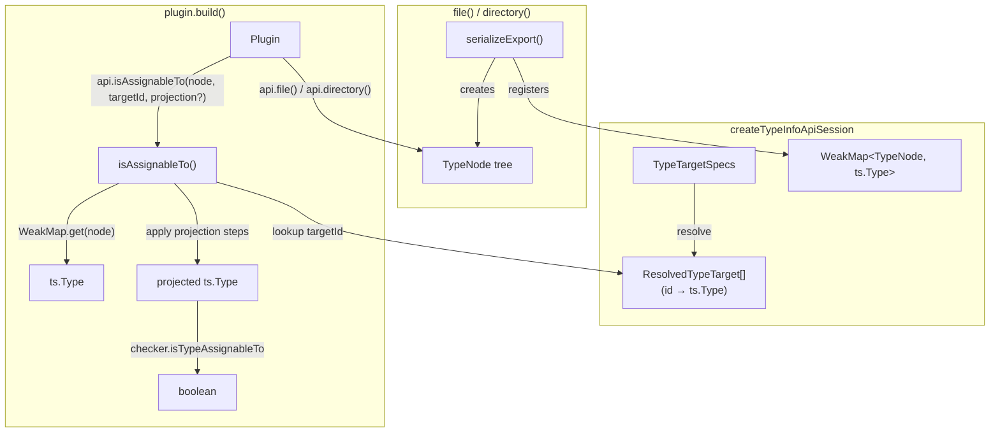

# Specification: Composable Type Projections for TypeInfoApi

## System Context and Scope

TypeInfoApi provides compile-time type introspection for virtual module plugins. Currently, assignability checking is pre-computed during snapshot creation with four hardcoded extraction paths. This spec replaces that with a dynamic `isAssignableTo` method on `TypeInfoApi` that plugins call at query time with any combination of resolved target and projection.

**In scope**: TypeInfoApi `isAssignableTo` method, `TypeProjectionStep` type, WeakMap registration in `serializeTypeNode`, removal of pre-computed assignability fields from `ExportedTypeInfo`, consumer migration.

**Out of scope**: Type target resolution changes, bootstrap changes, new assignability modes, high-compatibility type construct expansion (separate workflow).

## Component Responsibilities and Interfaces

### TypeProjectionStep (new type in `types.ts`)

```ts
export type TypeProjectionStep =
  | { readonly kind: "returnType" }
  | { readonly kind: "param"; readonly index: number }
  | { readonly kind: "typeArg"; readonly index: number }
  | { readonly kind: "property"; readonly name: string };
```

### TypeInfoApi (extended interface in `types.ts`)

```ts
export interface TypeInfoApi {
  file(relativePath: string, options: TypeInfoFileQueryOptions): FileSnapshotResult;
  directory(
    relativeGlobs: string | readonly string[],
    options: TypeInfoDirectoryQueryOptions,
  ): readonly TypeInfoFileSnapshot[];
  resolveExport(
    baseDir: string,
    filePath: string,
    exportName: string,
  ): ExportedTypeInfo | undefined;

  /** Dynamic structural assignability check against a resolved type target. */
  isAssignableTo(
    node: TypeNode,
    targetId: string,
    projection?: readonly TypeProjectionStep[],
  ): boolean;
}
```

### ExportedTypeInfo (simplified in `types.ts`)

```ts
export interface ExportedTypeInfo {
  readonly name: string;
  readonly declarationKind?: string;
  readonly declarationText?: string;
  readonly docs?: string;
  readonly type: TypeNode;
  // assignableTo, returnTypeAssignableTo, firstParamAssignableTo,
  // returnTypeEffectSuccessAssignableTo — all REMOVED
}
```

### Internal: TypeNode Registry (WeakMap in `TypeInfoApi.ts`)

Per-session `WeakMap<TypeNode, ts.Type>` created in `createTypeInfoApiSession`. Passed into `serializeTypeNode` (and transitively into `serializeFunctionSignature`, `serializeObjectProperties`, etc.). Every TypeNode object returned by the serializer is registered.

## System Diagrams (Mermaid)



## Data and Control Flow

### Registration (during serialization)

1. `serializeTypeNode(tsType, ...)` creates a `TypeNode` object
2. Before returning, registers `weakMap.set(typeNode, tsType)`
3. Recursive calls (union elements, function params/return, type args, properties) also register their nodes
4. The WeakMap is closed over by the `TypeInfoApi` instance

### Query (during plugin build)

1. Plugin calls `api.isAssignableTo(node, targetId, projection?)`
2. Implementation looks up `weakMap.get(node)` → `ts.Type | undefined`
3. If undefined → return `false`
4. If projection is provided, apply each step sequentially:
   - `returnType`: get first call signature return type
   - `param[i]`: get ith parameter type from first call signature
   - `typeArg[i]`: get ith type argument via `checker.getTypeArguments`
   - `property[name]`: get property via `type.getProperty(name)`, resolve type
5. If any step fails (no call signature, index out of bounds, property not found) → return `false`
6. Look up `targetId` in resolved targets map → `ts.Type`
7. If target not found → return `false`
8. Call `isAssignableTo(projectedType, targetType, checker, tsMod, mode)` → `boolean`

### Plugin navigation pattern

Plugins can also navigate the TypeNode tree manually and pass sub-nodes:

```ts
const returnType = getCallableReturnType(exp.type);
if (returnType && api.isAssignableTo(returnType, "Effect")) {
  // return type is an Effect
  if (returnType.kind === "reference" && returnType.typeArguments?.[0]) {
    if (api.isAssignableTo(returnType.typeArguments[0], "Option")) {
      // Effect success type is Option
    }
  }
}
```

This works because sub-nodes (returnType, typeArguments[0]) were registered during serialization.

## Failure Modes and Mitigations

| Failure Mode                        | Cause                                                       | Mitigation                                                                |
| ----------------------------------- | ----------------------------------------------------------- | ------------------------------------------------------------------------- |
| TypeNode not in WeakMap             | Node constructed by plugin, not from API                    | Return `false`. Document in JSDoc.                                        |
| Projection step fails               | Wrong step for type shape (e.g. returnType on non-function) | Return `false`. No throw.                                                 |
| Target not resolved                 | Module not in program or bootstrap missing                  | Return `false`. Existing failWhenNoTargetsResolved handles session-level. |
| Internal TS API error in projection | getTypeArguments etc. may throw on edge types               | Wrap in try/catch, call onInternalError, return `false`.                  |

## Requirement Traceability

| requirement_id | design_element                             | notes                                                                     |
| -------------- | ------------------------------------------ | ------------------------------------------------------------------------- |
| FR-1           | `TypeInfoApi.isAssignableTo` method        | Dynamic API on interface                                                  |
| FR-2           | WeakMap in `serializeTypeNode`             | Register all nodes recursively                                            |
| FR-3           | `TypeProjectionStep` type                  | 4 step kinds                                                              |
| FR-4           | Step failure → false                       | In `applyProjection` implementation                                       |
| FR-5           | WeakMap miss → false                       | In `isAssignableTo` implementation                                        |
| FR-6           | Remove 4 fields from `ExportedTypeInfo`    | Breaking change to interface                                              |
| FR-7           | TypeTargetSpec unchanged                   | No modification                                                           |
| FR-8           | Exports from `types.ts` and `index.ts`     | TypeProjectionStep + isAssignableTo                                       |
| FR-9           | Consumer migration                         | routeTypeNode.ts, buildRouteDescriptors.ts, HttpApiVirtualModulePlugin.ts |
| NFR-1          | Synchronous implementation                 | Same as all TypeInfoApi                                                   |
| NFR-2          | WeakMap GC semantics                       | No ownership, entries collected with nodes                                |
| NFR-3          | Projection is O(steps) before checker call | Typically 0-3 steps                                                       |

## References Consulted

- specs: `.docs/specs/virtual-modules/spec.md`
- adrs: none modified
- workflows: `20260224-2130-composable-type-projections/01-brainstorming.md`, `02-research.md`, `03-requirements.md`

## ADR Links

No new ADR needed; this is an evolution of the existing type target system design (original design in `.docs/workflows/20250222-2100-typeinfoapi-structural-typecheck/memory/02-design-structural-type-targets.md`).

---

## Testing Strategy

### Test Type Taxonomy

- **unit**: `TypeInfoApi.test.ts` — test `isAssignableTo` with fixtures for each projection step, WeakMap registration of sub-nodes, failure modes. Also test `applyProjection` internal function directly if exported for testing.
- **integration**: `RouterVirtualModulePlugin.test.ts`, `HttpApiVirtualModulePlugin.test.ts` — verify migrated consumers produce correct build output using the dynamic API.
- **e2e**: N/A — no runtime behavior change; this is a compile-time API.

### Critical Path Scenarios

| ts_id | scenario                                                                                                    | maps_to_fr_nfr | maps_to_ac | blocking |
| ----- | ----------------------------------------------------------------------------------------------------------- | -------------- | ---------- | -------- |
| TS-1  | `isAssignableTo(node, "Fx")` returns true for Fx-typed export                                               | FR-1, FR-2     | AC-1       | yes      |
| TS-2  | `isAssignableTo(node, "Option", [returnType, typeArg(0)])` returns true for Effect\<Option, E, R\> function | FR-1, FR-3     | AC-1       | yes      |
| TS-3  | Sub-node (e.g. `functionNode.returnType`) passed directly returns correct result                            | FR-2           | AC-2       | yes      |
| TS-4  | Projection on non-matching shape returns false                                                              | FR-4           | AC-3       | yes      |
| TS-5  | Plugin-constructed TypeNode returns false                                                                   | FR-5           | AC-4       | no       |
| TS-6  | Router plugin test suite passes with migrated API                                                           | FR-9           | AC-6       | yes      |
| TS-7  | HttpApi plugin test suite passes with migrated API                                                          | FR-9           | AC-6       | yes      |

### Coverage Targets

- critical_path_target: 100% of TS-\* scenarios passing
- code_coverage_target: projection logic and WeakMap registration fully covered
- validation_hooks: `pnpm test` in CI, `tsc -b` type check, `ReadLints` on modified files

### Dependency Readiness Matrix

| dep                                                                   | status | unblock_action                                   |
| --------------------------------------------------------------------- | ------ | ------------------------------------------------ |
| TypeScript checker API (getSignatures, getTypeArguments, getProperty) | ready  | N/A — public APIs                                |
| WeakMap (ES2015)                                                      | ready  | N/A — baseline                                   |
| Existing test fixtures                                                | ready  | May need minor fixture extensions for projection |

### Acceptance Failure Policy

- If a TS-\* blocking scenario fails → fix before proceeding to finalization
- If a dependency is incomplete → prioritize unblocking before new test authoring
