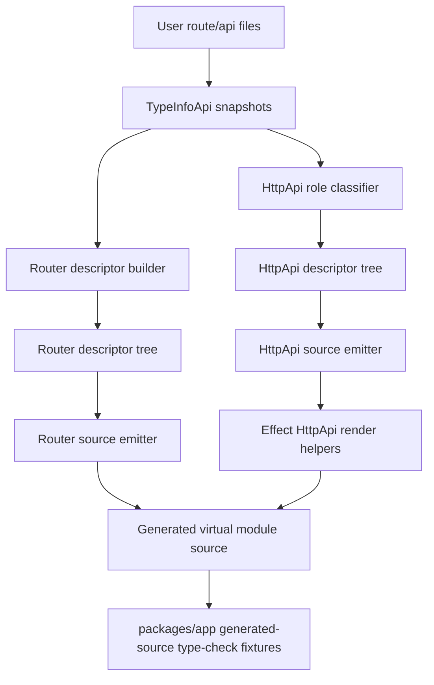
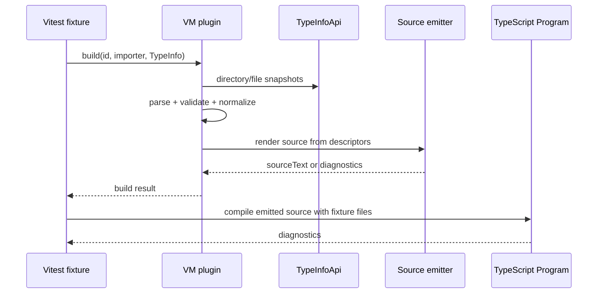

# Specification — Router and HttpApi Implementation Hardening

Status: approved.

## System Context and Scope

This specification defines the hardening design for the Router and HttpApi virtual-module plugin implementations in `@typed/app`.

Primary scope:

- generated-source correctness for `router:` and `api:` virtual modules;
- direct type-check proof for emitted virtual module source in `packages/app` Vitest fixtures;
- HttpApi generated output aligned to installed `effect@4.0.0-beta.66` declarations;
- OpenAPI annotations and exposure controls through installed Effect APIs;
- fail-clear diagnostics for participating invalid source files;
- non-participation semantics for unrelated reserved-looking HttpApi files.

Out of scope:

- env/config/create-app framework plugins;
- broad Vite/editor integration proof unless generated-source fixture proof exposes a host-integration gap;
- implementing unsupported stale Effect API references such as `OpenApi.fromApi({ additionalProperties })`;
- treating arbitrary underscore-prefixed files as plugin errors.

## Component Responsibilities and Interfaces

### 1. Generated Source Type-Check Harness

Owned by `packages/app` tests.

Responsibilities:

- build virtual module source through real `createRouterVirtualModulePlugin` and `createHttpApiVirtualModulePlugin`;
- write emitted source into fixture programs or in-memory compiler inputs;
- compile emitted source against the same module resolution fallbacks used by package tests;
- report TypeScript diagnostics as test failures with enough context to identify the generated file and source fixture.

Interface shape:

```ts
type GeneratedSourceFixture = {
  readonly sourceText: string;
  readonly generatedPath: string;
  readonly rootFiles: readonly string[];
  readonly expectedDiagnostics?: readonly string[];
};
```

### 2. Router Hardening Boundary

Owned by `RouterVirtualModulePlugin`, `buildRouteDescriptors`, `routerDescriptorTree`, and `emitRouterSource`.

Responsibilities:

- keep descriptor construction separate from rendering;
- prove generated Router source type-checks for representative route trees;
- preserve existing observable composition order unless planning identifies a proven mismatch with `Matcher`;
- replace user-reachable renderer invariant throws with structured diagnostics or earlier validation;
- keep unrelated renderer internal errors as internal invariants only when tests prove validation prevents user source from reaching them.

### 3. HttpApi Convention Parity Boundary

Owned by `HttpApiVirtualModulePlugin`, `httpapiFileRoles`, `httpapiDescriptorTree`, `validatePrefixConventions`, `httpapiOpenApiConfig`, and `emitHttpApiSource`.

Responsibilities:

- parse only supported conventions into participating roles;
- treat unsupported reserved-looking files as ordinary non-participating files;
- diagnose duplicate/colliding supported conventions, not unrelated files;
- maintain a convention-to-rendering parity matrix:

| convention/source | behavior |
| ----------------- | -------- |
| endpoint primary files | emitted as `HttpApiEndpoint.*` and builder handlers |
| pathless directories | structural only, no group name |
| `_group.ts` name/prefix/openapi | emitted or explicitly deferred with diagnostic/spec note |
| `_api.ts` OpenAPI | emitted for supported annotations/exposure; unsupported generation options deferred |
| `_prefix.ts` and `.prefix.ts` | emitted where supported by current implementation plan |
| `.name.ts` / in-file name | emitted or diagnosed if conflicting |
| `_middlewares.ts` / `.middlewares.ts` | emitted where supported; otherwise deferred explicitly |
| `_dependencies.ts` / `.dependencies.ts` | emitted where supported; otherwise deferred explicitly |
| unknown underscore/reserved-looking files | ignored as non-participating unless colliding with a supported role |

### 4. Effect HttpApi Adapter Boundary

Owned by the HttpApi source emitter.

Responsibilities:

- isolate installed Effect calls behind small render helpers where practical;
- emit only APIs present in `packages/app/node_modules/effect/dist/unstable/httpapi/*.d.ts`;
- support `HttpApiBuilder.layer`, `HttpApiBuilder.group`, `handlers.handle`, `handlers.handleRaw`, `HttpApiEndpoint.*`, `HttpApiGroup.make/add/prefix`, `OpenApi.fromApi`, `HttpApiSwagger.layer`, `HttpApiScalar.layer`, and `HttpApiScalar.layerCdn`;
- map local `body` export to Effect `payload`;
- avoid casts or guessed options for stale API surfaces.

### 5. OpenAPI Mapping Boundary

Owned by `httpapiOpenApiConfig`, `extractHttpApiOpenApi`, and `emitHttpApiSource`.

Responsibilities:

- support installed Effect `OpenApi.annotations` keys at API, group, and endpoint scopes where annotation APIs exist;
- support API-level exposure:
  - JSON spec route via `HttpApiBuilder.layer(Api, { openapiPath })`;
  - Swagger via `HttpApiSwagger.layer(Api, { path })`;
  - Scalar inline via `HttpApiScalar.layer(Api, { path, scalar })`;
  - Scalar CDN via `HttpApiScalar.layerCdn(Api, { path, scalar, version })`;
- detect route conflicts among exposure modes;
- reject or defer unsupported config keys with structured diagnostics, including stale `additionalProperties`.

## System Diagrams (Mermaid)





## Data and Control Flow

1. A test fixture creates a real source tree with route/API modules and an importer.
2. The plugin builds through the existing virtual-module contract using a real `TypeInfoApi` session.
3. Router flow:
   - discover snapshots;
   - build route descriptors;
   - validate route/entrypoint/concern contracts;
   - build descriptor tree;
   - emit Router source.
4. HttpApi flow:
   - discover snapshots;
   - classify supported file roles;
   - ignore non-participating files;
   - build descriptor tree;
   - validate endpoint/prefix/OpenAPI contracts;
   - normalize convention metadata;
   - emit Effect HttpApi source through render helpers.
5. Generated source is compiled as a fixture module against installed workspace dependencies.
6. Diagnostics from either plugin validation or generated-source compilation fail the matching TS scenario.

## Failure Modes and Mitigations

- Generated source uses stale Effect API:
  - Mitigation: generated-source type-check fixtures against `effect@4.0.0-beta.66` declarations.
- OpenAPI config references unsupported `additionalProperties` path:
  - Mitigation: structured diagnostic or explicit deferral; no guessed `OpenApi.fromApi` options.
- Scalar CDN requested but emitter always renders inline Scalar:
  - Mitigation: render `HttpApiScalar.layerCdn` when `source: "cdn"`.
- Supported convention parsed but not rendered:
  - Mitigation: convention parity matrix and TS scenarios.
- Unknown underscore/reserved-looking file blocks generation:
  - Mitigation: classify as non-participating unless it collides with a supported role.
- Router renderer invariant throw reachable from user source:
  - Mitigation: add validation or convert to structured build diagnostic before render.
- Snapshot passes but emitted source does not type-check:
  - Mitigation: fixture compiles emitted virtual module source.

## Requirement Traceability

| requirement_id | design_element | notes |
| -------------- | -------------- | ----- |
| FR-1 | all boundaries | Implementation hardening is proven through generated-source behavior. |
| FR-2 | Router Hardening Boundary; Generated Source Type-Check Harness | Router emitted source is deterministic and type-checked. |
| FR-3 | Effect HttpApi Adapter Boundary; Generated Source Type-Check Harness | HttpApi emitted source targets installed Effect declarations. |
| FR-4 | Effect HttpApi Adapter Boundary; ADR | Unsupported stale Effect API references are deferred or diagnosed. |
| FR-5 | HttpApi Convention Parity Boundary | Every parsed convention gets emitted, diagnosed, ignored, or deferred explicitly. |
| FR-6 | Generated Source Type-Check Harness | Fixture-level emitted-source compilation is required. |
| FR-7 | Router/HttpApi validation boundaries | User-reachable invalid contracts return structured diagnostics. |
| FR-8 | OpenAPI Mapping Boundary | Exposure uses installed Effect APIs only. |
| FR-9 | HttpApi Convention Parity Boundary | Reserved-looking unrelated files are non-participating. |
| FR-10 | OpenAPI Mapping Boundary | OpenAPI annotations and exposure are in scope. |
| FR-11 | Generated Source Type-Check Harness | Canonical proof lives in `packages/app` Vitest fixtures. |
| NFR-1 | source emitters | Stable output for unchanged inputs. |
| NFR-2 | validation and diagnostics | Stable codes/messages and paths. |
| NFR-3 | parse/normalize/validate/render boundaries | Focused red-green slices. |
| NFR-4 | scope boundary | No unrelated framework feature expansion. |
| NFR-5 | Effect HttpApi Adapter Boundary | Localizes unstable Effect API drift. |
| NFR-6 | testing strategy | Package compilation and generated fixture compilation are separate gates. |

## References Consulted

- specs:
  - `.docs/specs/router-virtual-module-plugin/spec.md`
  - `.docs/specs/router-virtual-module-plugin/requirements.md`
  - `.docs/specs/httpapi-virtual-module-plugin/spec.md`
  - `.docs/specs/httpapi-virtual-module-plugin/requirements.md`
  - `.docs/specs/httpapi-virtual-module-plugin/testing-strategy.md`
- adrs:
  - `.docs/adrs/20260221-1745-router-virtual-module-discovery-and-composition-contract.md`
  - `.docs/adrs/20260223-0043-httpapi-virtual-module-filesystem-contract.md`
- workflows:
  - `.docs/workflows/20260516-0957-router-httpapi-implementation-hardening/intent.md`
  - `.docs/workflows/20260516-0957-router-httpapi-implementation-hardening/scope.md`
  - `.docs/workflows/20260516-0957-router-httpapi-implementation-hardening/02-research.md`
  - `.docs/workflows/20260516-0957-router-httpapi-implementation-hardening/requirements.md`
- local dependency references:
  - `packages/app/node_modules/effect/dist/unstable/httpapi/HttpApiBuilder.d.ts`
  - `packages/app/node_modules/effect/dist/unstable/httpapi/HttpApiEndpoint.d.ts`
  - `packages/app/node_modules/effect/dist/unstable/httpapi/HttpApiGroup.d.ts`
  - `packages/app/node_modules/effect/dist/unstable/httpapi/OpenApi.d.ts`
  - `packages/app/node_modules/effect/dist/unstable/httpapi/HttpApiScalar.d.ts`
  - `packages/app/node_modules/effect/dist/unstable/httpapi/HttpApiSwagger.d.ts`

## ADR Links

- `.docs/adrs/20260516-1318-httpapi-generated-source-effect-source-of-truth.md`

## Durable Spec Update Route

After this specification is approved, update durable HttpApi spec/requirements/testing-strategy references that conflict with this tranche:

- replace stale `effect@4.0.0-beta.4` references with installed-declaration source-of-truth language;
- remove or defer `OpenApi.fromApi({ additionalProperties })`;
- change unsupported reserved file behavior from diagnostics to non-participation unless colliding with supported conventions.
