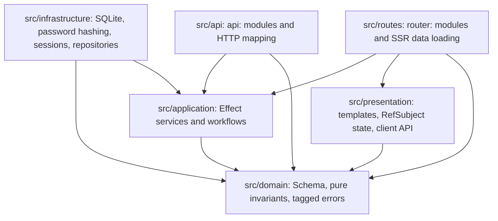

# RealWorld Flagship Example Implementation Plan

Status: draft, expanded after human feedback on 2026-05-16.

> **For agentic workers:** REQUIRED SUB-SKILL: Use `superpowers:subagent-driven-development` or `superpowers:executing-plans` to implement this plan task-by-task. Steps use checkbox (`- [ ]`) syntax for tracking.

**Goal:** Build `examples/realworld` as a real full-stack RealWorld/Conduit app that showcases `@typed/app`, Typed virtual modules, Effect services/layers, Effect Schema, SQLite persistence, real-data SSR, and hydrated CSR.

**Architecture:** Use a single package with DDD folders. Domain schemas and pure invariants sit at the center, application services express RealWorld workflows, infrastructure adapts SQLite/password/session/HTTP details, `api:` endpoint modules expose the RealWorld API, and `router:` route modules render SSR/CSR pages. Server rendering calls application services directly; browser workflows call same-origin `/api`.

**Tech Stack:** `@typed/app`, `@typed/router`, `@typed/template`, `@typed/ui`, `@typed/fx`, `@typed/async-data`, `@typed/guard`, `@typed/navigation`, `effect@4.0.0-beta.66`, `@effect/sql-sqlite-node@4.0.0-beta.66`, `micromark@4.0.2`, Vite 8, Vitest 4, optional example-scoped `@playwright/test` for local/manual E2E automation.

---

## Execution Policy

- Do not start implementation until `requirements.md` and this plan are explicitly approved.
- Use TDD for each task: failing test, confirm failure, implementation, passing test, focused commit.
- Before editing Effect code in a task, route through `.cursor/rules/effect-skill-loading.mdc` and the relevant Effect skill owner.
- Preserve unrelated dirty worktree changes. Current unrelated dirty paths include `README.md`, root TypeScript configs, `scripts/publish-beta.sh`, root lockfile, `.cursor/hooks/`, and `packages/threads/`.
- Stage only files owned by the active task.
- Ask before adding any dependency not approved in `requirements.md`.
- Keep upstream RealWorld specs in `.temp/references/realworld`; do not vendor them.
- Keep Hurl/E2E scripts local/manual; do not wire them into CI in this first PR.
- Never commit `examples/realworld/.data/`.

## Planned File Structure

### Package Root

| path | action | responsibility |
| ---- | ------ | -------------- |
| `examples/realworld/package.json` | create | Package metadata, approved deps, scripts. |
| `examples/realworld/tsconfig.json` | create | Example TypeScript config using `@typed/tsconfig` where compatible. |
| `examples/realworld/vite.config.ts` | create | Vite + `typedVitePlugin` config. |
| `examples/realworld/vmc.config.ts` | create | Virtual module compiler plugin setup for router/API generation. |
| `examples/realworld/typed.config.ts` | create | Typed app config for server/browser/html/env/config virtual modules. |
| `examples/realworld/index.html` | create | Browser HTML entry for Vite/Typed. |
| `examples/realworld/.gitignore` | create | Ignore `.data/`, local reports, and generated acceptance artifacts. |
| `examples/realworld/README.md` | create | Local setup, architecture, scripts, and manual acceptance instructions. |

### Domain

| path | action | responsibility |
| ---- | ------ | -------------- |
| `src/domain/Ids.ts` | create | ID/slug/username/email/tag schemas and constructors. |
| `src/domain/User.ts` | create | User/profile/session schemas and pure normalization helpers. |
| `src/domain/Article.ts` | create | Article/comment/tag schemas and pure article invariants. |
| `src/domain/RealWorldApi.ts` | create | Request/response/error envelope schemas shared by API/client/tests. |
| `src/domain/Auth.ts` | create | Auth header/token schemas and parsing helpers. |
| `src/domain/Markdown.ts` | create | Markdown rendering boundary using `micromark` through a pure wrapper. |
| `src/domain/Pagination.ts` | create | Limit/offset/page helpers and defaults. |
| `src/domain/Errors.ts` | create | Domain/application error types and RealWorld error key mapping. |

### Application

| path | action | responsibility |
| ---- | ------ | -------------- |
| `src/application/Users.ts` | create | Register/login/current/update user workflows. |
| `src/application/Profiles.ts` | create | Profile lookup, follow, unfollow workflows. |
| `src/application/Articles.ts` | create | Article list/feed/create/get/update/delete/favorite workflows. |
| `src/application/Comments.ts` | create | Comment list/create/delete workflows. |
| `src/application/Tags.ts` | create | Tag list workflow. |
| `src/application/Services.ts` | create | `Context.Service` class exports and combined application layer constructors. |

### Infrastructure

| path | action | responsibility |
| ---- | ------ | -------------- |
| `src/infrastructure/Config.ts` | create | Database path, host, port, API base config from Typed/env. |
| `src/infrastructure/Sql.ts` | create | SQLite adapter layer and SQL client construction. |
| `src/infrastructure/Migrations.ts` | create | SQL migration definitions and runner. |
| `src/infrastructure/Seed.ts` | create | Deterministic seed data and seed runner. |
| `src/infrastructure/Reset.ts` | create | Delete/recreate database, migrate, seed. |
| `src/infrastructure/PasswordHasher.ts` | create | Class-based `Context.Service` layer backed by Node `crypto.scrypt`. |
| `src/infrastructure/SessionTokens.ts` | create | Class-based `Context.Service` layer for opaque token generation/lookup. |
| `src/infrastructure/repositories/UserRepository.ts` | create | User/session persistence. |
| `src/infrastructure/repositories/ProfileRepository.ts` | create | Profile/follow persistence. |
| `src/infrastructure/repositories/ArticleRepository.ts` | create | Article/tag/favorite/feed persistence. |
| `src/infrastructure/repositories/CommentRepository.ts` | create | Comment persistence. |
| `src/infrastructure/repositories/TagRepository.ts` | create | Tag persistence. |

### API

| path | action | responsibility |
| ---- | ------ | -------------- |
| `src/api/_api.ts` | create | `/api` prefix, API metadata, OpenAPI JSON exposure. |
| `src/api/_dependencies.ts` | create | Application/infrastructure layer dependencies for endpoints. |
| `src/api/users/register.ts` | create | `POST /api/users`. |
| `src/api/users/login.ts` | create | `POST /api/users/login`. |
| `src/api/user/current.ts` | create | `GET /api/user`. |
| `src/api/user/update.ts` | create | `PUT /api/user`. |
| `src/api/profiles/get.ts` | create | `GET /api/profiles/:username`. |
| `src/api/profiles/follow.ts` | create | `POST /api/profiles/:username/follow`. |
| `src/api/profiles/unfollow.ts` | create | `DELETE /api/profiles/:username/follow`. |
| `src/api/articles/list.ts` | create | `GET /api/articles`. |
| `src/api/articles/feed.ts` | create | `GET /api/articles/feed`. |
| `src/api/articles/create.ts` | create | `POST /api/articles`. |
| `src/api/articles/get.ts` | create | `GET /api/articles/:slug`. |
| `src/api/articles/update.ts` | create | `PUT /api/articles/:slug`. |
| `src/api/articles/delete.ts` | create | `DELETE /api/articles/:slug`. |
| `src/api/articles/favorite.ts` | create | `POST /api/articles/:slug/favorite`. |
| `src/api/articles/unfavorite.ts` | create | `DELETE /api/articles/:slug/favorite`. |
| `src/api/comments/list.ts` | create | `GET /api/articles/:slug/comments`. |
| `src/api/comments/create.ts` | create | `POST /api/articles/:slug/comments`. |
| `src/api/comments/delete.ts` | create | `DELETE /api/articles/:slug/comments/:id`. |
| `src/api/tags/list.ts` | create | `GET /api/tags`. |
| `src/api/HttpErrors.ts` | create | Domain/application error to RealWorld status/envelope mapping. |

### Routes and Presentation

| path | action | responsibility |
| ---- | ------ | -------------- |
| `src/routes/index.ts` | create | `/` with feed query handling. |
| `src/routes/tag.ts` | create | `/tag/:tag`. |
| `src/routes/login.ts` | create | `/login`. |
| `src/routes/register.ts` | create | `/register`. |
| `src/routes/editor.ts` | create | `/editor`. |
| `src/routes/editor-slug.ts` | create | `/editor/:slug`. |
| `src/routes/settings.ts` | create | `/settings`. |
| `src/routes/profile.ts` | create | `/profile/:username`. |
| `src/routes/profile-favorites.ts` | create | `/profile/:username/favorites`. |
| `src/routes/article.ts` | create | `/article/:slug`. |
| `src/presentation/App.ts` | create | Root layout composition. |
| `src/presentation/Layout.ts` | create | Navbar, container, banner, auth nav. |
| `src/presentation/Feed.ts` | create | Feed tabs, article previews, pagination, sidebar tags. |
| `src/presentation/ArticlePage.ts` | create | Article detail, meta, comments, markdown body. |
| `src/presentation/AuthPages.ts` | create | Login/register forms and errors. |
| `src/presentation/EditorPage.ts` | create | Create/edit article form and tag input. |
| `src/presentation/SettingsPage.ts` | create | Settings form/logout. |
| `src/presentation/ProfilePage.ts` | create | Profile header, follow/settings controls, article tabs. |
| `src/presentation/Errors.ts` | create | `.error-messages` rendering and network/decode messages. |
| `src/presentation/Debug.ts` | create | `window.__conduit_debug__` installation. |
| `src/presentation/State.ts` | create | RefSubject/AsyncData state stores. |
| `src/presentation/ClientApi.ts` | create | Browser local `/api` client using Effect HTTP/Schema decoding. |
| `src/presentation/styles.css` | create | Local Conduit-compatible styles. |
| `public/default-avatar.svg` | create | Local default avatar asset. |

### Entries, Tests, Scripts

| path | action | responsibility |
| ---- | ------ | -------------- |
| `src/main.ts` | create | Shared app entry composition. |
| `src/server.ts` | create | Server runtime entry using `typed:server`, `api:./api`, `router:./routes`, `typed:html`. |
| `src/browser.ts` | create | Browser runtime entry using `typed:browser`/router hydration. |
| `src/tests/domain/*.test.ts` | create | Schema/domain invariant tests. |
| `src/tests/infrastructure/*.test.ts` | create | Migration/reset/seed/repository tests. |
| `src/tests/application/*.test.ts` | create | Workflow/service tests. |
| `src/tests/api/*.test.ts` | create | Endpoint contract/OpenAPI tests. |
| `src/tests/presentation/*.test.ts` | create | SSR/CSR selector/state/markdown tests. |
| `scripts/db.ts` | create | `migrate`, `seed`, `reset` command entry. |
| `scripts/run-hurl-local.ts` | create | Local/manual Hurl wrapper. |
| `scripts/run-e2e-local.ts` | create | Local/manual Playwright wrapper. |
| `playwright.config.ts` | create | Example local/manual E2E config. |

## Implementation Architecture Contract

### Dependency Direction



- `src/domain/**` must not import `@typed/*`, `effect/unstable/*`, browser globals, Node APIs, SQL APIs, or virtual modules.
- `src/application/**` may import domain modules, Effect core modules, and service tags; it must not import SQLite, Vite, DOM, browser storage, or virtual modules.
- `src/infrastructure/**` is the only layer that may import `@effect/sql-sqlite-node`, `effect/unstable/sql`, Node `crypto`, and filesystem APIs.
- `src/api/**` is the only layer that should translate application errors into HTTP statuses and RealWorld error envelopes.
- `src/routes/**` loads SSR data from application services directly and must not call same-origin HTTP APIs during SSR.
- `src/presentation/**` owns HTML/template composition, selector compatibility, `RefSubject` state, `AsyncData`, browser local-storage handling, and the browser local API client.

### Effect and Typed Module Inventory

| area | modules to use | prohibited shortcuts |
| ---- | -------------- | -------------------- |
| Schema | `effect/Schema`, Schema branding/refinements, Schema decode/encode helpers. | Hand-written unchecked DTO casts at boundaries. |
| Services | `Effect`, class-based `Context.Service`, `Layer.effect`, `Layer.sync`, `Layer.succeed`, `Data.TaggedError`, `Option`, `Match`, `Clock`/`DateTime` where compatible. | Raw interface-only DI contracts, plain singleton services, global mutable state, unchecked thrown errors. |
| Collections | `Array`, `Record`, `String`, `Boolean`, `Predicate` from Effect where they fit. | Lodash/Ramda/utility packages. |
| SQL | `effect/unstable/sql` behind `src/infrastructure/Sql.ts`; SQLite runtime via `@effect/sql-sqlite-node`. | Raw adapter imports in domain/application/API/presentation modules. |
| API | `@typed/app` `ApiHandler`, `api:./api`, `_api.ts`, `effect/unstable/httpapi` where required by generated surface. | `defineApiHandler`, hand-built Express/Fastify/Hono server. |
| Router | `router:./routes`, `@typed/router` route declarations, route guards/dependencies where useful. | Third-party client/router dependency. |
| Rendering | `@typed/template`, `typed:server`, `typed:browser`, `typed:html`. | Separate React/Vue/Svelte runtime. |
| Browser state | `@typed/fx` `RefSubject`, `@typed/async-data`, `@typed/navigation`, `@typed/ui` links. | TanStack Query, Redux/Zustand, browser-only business rules. |

### Context.Service Contracts

Execution workers should start from these `Context.Service` contracts and keep implementation details behind layers. Raw TypeScript interfaces may be used as internal helper aliases, but the runtime dependency identity must be the exported service class.

```ts
// src/application/Services.ts
export class Users extends Context.Service<
  Users,
  {
    readonly register: (input: RegisterUserRequest) => Effect.Effect<UserResponse, RealWorldError>;
    readonly login: (input: LoginUserRequest) => Effect.Effect<UserResponse, RealWorldError>;
    readonly current: (token: BearerToken) => Effect.Effect<UserResponse, RealWorldError>;
    readonly update: (
      token: BearerToken,
      input: UpdateUserRequest,
    ) => Effect.Effect<UserResponse, RealWorldError>;
  }
>()("RealWorld/Users") {
  static readonly Live = Layer.effect(
    Users,
    Effect.gen(function* () {
      const passwords = yield* PasswordHasher;
      const sessions = yield* SessionTokens;
      const users = yield* UserRepository;

      return {
        register: makeRegister({ passwords, sessions, users }),
        login: makeLogin({ passwords, sessions, users }),
        current: makeCurrent({ users }),
        update: makeUpdate({ passwords, users }),
      };
    }),
  );
}

export class Articles extends Context.Service<
  Articles,
  {
    readonly list: (
      viewer: Option.Option<UserId>,
      filter: ArticleFilter,
    ) => Effect.Effect<MultipleArticlesResponse, RealWorldError>;
    readonly feed: (
      viewer: UserId,
      filter: FeedFilter,
    ) => Effect.Effect<MultipleArticlesResponse, RealWorldError>;
    readonly create: (
      author: UserId,
      input: CreateArticleRequest,
    ) => Effect.Effect<SingleArticleResponse, RealWorldError>;
    readonly get: (
      viewer: Option.Option<UserId>,
      slug: Slug,
    ) => Effect.Effect<SingleArticleResponse, RealWorldError>;
    readonly update: (
      author: UserId,
      slug: Slug,
      input: UpdateArticleRequest,
    ) => Effect.Effect<SingleArticleResponse, RealWorldError>;
    readonly delete: (author: UserId, slug: Slug) => Effect.Effect<void, RealWorldError>;
    readonly favorite: (
      viewer: UserId,
      slug: Slug,
    ) => Effect.Effect<SingleArticleResponse, RealWorldError>;
    readonly unfavorite: (
      viewer: UserId,
      slug: Slug,
    ) => Effect.Effect<SingleArticleResponse, RealWorldError>;
  }
>()("RealWorld/Articles") {}
```

```ts
// src/infrastructure/repositories/ArticleRepository.ts
export class ArticleRepository extends Context.Service<
  ArticleRepository,
  {
    readonly list: (
      viewer: Option.Option<UserId>,
      filter: ArticleFilter,
    ) => Effect.Effect<ArticleListResult, RepositoryError>;
    readonly feed: (
      viewer: UserId,
      filter: FeedFilter,
    ) => Effect.Effect<ArticleListResult, RepositoryError>;
    readonly findBySlug: (
      viewer: Option.Option<UserId>,
      slug: Slug,
    ) => Effect.Effect<Option.Option<Article>, RepositoryError>;
    readonly createWithTags: (
      author: UserId,
      input: CreateArticleInput,
    ) => Effect.Effect<Article, RepositoryError>;
    readonly updateWithTags: (
      author: UserId,
      slug: Slug,
      input: UpdateArticleInput,
    ) => Effect.Effect<Article, RepositoryError>;
    readonly deleteBySlug: (author: UserId, slug: Slug) => Effect.Effect<void, RepositoryError>;
    readonly favorite: (viewer: UserId, slug: Slug) => Effect.Effect<Article, RepositoryError>;
    readonly unfavorite: (viewer: UserId, slug: Slug) => Effect.Effect<Article, RepositoryError>;
  }
>()("RealWorld/ArticleRepository") {
  static readonly Sqlite = Layer.effect(
    ArticleRepository,
    Effect.gen(function* () {
      const sql = yield* SqlClient;

      return {
        list: makeList(sql),
        feed: makeFeed(sql),
        findBySlug: makeFindBySlug(sql),
        createWithTags: makeCreateWithTags(sql),
        updateWithTags: makeUpdateWithTags(sql),
        deleteBySlug: makeDeleteBySlug(sql),
        favorite: makeFavorite(sql),
        unfavorite: makeUnfavorite(sql),
      };
    }),
  );
}
```

The exact method type aliases may be adjusted during implementation to match Effect Schema output types, but the operation names and responsibilities must remain traceable to `requirements.md`. The `Context.Service` classes and layer constructor pattern are not optional.

### Endpoint Module Pattern

Each endpoint module should use the same shape unless a generated-plugin limitation forces a documented exception:

```ts
import { ApiHandler } from "@typed/app";
import { Route } from "@typed/router";
import * as Schema from "effect/Schema";

export const route = Route.Parse("/articles/:slug");
export const method = "GET" as const;
export const success = SingleArticleResponse;
export const error = ErrorResponse;

export const handler = ApiHandler(route, method, { success, error })(
  ({ path, headers }) => Effect.gen(function* () {
    const viewer = yield* optionalViewerFromHeaders(headers);
    return yield* Articles.get(viewer, path.slug);
  }),
);
```

Required endpoint grouping:
- Auth/user endpoints first: EP-1 through EP-4.
- Profiles next: EP-5 through EP-7.
- Article list/feed/create/get/update/delete/favorite/unfavorite next: EP-8 through EP-15.
- Comments next: EP-16 through EP-18.
- Tags and OpenAPI last: EP-19 through EP-20.

### Test Inventory Contract

| task | minimum red tests before implementation | primary green command |
| ---- | --------------------------------------- | --------------------- |
| Task 0 | `@typed/app` public export/docs/templates still mention `defineApiHandler`, and current tests expose two `ApiHandler` shapes; tests prove route/method `ApiHandler` is canonical. | `pnpm --filter @typed/app test && pnpm --filter @typed/app build` |
| Task 1 | manifest dependency allowlist, script names, ignored `.data`, virtual plugin config imports. | `pnpm --filter typed-realworld build` |
| Task 2 | schema decode/encode for every request, response, query, path, local-storage, and error envelope. | `pnpm --filter typed-realworld test:unit -- src/tests/domain/schema.test.ts` |
| Task 3 | duplicate-title slugs, auth header parsing, tag update rules, pagination math, nullable normalization, markdown/XSS strings. | `pnpm --filter typed-realworld test:unit` |
| Task 4 | reset idempotence, table/index existence, seed counts, foreign keys, `.data` ignored. | `pnpm --filter typed-realworld test:integration -- src/tests/infrastructure/database.test.ts` |
| Task 5 | password hashing/verify, duplicate username/email, token lookup, update user rules. | `pnpm --filter typed-realworld test:integration -- src/tests/infrastructure/users.test.ts` |
| Task 6 | repository list/filter/feed/favorite/follow/comment/tag workflows and transaction behavior. | `pnpm --filter typed-realworld test:integration -- src/tests/infrastructure` |
| Task 7 | one service-level test for every EP-1 through EP-19 workflow, each required error status, and service construction through `Context.Service` layers. | `pnpm --filter typed-realworld test:integration -- src/tests/application` |
| Task 8 | generated `api:./api` discovery, endpoint statuses/envelopes, OpenAPI JSON path, no docs UI path. | `pnpm --filter typed-realworld test:integration -- src/tests/api` |
| Task 9 | SSR first HTML data for feed, page 2, tag, article, profile, profile favorites. | `pnpm --filter typed-realworld test:ssr` |
| Task 10 | auth state machine, local API client decoding, form workflows, debug API, mutation refreshes. | `pnpm --filter typed-realworld test:ssr` plus presentation targeted tests |
| Task 11 | selector matrix, local CSS/classes, default avatar, XSS surfaces. | `pnpm --filter typed-realworld test:ssr` plus selector/XSS targeted tests |
| Task 12 | wrappers reference `.temp/references`, env vars, prerequisite failures. | local/manual Hurl/E2E wrapper commands |
| Task 13 | final docs, no forbidden staged files, example gates, feasible root/framework gates. | final verification matrix commands |

## Subgoal DAG

| subgoal_id | objective | prerequisites | risk | requirement_links | success_check |
| ---------- | --------- | ------------- | ---- | ----------------- | ------------- |
| SG-0 | Canonical `ApiHandler` app API | Approved docs | Medium | FR-135..FR-138, AC-29 | Public docs/templates/tests use route/method `ApiHandler`; no shipped `defineApiHandler` or conflicting public `ApiHandler` shape remains. |
| SG-1 | Package skeleton and tooling | SG-0 | Medium | FR-1..FR-20, FR-124..FR-129 | Package scripts run enough to fail from missing tests/implementation, not config errors. |
| SG-2 | Domain schemas and invariants | SG-1 | High | FR-21..FR-29, FR-40..FR-70, FR-113..FR-118 | Domain/schema tests pass and no infrastructure imports leak into domain. |
| SG-3 | SQLite infrastructure | SG-2 | High | FR-71..FR-79, FR-130..FR-134 | Migration/reset/seed/repository tests pass against ignored SQLite file. |
| SG-4 | Application services | SG-3 | High | EP-1..EP-19, FR-30..FR-64, FR-130..FR-134 | Service tests cover all RealWorld workflows and error mapping. |
| SG-5 | API endpoints and OpenAPI | SG-4 | High | FR-9..FR-15, EP-1..EP-20, FR-135..FR-138 | API contract tests prove endpoint status/envelopes and OpenAPI JSON using route/method `ApiHandler`. |
| SG-6 | SSR route rendering | SG-5 | High | FR-87..FR-97 | SSR smoke tests prove first-response real data. |
| SG-7 | CSR/hydration and UI contract | SG-6 | High | FR-98..FR-123, FR-130..FR-134 | Browser/presentation tests prove selectors, state, debug API, errors, and workflows. |
| SG-8 | Local/manual acceptance scripts | SG-7 | Medium | FR-124..FR-129 | Hurl/E2E scripts are runnable locally or fail with precise prerequisites. |
| SG-9 | Final verification and PR | SG-8 | Medium | AC-19..AC-29 | Example gates and feasible root gates pass; blockers are evidence-backed. |

## Detailed Task List

### Task 0: Canonicalize `ApiHandler` in `@typed/app`

**Files:**
- Modify: `packages/app/src/index.ts`
- Modify: `packages/app/src/httpapi/ApiHandler.ts`
- Modify: `packages/app/src/httpapi/defineApiHandler.ts` or replace with a better-named module if implementation requires it.
- Modify: `packages/app/src/defineApiHandler.test.ts`
- Modify: `packages/app/src/handlers.test.ts`
- Modify: `packages/app/README.md`
- Modify: `packages/app/AGENTS.md`
- Modify: `.docs/specs/httpapi-virtual-module-plugin/spec.md`
- Modify: `.docs/specs/httpapi-virtual-module-plugin/testing-strategy.md`
- Modify: `packages/cli/templates/starter/packages/app/src/api/status.ts`
- Modify: `packages/virtual-modules-ts-plugin/sample-project/README.md`

- [x] Step 1: Write or update failing package-level tests proving `ApiHandler(route, method, schemas?)(handler)` is the public endpoint helper and `defineApiHandler` is not imported by tests/templates/docs owned by this cleanup.
- [x] Step 2: Update or remove the config-object `ApiHandler({ route, method, ... })(handler)` tests in `packages/app/src/handlers.test.ts`; keep that shape only if it is renamed/internalized with a non-conflicting public name explicitly approved later.
- [x] Step 3: Run `pnpm --dir packages/app exec vitest run src/ApiHandler.canonical.test.ts`.
  - Observed red: failed because the package-root namespace still exposed the historical alias.
- [x] Step 4: Rename tests/descriptions/imports from the historical helper name to route/method `ApiHandler` and remove the historical public alias from `packages/app/src/index.ts`.
- [x] Step 5: Consolidate `packages/app/src/httpapi/ApiHandler.ts` and the old helper module so `@typed/app` exposes one canonical endpoint helper named `ApiHandler` with route/method/schemas call shape.
- [x] Step 6: Update `packages/app` docs, starter template, virtual-module sample docs, and HttpApi virtual-module specs to reference route/method `ApiHandler`.
- [x] Step 7: Run `rg "defineApiHandler" packages/app packages/cli/templates/starter packages/virtual-modules-ts-plugin/sample-project .docs/specs/httpapi-virtual-module-plugin`.
  - Observed green: no matches.
- [x] Step 8: Run `pnpm --filter @typed/app test` and `pnpm --filter @typed/app clean && pnpm --filter @typed/app build`.
- [x] Step 9: Commit as `refactor: canonicalize typed app api handler`.

#### Task 0 Execution Detail

Initial rebased baseline before Task 0 implementation:
- `packages/app/src/index.ts` exports `ApiHandler` and `defineApiHandler` from `src/httpapi/defineApiHandler.ts`, while also exporting `src/httpapi/ApiHandler.ts`.
- `packages/app/src/httpapi/ApiHandler.ts` currently owns a config-object call shape: `ApiHandler({ route, method, ... })(handler)`.
- `packages/app/src/httpapi/defineApiHandler.ts` currently owns the desired route/method call shape but exposes it through both `ApiHandler` and the historical `defineApiHandler` alias.
- `packages/app/src/defineApiHandler.test.ts`, `packages/app/README.md`, `packages/app/AGENTS.md`, the starter template, virtual-module sample docs, and HttpApi virtual-module specs still mention `defineApiHandler`.

Execution refinements:
- First red test must make route/method `ApiHandler(route, method, schemas?)(handler)` the named public contract.
- The config-object helper must not remain exported as `ApiHandler`; if code reuse is needed, move route/method helper types into `src/httpapi/ApiHandler.ts` and delete the alias module contents or turn it into a non-public internal compatibility file during the cleanup.
- Root package export must not include `defineApiHandler`.
- The search gate is strict: `rg "defineApiHandler" packages/app packages/cli/templates/starter packages/virtual-modules-ts-plugin/sample-project .docs/specs/httpapi-virtual-module-plugin` returns no matches.

### Task 1: Package Skeleton and Approved Dependencies

**Files:**
- Create: `examples/realworld/package.json`
- Create: `examples/realworld/tsconfig.json`
- Create: `examples/realworld/vite.config.ts`
- Create: `examples/realworld/vmc.config.ts`
- Create: `examples/realworld/typed.config.ts`
- Create: `examples/realworld/index.html`
- Create: `examples/realworld/.gitignore`
- Create: `examples/realworld/README.md`
- Create: `examples/realworld/src/main.ts`
- Create: `examples/realworld/src/server.ts`
- Create: `examples/realworld/src/browser.ts`
- Create: `examples/realworld/public/default-avatar.svg`

- [x] Step 1: Write the package manifest with approved dependencies and scripts.
  - Dependencies: workspace Typed packages, `effect`, `@effect/sql-sqlite-node`, `micromark`.
  - Dev dependencies: `@typed/tsconfig`, `@typed/vite-plugin`, `@playwright/test`, `typescript`, `vite`, `vitest`.
  - Scripts: `dev`, `build`, `preview`, `test`, `test:unit`, `test:integration`, `test:ssr`, `test:e2e:local`, `test:api:hurl:local`, `db:migrate`, `db:seed`, `db:reset`.
- [x] Step 2: Add `examples/realworld/.gitignore` with `.data/`, `playwright-report/`, `test-results/`, `.hurl/`, and local coverage output.
- [x] Step 3: Add `vmc.config.ts` registering `createRouterVirtualModulePlugin()` and `createHttpApiVirtualModulePlugin()`.
- [x] Step 4: Add `vite.config.ts` using `typedVitePlugin()` and local CSS/assets handling.
- [x] Step 5: Add minimal server/browser/main entries that compile and render a clearly empty shell before route/API wiring lands.
- [x] Step 6: Run `pnpm install --lockfile-only` from the repository root and inspect the lockfile diff for only approved example dependencies.
- [x] Step 7: Run `pnpm --filter typed-realworld build`.
  - Expected first result: fail only because route/API files are not implemented, or pass with the empty shell if virtual imports are not yet referenced.
- [x] Step 8: Commit as `chore: scaffold realworld example package`.

### Task 2: Domain Schema Baseline

**Files:**
- Create: `src/domain/Ids.ts`
- Create: `src/domain/User.ts`
- Create: `src/domain/Article.ts`
- Create: `src/domain/RealWorldApi.ts`
- Create: `src/domain/Auth.ts`
- Create: `src/domain/Pagination.ts`
- Create: `src/domain/Errors.ts`
- Create: `src/tests/domain/schema.test.ts`

- [x] Step 1: Write failing schema tests for `UserResponse`, `ProfileResponse`, `SingleArticleResponse`, `MultipleArticlesResponse`, `SingleCommentResponse`, `MultipleCommentsResponse`, `TagsResponse`, and `ErrorResponse`.
- [x] Step 2: Run `pnpm --filter typed-realworld test:unit -- src/tests/domain/schema.test.ts`.
  - Expected: fail because schemas do not exist.
- [x] Step 3: Implement domain schemas with Effect Schema.
- [x] Step 4: Add encode/decode round-trip tests for all API envelopes.
- [x] Step 5: Run `pnpm --filter typed-realworld test:unit -- src/tests/domain/schema.test.ts`.
  - Expected: pass.
- [x] Step 6: Commit as `feat: model realworld schemas`.

### Task 3: Domain Invariants and Markdown Safety

**Files:**
- Modify: `src/domain/Ids.ts`
- Modify: `src/domain/User.ts`
- Modify: `src/domain/Article.ts`
- Create: `src/domain/Markdown.ts`
- Create: `src/tests/domain/invariants.test.ts`
- Create: `src/tests/domain/markdown.test.ts`

- [x] Step 1: Write failing tests for slug generation from duplicate titles, stable slug base, tag order preservation, tag removal, nullable `bio`/`image` normalization, auth header parsing, page-to-offset conversion, and ownership checks.
- [x] Step 2: Write failing tests proving malicious Markdown and description strings produce no script tags, event handler attributes, JavaScript URL execution hooks, or raw HTML nodes.
- [x] Step 3: Run the domain tests and confirm failures.
- [x] Step 4: Implement pure helpers for slug bases, unique slug candidate generation, tag normalization, nullable field normalization, auth token extraction, pagination, ownership checks, and `micromark` rendering.
- [x] Step 5: Run `pnpm --filter typed-realworld test:unit`.
- [x] Step 6: Commit as `feat: add realworld domain invariants`.

### Task 4: SQLite Migration, Reset, and Seed

**Files:**
- Create: `src/infrastructure/Config.ts`
- Create: `src/infrastructure/Sql.ts`
- Create: `src/infrastructure/Migrations.ts`
- Create: `src/infrastructure/Seed.ts`
- Create: `src/infrastructure/Reset.ts`
- Create: `scripts/db.ts`
- Create: `src/tests/infrastructure/database.test.ts`

- [x] Step 1: Write failing tests that reset creates `examples/realworld/.data/realworld.sqlite`, migrations create all tables/indexes, and second reset returns identical seed counts.
- [x] Step 2: Run `pnpm --filter typed-realworld test:integration -- src/tests/infrastructure/database.test.ts`.
  - Expected: fail because SQL layer/reset does not exist.
- [x] Step 3: Implement SQLite client layer using `@effect/sql-sqlite-node` and `effect/unstable/sql`.
- [x] Step 4: Implement migrations for users, sessions, follows, articles, tags, article_tags, favorites, and comments with required indexes/unique constraints.
- [x] Step 5: Implement deterministic seed with at least two users, one follow, fifteen articles, multiple tags, one favorite, one comment, and a missing-avatar user.
- [x] Step 6: Implement `db:migrate`, `db:seed`, and `db:reset` scripts.
- [x] Step 7: Run `pnpm --filter typed-realworld db:reset` and `pnpm --filter typed-realworld test:integration -- src/tests/infrastructure/database.test.ts`.
- [x] Step 8: Verify `git status --short examples/realworld/.data` shows no tracked data.
- [x] Step 9: Commit as `feat: add realworld sqlite storage`.

### Task 5: Password, Sessions, and User Repository

**Files:**
- Create: `src/infrastructure/PasswordHasher.ts`
- Create: `src/infrastructure/SessionTokens.ts`
- Create: `src/infrastructure/repositories/UserRepository.ts`
- Create: `src/tests/infrastructure/users.test.ts`

- [x] Step 1: Write failing tests for password hashing/verify, no plaintext persistence, opaque token creation, token lookup, duplicate username/email, user update normalization, and password policy.
- [x] Step 2: Run targeted integration tests and confirm failures.
- [x] Step 3: Implement `PasswordHasher` as a class-based Effect `Context.Service` with `Layer.effect(PasswordHasher, Effect.gen(...))`, backed by Node `crypto.scrypt`.
- [x] Step 4: Implement `SessionTokens` as a class-based Effect `Context.Service` with a layer constructor for opaque token generation and session persistence.
- [x] Step 5: Implement `UserRepository` as a class-based Effect `Context.Service` with `Layer.effect(UserRepository, Effect.gen(...))`; expose create, find by email, find by username, find by token, update current user, and create session operations through the service object.
- [x] Step 6: Run `pnpm --filter typed-realworld test:integration -- src/tests/infrastructure/users.test.ts`.
- [x] Step 7: Commit as `feat: add user persistence services`.

### Task 6: Article, Profile, Comment, and Tag Repositories

**Files:**
- Create: `src/infrastructure/repositories/ProfileRepository.ts`
- Create: `src/infrastructure/repositories/ArticleRepository.ts`
- Create: `src/infrastructure/repositories/CommentRepository.ts`
- Create: `src/infrastructure/repositories/TagRepository.ts`
- Create: `src/tests/infrastructure/articles.test.ts`
- Create: `src/tests/infrastructure/profiles.test.ts`
- Create: `src/tests/infrastructure/comments.test.ts`

- [x] Step 1: Write failing repository tests for profile lookup/following, follow/unfollow, article create/list/feed/filter/favorite/update/delete, comment create/list/delete, and tag list.
- [x] Step 2: Run repository tests and confirm failures.
- [x] Step 3: Implement `ProfileRepository` as a class-based Effect `Context.Service` whose layer constructor acquires SQL dependencies and returns profile/follow operations.
- [x] Step 4: Implement `ArticleRepository` as a class-based Effect `Context.Service` whose layer constructor acquires SQL dependencies and returns article list/feed/filter queries with author/tag/favorited/limit/offset and total counts.
- [x] Step 5: Add article create/update/delete operations to `ArticleRepository` with tag transactions and unique slug handling.
- [x] Step 6: Add favorite/unfavorite and favorites count operations to `ArticleRepository`.
- [x] Step 7: Implement `CommentRepository` and `TagRepository` as class-based Effect `Context.Service` values with layer constructors.
- [x] Step 8: Run `pnpm --filter typed-realworld test:integration -- src/tests/infrastructure`.
- [x] Step 9: Commit as `feat: add realworld repositories`.

### Task 7: Application Services and Error Mapping

**Files:**
- Create: `src/application/Services.ts`
- Create: `src/application/Users.ts`
- Create: `src/application/Profiles.ts`
- Create: `src/application/Articles.ts`
- Create: `src/application/Comments.ts`
- Create: `src/application/Tags.ts`
- Modify: `src/domain/Errors.ts`
- Create: `src/tests/application/users.test.ts`
- Create: `src/tests/application/articles.test.ts`
- Create: `src/tests/application/social.test.ts`

- [x] Step 1: Write failing service tests for every endpoint workflow using repositories through Effect services.
- [x] Step 2: Include exact RealWorld error mapping tests for missing token, invalid credentials, blank fields, duplicates, forbidden article/comment operations, and not found.
- [x] Step 3: Run application tests and confirm failures.
- [x] Step 4: Implement each application service as a class-based `Context.Service` with a `Layer.effect(Service, Effect.gen(...))` constructor that acquires repository/helper services and returns the implementation object.
- [x] Step 5: Implement user/auth services.
- [x] Step 6: Implement profile/follow services.
- [x] Step 7: Implement article/feed/favorite services.
- [x] Step 8: Implement comment/tag services.
- [x] Step 9: Run `pnpm --filter typed-realworld test:integration -- src/tests/application`.
- [x] Step 10: Commit as `feat: add realworld application services`.

### Task 8: API Endpoint Modules and OpenAPI JSON

**Files:**
- Create all files listed in the API section of the file map.
- Create: `src/tests/api/endpoints.test.ts`
- Create: `src/tests/api/openapi.test.ts`

- [x] Step 1: Write failing generated API source tests that assert endpoint discovery includes EP-1 through EP-20.
- [x] Step 2: Write failing HTTP/API tests for success statuses and RealWorld error envelopes.
- [x] Step 3: Write failing OpenAPI JSON test asserting all endpoint paths exist and docs UI paths do not.
- [x] Step 4: Run API tests and confirm failures.
- [x] Step 5: Implement `_api.ts` with `/api` prefix, metadata, and JSON OpenAPI exposure path.
- [x] Step 6: Implement `_dependencies.ts` with application/infrastructure layers.
- [x] Step 7: Implement endpoint modules in small groups: auth/user, profiles, articles, comments, tags.
- [x] Step 8: Implement API support helpers to convert application errors to status/envelope responses.
- [x] Step 9: Run `pnpm --filter typed-realworld test:integration -- src/tests/api`.
- [x] Step 10: Run `pnpm --filter typed-realworld build`.
- [x] Step 11: Commit as `feat: expose realworld api modules`.

### Task 9: SSR Route Modules and Real-Data Page Rendering

**Files:**
- Create all files listed in the Routes section of the file map.
- Create: `src/presentation/App.ts`
- Create: `src/presentation/Layout.ts`
- Create: `src/presentation/Feed.ts`
- Create: `src/presentation/ArticlePage.ts`
- Create: `src/presentation/ProfilePage.ts`
- Create: `src/tests/presentation/ssr.test.ts`

- [x] Step 1: Write failing SSR tests for `/`, `/?page=2`, `/tag/:tag`, `/article/:slug`, `/profile/:username`, and `/profile/:username/favorites`.
- [x] Step 2: Assert first HTML response contains seeded article/profile/tag data before hydration.
- [x] Step 3: Run SSR tests and confirm failures.
- [x] Step 4: Implement route modules with `Route.Parse` and server-side service calls.
- [x] Step 5: Implement shared layout, navbar, feed preview, pagination, tag sidebar, article page, and profile page templates.
- [x] Step 6: Run `pnpm --filter typed-realworld test:ssr`.
- [x] Step 7: Commit as `feat: render realworld pages with ssr`.

### Task 10: CSR Hydration, Auth State, and Forms

**Files:**
- Create: `src/presentation/State.ts`
- Create: `src/presentation/ClientApi.ts`
- Create: `src/presentation/Debug.ts`
- Create: `src/presentation/AuthPages.ts`
- Create: `src/presentation/EditorPage.ts`
- Create: `src/presentation/SettingsPage.ts`
- Modify: `src/browser.ts`
- Create: `src/tests/presentation/hydration.test.ts`
- Create: `src/tests/presentation/auth-state.test.ts`

**Progress notes:**
- 2026-05-17: Auth/debug runtime slice is complete and committed separately from the remaining form/mutation work. It covers `jwtToken` storage compatibility, `/api/user` initialization, login/register/logout token updates, `__conduit_debug__`, and 4xx/5xx/network/decode auth-state handling.
- 2026-05-17: TodoMVC-style form/mutation slice is complete and committed separately. It uses `@typed/template` `EventHandler` bindings, schema-decoded form requests, a browser auth service layer passed through `typed:browser`, and same-origin workflows for settings, editor, favorite/follow, comment, and delete mutations.
- 2026-05-17: Visible form-error rendering and generated runtime hardening are complete. Form workflows render typed API/auth/decode/form failures into `.error-messages` as text nodes, and generated `typed:browser`/`typed:server` runtime options no longer expose unsafe `options.run`.

- [x] Step 1: Write failing browser/hydration tests for `jwtToken`, `__conduit_debug__`, auth states, login/register/logout/settings, editor create/update, favorite/follow/comment workflows, and API error display.
- [x] Step 2: Run presentation tests and confirm failures.
- [x] Step 3: Implement browser local API client with Effect HTTP/Schema decoding.
- [x] Step 4: Implement RefSubject/AsyncData stores for auth, feeds, article detail, profile, editor/settings forms, comments, favorites, and follows.
- [x] Step 5: Install debug interface with exact method names and return states.
- [x] Step 6: Implement form event handlers and optimistic refresh where it reduces duplicate code.
- [x] Step 7: Run `pnpm --filter typed-realworld test:ssr` and browser/presentation tests.
- [x] Step 8: Commit as `feat: hydrate realworld client workflows`.

### Task 11: UI Selector Contract, CSS, Assets, and XSS Hardening

**Files:**
- Create: `src/presentation/styles.css`
- Modify: all presentation components touched by selector contract.
- Create: `src/tests/presentation/selectors.test.ts`
- Create: `src/tests/presentation/xss.test.ts`
- Create: `public/default-avatar.svg`

**Progress notes:**
- 2026-05-17: Selector/XSS slice is complete. Browser verification confirmed the stylesheet loads and applies under raw Vite dev; the app body remains empty there because `typed:browser` is currently hydration-mode and expects SSR HTML, so the full local-server verification belongs to Task 12.

- [x] Step 1: Write failing selector tests for every required class, input name, placeholder, visible label, active page class, `.error-messages`, and default avatar usage.
- [x] Step 2: Write failing XSS tests for malicious image URL, article description, article body Markdown, and comment/avatar contexts.
- [x] Step 3: Run selector/XSS tests and confirm failures.
- [x] Step 4: Implement local Conduit-compatible CSS without external CSS packages.
- [x] Step 5: Ensure each presentation component emits required classes and labels.
- [x] Step 6: Ensure image/avatar helpers never spread untrusted strings into attributes other than safe `src`.
- [x] Step 7: Run `pnpm --filter typed-realworld test:ssr` and selector/XSS tests.
- [x] Step 8: Use browser verification or Playwright screenshot for representative desktop/mobile pages if local browser tooling is available.
- [x] Step 9: Commit as `feat: satisfy realworld ui contract`.

### Task 12: Local/Manual Hurl and E2E Automation

**Files:**
- Create: `scripts/run-hurl-local.ts`
- Create: `scripts/run-e2e-local.ts`
- Create: `playwright.config.ts`
- Modify: `package.json`
- Modify: `README.md`
- Create: `src/tests/local-gates.test.ts`

**Progress notes:**
- 2026-05-17: Local acceptance wrappers are wired against the upstream `.temp/references/realworld` checkout without vendoring specs. `test:api:hurl:local` was run and failed with the documented missing-`hurl` prerequisite. `test:e2e:local` was run and failed with the documented missing local app server prerequisite.

- [x] Step 1: Write failing tests or script checks that verify `.temp/references/realworld/specs/api/hurl` and `.temp/references/realworld/specs/e2e` are referenced, not vendored.
- [x] Step 2: Implement `test:api:hurl:local` wrapper with `HOST`, `UID_VAL`, and helpful missing-`hurl` error.
- [x] Step 3: Implement `test:e2e:local` wrapper with app `baseURL`, `API_BASE`, local server host/port, and helpful Playwright/browser prerequisite errors.
- [x] Step 4: Update README with exact local acceptance commands and prerequisites.
- [x] Step 5: Run `pnpm --filter typed-realworld test:api:hurl:local`.
  - Expected: pass if `hurl` and app server are available; otherwise fail with the documented prerequisite message.
- [x] Step 6: Run `pnpm --filter typed-realworld test:e2e:local`.
  - Expected: pass if Playwright browsers and app server are available; otherwise fail with the documented prerequisite message.
- [x] Step 7: Commit as `test: add realworld local acceptance scripts`.

### Task 13: Final Verification and Documentation

**Files:**
- Modify: `examples/realworld/README.md`
- Create: `.docs/workflows/20260516-1826-realworld-flagship-example/memories.md`
- Modify: `.docs/workflows/20260516-1826-realworld-flagship-example/plan.md`

- [ ] Step 1: Update README with final architecture, scripts, local/manual gates, and known prerequisites.
- [ ] Step 2: Record durable implementation notes in workflow `memories.md`.
- [ ] Step 3: Run `pnpm --filter typed-realworld test`.
- [ ] Step 4: Run `pnpm --filter typed-realworld build`.
- [ ] Step 5: Run `pnpm --filter @typed/app test`.
- [ ] Step 6: Run `pnpm --filter @typed/app build`.
- [ ] Step 7: Run `pnpm -r run test`.
- [ ] Step 8: Run `pnpm -r build`.
- [ ] Step 9: Run `pnpm build`.
- [ ] Step 10: Run `git diff --check`.
- [ ] Step 11: Inspect `git status --short` and confirm no `.data`, upstream spec clone, build output, or unrelated dirty files are staged.
- [ ] Step 12: Commit final docs as `docs: document realworld example workflow`.

## Tactical Replanning Triggers

- `@typed/app` generated `api:` modules cannot expose a required endpoint shape without a framework fix.
- `@typed/app` generated `router:` modules cannot express a required frontend route without a framework fix.
- `typed:server`/`typed:browser`/`typed:html` are not mature enough for the example entrypoint shape.
- `@effect/sql-sqlite-node` install/build fails in this worktree.
- Effect unstable SQL/HttpApi APIs differ from loaded skills once dependencies are installed.
- Local/manual Hurl/E2E scripts require vendoring upstream specs.
- Root recursive gates fail due unrelated pre-existing worktree changes.

When a trigger fires, replan the affected task only. Update `plan.md` and `memories.md` with the reason, evidence, and revised task steps before continuing.

## Commit Plan

- Commit Phase 2/3 docs after human approval.
- Commit each major task after its scoped tests pass.
- Use conventional commit messages.
- Keep commits focused; never include unrelated dirty files.

## Memory Plan

- Capture in `.docs/workflows/20260516-1826-realworld-flagship-example/memories.md`:
  - final file layout deviations from this plan;
  - exact commands that pass/fail;
  - Effect API caveats;
  - Typed virtual module caveats;
  - local Hurl/E2E prerequisites;
  - dependency and seed-data decisions.
- Promote to `.docs/_meta/memory/` only after implementation evidence proves a reusable pattern.
- Recall targets during execution:
  - `.docs/specs/router-virtual-module-plugin/spec.md`;
  - `.docs/specs/httpapi-virtual-module-plugin/spec.md`;
  - `.docs/specs/typed-framework-starter/spec.md`;
  - `.docs/adrs/20260516-1643-vavite-backed-typed-http-server.md`;
  - existing strict workflow memory for final verification order.

## Approval Rule

This plan is a draft until explicitly approved by the human. It is reviewed together with `requirements.md` at the human's request.
