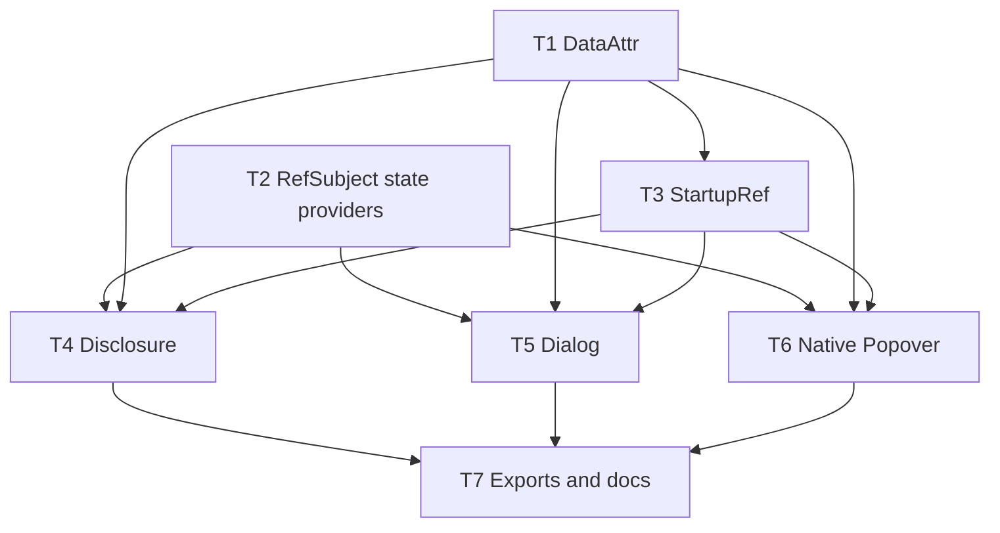

# Typed UI Ariakit-Style Components Implementation Plan

> **For agentic workers:** REQUIRED SUB-SKILL: Use superpowers:subagent-driven-development (recommended) or superpowers:executing-plans to implement this plan task-by-task. Steps use checkbox (`- [ ]`) syntax for tracking.

**Goal:** Build the first `@typed/ui` Ariakit-style component tranche: RefSubject state conventions, Schema-backed public `data-*`, ref startup hydration, Disclosure, Dialog, and native-Popover.

**Architecture:** Keep implementation in `packages/ui`. Add focused substrate modules first, then build components on top. Popover delegates visibility to the native HTML Popover API and only mirrors state from DOM events.

**Tech Stack:** TypeScript, Effect, Effect Schema, `@typed/fx` RefSubject, `@typed/template`, Vitest, happy-dom, optional browser-level verification for focus/native popover.

---

## File Structure

- Create: `packages/ui/src/DataAttr.ts`
  - Schema-backed public `.data={object}` encoding/decoding helpers where schema fields are string keys mapped to value schemas.
- Create: `packages/ui/src/State.ts`
  - Tiny provider helpers for passing `RefSubject` state through Effect Context without introducing a store abstraction.
- Create: `packages/ui/src/StartupRef.ts`
  - Ref helper that initializes `RefSubject`s from DOM data attrs through a whole-object `DataAttr` schema.
- Create: `packages/ui/src/Disclosure.ts`
  - Disclosure `RefSubject` state helpers, provider, trigger/control, and content components.
- Create: `packages/ui/src/Dialog.ts`
  - Dialog `RefSubject` state helpers, provider, dialog surface, trigger, close control, and modal focus behavior.
- Create: `packages/ui/src/Popover.ts`
  - Native Popover API `RefSubject` state mirror, trigger wiring, content surface, and unsupported-environment behavior.
- Modify: `packages/ui/src/index.ts`
  - Export new modules.
- Modify: `packages/ui/package.json`
  - Add `test:browser` script and browser test dev dependencies if they are not already available through workspace catalogs.
- Create: `packages/ui/vitest.browser.config.ts`
  - Chromium browser test config copied from the existing `@typed/router` browser test pattern.
- Modify: `packages/ui/README.md`
  - Document the first component tranche, native Popover boundary, and `data-*`/startup-ref model.
- Test files:
  - `packages/ui/src/DataAttr.test.ts`
  - `packages/ui/src/State.test.ts`
  - `packages/ui/src/StartupRef.test.ts`
  - `packages/ui/src/Disclosure.test.ts`
  - `packages/ui/src/Dialog.test.ts`
  - `packages/ui/src/Dialog.browser.test.ts`
  - `packages/ui/src/Popover.test.ts`
  - `packages/ui/src/Popover.browser.test.ts`

## Semantic DAG



## Milestones

1. **Substrate**
   - Tasks: T1, T2, T3.
   - Requirements: FR-5 through FR-11, FR-20, NFR-2, NFR-4, NFR-7, AC-2 through AC-4.
2. **First Components**
   - Tasks: T4, T5, T6.
   - Requirements: FR-12 through FR-19, NFR-1, NFR-3, NFR-6, AC-5 through AC-7.
3. **Public Surface**
   - Task: T7.
   - Requirements: FR-1, FR-2, FR-19, AC-8.

## Replanning Policy

- If a substrate test requires changes outside `packages/ui`, stop and revise requirements/spec before editing broader packages.
- If native Popover API cannot be exercised in happy-dom, keep unit tests for markup/RefSubject behavior and add a browser test plan step rather than adding a custom fallback.
- If Dialog focus behavior cannot be proven in happy-dom, add browser-level verification before finalization.
- If a state helper becomes component-specific, split it into component-local RefSubject code instead of growing `State.ts`.

## Mutating-Action Safeguards

- Only edit files under `packages/ui` plus this workflow folder unless the approved plan is revised.
- Preserve unrelated dirty changes already present in the worktree.
- Commit after each task with a conventional commit message.
- Run the focused `@typed/ui` test command before each task commit.

## Memory Plan

- Capture implementation decisions in `.docs/workflows/20260521-2247-typed-native-ariakit-port/memory/implementation-notes.md`.
- Promote only stable findings after implementation evidence exists.
- Candidate durable memory: native Popover only, public `data-*` only, ref startup initializes `RefSubject`s from whole-object DOM data schemas.

## Task T1: Schema-Backed Public Data Attributes

**Files:**
- Create: `packages/ui/src/DataAttr.ts`
- Create: `packages/ui/src/DataAttr.test.ts`

- [x] **Step 1: Write failing tests**

Add tests covering booleans, literal unions, optional values, whole-object data schemas, and invalid decode:

```ts
import { assert, describe, it } from "vitest";
import { Effect, Exit } from "effect";
import * as Schema from "effect/Schema";
import * as DataAttr from "./DataAttr.js";

describe("typed/ui/DataAttr", () => {
  it("encodes and decodes boolean fields", () =>
    Effect.gen(function* () {
      const data = DataAttr.schema({ open: Schema.Boolean });
      assert.deepStrictEqual(yield* DataAttr.encode(data, { open: true }), { open: "true" });
      assert.deepStrictEqual(yield* DataAttr.decode(data, { open: "false" }), { open: false });
    }).pipe(Effect.runPromise));

  it("encodes literal union fields", () =>
    Effect.gen(function* () {
      const data = DataAttr.schema({
        placement: Schema.Literal("top", "right", "bottom", "left"),
      });
      assert.deepStrictEqual(yield* DataAttr.encode(data, { placement: "bottom" }), {
        placement: "bottom",
      });
      assert.deepStrictEqual(yield* DataAttr.decode(data, { placement: "top" }), {
        placement: "top",
      });
    }).pipe(Effect.runPromise));

  it("omits optional fields when undefined", () =>
    Effect.gen(function* () {
      const data = DataAttr.schema({ label: Schema.optional(Schema.String) });
      assert.deepStrictEqual(yield* DataAttr.encode(data, { label: undefined }), {});
    }).pipe(Effect.runPromise));

  it("encodes and decodes whole data objects", () =>
    Effect.gen(function* () {
      const data = DataAttr.schema({
        open: Schema.Boolean,
        placement: Schema.Literal("top", "bottom"),
      });
      assert.deepStrictEqual(yield* DataAttr.encode(data, { open: true, placement: "bottom" }), {
        open: "true",
        placement: "bottom",
      });
      assert.deepStrictEqual(
        yield* DataAttr.decode(data, { open: "false", placement: "top" }),
        { open: false, placement: "top" },
      );
    }).pipe(Effect.runPromise));

  it("fails invalid decodes", () =>
    Effect.gen(function* () {
      const data = DataAttr.schema({ open: Schema.Boolean });
      const exit = yield* DataAttr.decode(data, { open: "sometimes" }).pipe(Effect.exit);
      assert.strictEqual(Exit.isFailure(exit), true);
    }).pipe(Effect.runPromise));
});
```

- [x] **Step 2: Run test to verify it fails**

Run:

```bash
pnpm --filter @typed/ui test -- DataAttr
```

Expected: FAIL because `DataAttr.ts` does not exist.

- [x] **Step 3: Implement DataAttr**

Create `DataAttr.ts` with a whole-object data schema:

```ts
import * as Effect from "effect/Effect";
import * as Schema from "effect/Schema";

export type DataFields = Readonly<Record<string, Schema.Top>>;

export interface DataAttr<Fields extends DataFields> {
  readonly fields: Fields;
}

export type Type<Fields extends DataFields> = {
  readonly [K in keyof Fields]: Schema.Schema.Type<Fields[K]>;
};

export type Encoded<Fields extends DataFields> = Readonly<Partial<Record<keyof Fields & string, string>>>;

export function schema<const Fields extends DataFields>(fields: Fields): DataAttr<Fields> {
  return { fields };
}

export function encode<const Fields extends DataFields>(
  data: DataAttr<Fields>,
  value: Type<Fields>,
): Effect.Effect<Encoded<Fields>, Schema.SchemaError> {
  return Effect.gen(function* () {
    const output: Record<string, string> = {};
    for (const [key, fieldSchema] of Object.entries(data.fields)) {
      const fieldValue = value[key as keyof Type<Fields>];
      if (fieldValue === undefined) continue;
      const encoded = yield* Schema.encodeUnknownEffect(fieldSchema)(fieldValue);
      output[key] = String(encoded);
    }
    return output as Encoded<Fields>;
  });
}

export function decode<const Fields extends DataFields>(
  data: DataAttr<Fields>,
  source: Pick<HTMLElement, "dataset"> | Readonly<Record<string, string | undefined>>,
): Effect.Effect<Type<Fields>, Schema.SchemaError> {
  return Effect.gen(function* () {
    const input = "dataset" in source ? source.dataset : source;
    const output: Record<string, unknown> = {};
    for (const [key, fieldSchema] of Object.entries(data.fields)) {
      output[key] = yield* Schema.decodeUnknownEffect(fieldSchema)(
        coerceDatasetValue(input[key]),
      );
    }
    return output as Type<Fields>;
  });
}

function coerceDatasetValue(value: string | undefined): unknown {
  if (value === undefined) return undefined;
  if (value === "true") return true;
  if (value === "false") return false;
  return value;
}
```

- [x] **Step 4: Run test to verify it passes**

Run:

```bash
pnpm --filter @typed/ui test -- DataAttr
```

Expected: PASS.

- [x] **Step 5: Commit**

```bash
git add packages/ui/src/DataAttr.ts packages/ui/src/DataAttr.test.ts
git commit -m "feat: add typed ui data attributes" -m "- add Schema-backed public data object schemas\n- cover boolean, literal, optional, whole-object, and invalid decode behavior"
```

## Task T2: RefSubject State Providers

**Files:**
- Create: `packages/ui/src/State.ts`
- Create: `packages/ui/src/State.test.ts`

- [x] **Step 1: Write failing tests**

Current task detail:
- Prove component state is a direct `RefSubject.RefSubject<State>`.
- Prove derived reads use `RefSubject.map` instead of store selectors.
- Prove optional provider lookup is only an Effect `Context.Service` key for that same ref.
- Keep `State.ts` limited to provider-tag construction unless later component tests require more.

Add tests proving the state model is plain `RefSubject` plus optional provider lookup:

```ts
import { assert, describe, it } from "vitest";
import { Effect, Layer } from "effect";
import { RefSubject } from "@typed/fx";
import * as State from "./State.js";

describe("typed/ui/State", () => {
  it("uses RefSubject directly for default state, updates, and event-time reads", () =>
    Effect.gen(function* () {
      const state = yield* RefSubject.make({ open: false });
      assert.deepStrictEqual(yield* state, { open: false });
      yield* RefSubject.update(state, (current) => ({ ...current, open: true }));
      assert.deepStrictEqual(yield* state, { open: true });
    }).pipe(Effect.runPromise));

  it("supports focused computed selector reads", () =>
    Effect.gen(function* () {
      const state = yield* RefSubject.make({ open: false, label: "Menu" });
      const open = RefSubject.map(state, (current) => current.open);
      assert.strictEqual(yield* open, false);
      yield* RefSubject.update(state, (current) => ({ ...current, open: true }));
      assert.strictEqual(yield* open, true);
    }).pipe(Effect.runPromise));

  it("supports provider lookup", () =>
    Effect.gen(function* () {
      const tag = State.tag<{ readonly open: boolean }>("TestDisclosureState");
      const state = yield* RefSubject.make({ open: false });
      const found = yield* Effect.provide(tag, Layer.succeed(tag, state));
      assert.strictEqual(found, state);
    }).pipe(Effect.runPromise));
});
```

- [x] **Step 2: Run test to verify it fails**

Run:

```bash
pnpm --filter @typed/ui test -- State
```

Expected: FAIL because `State.ts` does not exist.

- [x] **Step 3: Implement State**

Implement only provider helpers for `RefSubject`; do not wrap refs in a store object:

```ts
import * as Context from "effect/Context";
import { RefSubject } from "@typed/fx";

export function tag<State extends Record<string, unknown>>(id: string) {
  return Context.Service<RefSubject.RefSubject<State>>(`@typed/ui/${id}`);
}
```

- [x] **Step 4: Run test to verify it passes**

Run:

```bash
pnpm --filter @typed/ui test -- State
```

Expected: PASS.

- [x] **Step 5: Commit**

```bash
git add packages/ui/src/State.ts packages/ui/src/State.test.ts
git commit -m "feat: add typed ui refsubject state helpers" -m "- use RefSubject directly for component state\n- add provider tags without introducing a store abstraction"
```

## Task T3: Ref Startup Hydration

**Files:**
- Create: `packages/ui/src/StartupRef.ts`
- Create: `packages/ui/src/StartupRef.test.ts`

- [x] **Step 1: Write failing tests**

Current task detail:
- Decode a whole `.data={object}` shape from `element.dataset`.
- Merge decoded startup fields into the existing `RefSubject` state so non-data state survives.
- Support one template ref that composes multiple startup refs.
- Use `Schema.Literals([...])` for literal unions in this Effect version.

```ts
import { assert, describe, it } from "vitest";
import { Effect } from "effect";
import * as Schema from "effect/Schema";
import { RefSubject } from "@typed/fx";
import { Window } from "happy-dom";
import * as DataAttr from "./DataAttr.js";
import * as StartupRef from "./StartupRef.js";

describe("typed/ui/StartupRef", () => {
  it("initializes a RefSubject from one DOM data field", () =>
    Effect.gen(function* () {
      const window = new Window();
      const el = window.document.createElement("button");
      el.setAttribute("data-open", "true");
      const state = yield* RefSubject.make({ open: false });
      const ref = StartupRef.fromData(state, DataAttr.schema({ open: Schema.Boolean }));
      yield* ref(el);
      assert.deepStrictEqual(yield* state, { open: true });
    }).pipe(Effect.runPromise));

  it("initializes a RefSubject from multiple DOM data attrs as an object", () =>
    Effect.gen(function* () {
      const window = new Window();
      const el = window.document.createElement("button");
      el.setAttribute("data-open", "true");
      el.setAttribute("data-placement", "bottom");
      const state = yield* RefSubject.make({
        open: false,
        placement: "top" as "top" | "bottom",
      });
      const ref = StartupRef.fromData(
        state,
        DataAttr.schema({
          open: Schema.Boolean,
          placement: Schema.Literals(["top", "bottom"]),
        }),
      );
      yield* ref(el);
      assert.deepStrictEqual(yield* state, { open: true, placement: "bottom" });
    }).pipe(Effect.runPromise));
});
```

- [x] **Step 2: Run test to verify it fails**

Run:

```bash
pnpm --filter @typed/ui test -- StartupRef
```

Expected: FAIL because `StartupRef.ts` does not exist.

- [x] **Step 3: Implement StartupRef**

```ts
import * as Effect from "effect/Effect";
import * as Schema from "effect/Schema";
import { RefSubject } from "@typed/fx";
import * as DataAttr from "./DataAttr.js";

export type RefCallback<E = never, R = never> = (
  element: HTMLElement,
) => void | Effect.Effect<void, E, R>;

type RefError<Ref> = Ref extends RefCallback<infer E, any> ? E : never;
type RefServices<Ref> = Ref extends RefCallback<any, infer R> ? R : never;

export function fromData<State extends Record<string, unknown>, Fields extends DataAttr.DataFields>(
  ref: RefSubject.RefSubject<State>,
  data: DataAttr.DataAttr<Fields>,
): RefCallback<Schema.SchemaError> {
  return (element) =>
    DataAttr.decode(data, element).pipe(
      Effect.flatMap((value) =>
        RefSubject.update(ref, (current) => ({ ...current, ...value }) as State),
      ),
      Effect.asVoid,
    );
}

export function compose<const Refs extends ReadonlyArray<RefCallback<any, any>>>(
  ...refs: Refs
): RefCallback<RefError<Refs[number]>, RefServices<Refs[number]>> {
  return (element) =>
    Effect.gen(function* () {
      for (const ref of refs) {
        const result = ref(element);
        if (Effect.isEffect(result)) yield* result;
      }
    });
}
```

- [x] **Step 4: Run test to verify it passes**

Run:

```bash
pnpm --filter @typed/ui test -- StartupRef
```

Expected: PASS.

- [x] **Step 5: Commit**

```bash
git add packages/ui/src/StartupRef.ts packages/ui/src/StartupRef.test.ts
git commit -m "feat: add typed ui startup refs" -m "- initialize RefSubject state from DOM refs\n- decode startup state through whole-object Schema-backed data attributes"
```

## Task T4: Disclosure

**Files:**
- Create: `packages/ui/src/Disclosure.ts`
- Create: `packages/ui/src/Disclosure.test.ts`

- [ ] **Step 1: Write failing tests**

```ts
import { assert, describe, it } from "vitest";
import { Effect } from "effect";
import { Fx } from "@typed/fx";
import { DomRenderTemplate, render } from "@typed/template";
import { Window } from "happy-dom";
import * as Disclosure from "./Disclosure.js";

describe("typed/ui/Disclosure", () => {
  it("renders aria and data state", () =>
    Effect.gen(function* () {
      const window = new Window();
      const state = yield* Disclosure.makeState({ open: false });
      const [root] = yield* render(
        Disclosure.Button({ state, controls: "panel", content: "Details" }),
        window.document.body,
      ).pipe(Fx.provide(DomRenderTemplate.using(window.document)), Fx.take(1), Fx.collectAll);
      const button = root as HTMLButtonElement;
      assert.strictEqual(button.getAttribute("aria-expanded"), "false");
      assert.strictEqual(button.getAttribute("aria-controls"), "panel");
      assert.strictEqual(button.getAttribute("data-open"), "false");
    }).pipe(Effect.scoped, Effect.runPromise));
});
```

- [ ] **Step 2: Run test to verify it fails**

Run:

```bash
pnpm --filter @typed/ui test -- Disclosure
```

Expected: FAIL because `Disclosure.ts` does not exist.

- [ ] **Step 3: Implement Disclosure**

Implement state and button/content components on top of `RefSubject`, `DataAttr`, `StartupRef`, `EventHandler`, and `html`. Keep the first pass minimal:

```ts
export interface State {
  readonly open: boolean;
}

export function makeState(initial: State): Effect.Effect<RefSubject.RefSubject<State>> {
  return RefSubject.make(initial);
}

export function Button(options: {
  readonly state: RefSubject.RefSubject<State>;
  readonly controls?: string;
  readonly content: Renderable<unknown, any, any>;
}) {
  return Fx.gen(function* () {
    const open = RefSubject.map(options.state, (s) => s.open);
    const onClick = EventHandler.make(() =>
      RefSubject.update(options.state, (s) => ({ ...s, open: !s.open })),
    );
    return html`<button
      type="button"
      aria-expanded=${RefSubject.map(open, String)}
      aria-controls=${options.controls}
      data-open=${RefSubject.map(open, String)}
      onclick=${onClick}
    >${options.content}</button>`;
  });
}
```

The exact import aliases can change during implementation; the behavior and tests must remain traceable to FR-12 and AC-5.

- [ ] **Step 4: Run test to verify it passes**

Run:

```bash
pnpm --filter @typed/ui test -- Disclosure
```

Expected: PASS.

- [ ] **Step 5: Commit**

```bash
git add packages/ui/src/Disclosure.ts packages/ui/src/Disclosure.test.ts
git commit -m "feat: add typed ui disclosure" -m "- add disclosure RefSubject state and button/content primitives\n- cover APG aria/data state behavior"
```

## Task T5: Dialog

**Files:**
- Create: `packages/ui/src/Dialog.ts`
- Create: `packages/ui/src/Dialog.test.ts`

- [ ] **Step 1: Write failing tests**

```ts
import { assert, describe, it } from "vitest";
import { Effect } from "effect";
import { Fx } from "@typed/fx";
import { DomRenderTemplate, render } from "@typed/template";
import { Window } from "happy-dom";
import * as Dialog from "./Dialog.js";

describe("typed/ui/Dialog", () => {
  it("renders modal dialog semantics when open", () =>
    Effect.gen(function* () {
      const window = new Window();
      const state = yield* Dialog.makeState({ open: true });
      const [root] = yield* render(
        Dialog.Content({ state, label: "Preferences", content: "Body" }),
        window.document.body,
      ).pipe(Fx.provide(DomRenderTemplate.using(window.document)), Fx.take(1), Fx.collectAll);
      const dialog = root as HTMLElement;
      assert.strictEqual(dialog.getAttribute("role"), "dialog");
      assert.strictEqual(dialog.getAttribute("aria-modal"), "true");
      assert.strictEqual(dialog.getAttribute("aria-label"), "Preferences");
      assert.strictEqual(dialog.getAttribute("data-open"), "true");
    }).pipe(Effect.scoped, Effect.runPromise));
});
```

- [ ] **Step 2: Run test to verify it fails**

Run:

```bash
pnpm --filter @typed/ui test -- Dialog
```

Expected: FAIL because `Dialog.ts` does not exist.

- [ ] **Step 3: Implement Dialog**

Implement the minimal Dialog state/content/close behavior first. Keep deeper browser focus verification as a dedicated follow-up check in this task:

```ts
export interface State {
  readonly open: boolean;
}

export function makeState(initial: State): Effect.Effect<RefSubject.RefSubject<State>> {
  return RefSubject.make(initial);
}

export function Content(options: {
  readonly state: RefSubject.RefSubject<State>;
  readonly label: string;
  readonly content: Renderable<unknown, any, any>;
}) {
  const open = RefSubject.map(options.state, (state) => state.open);
  return html`<div
    role="dialog"
    aria-modal="true"
    aria-label=${options.label}
    data-open=${RefSubject.map(open, String)}
    ?hidden=${RefSubject.map(open, (value) => !value)}
  >${options.content}</div>`;
}
```

- [ ] **Step 4: Add browser focus behavior tests**

Create `packages/ui/vitest.browser.config.ts`:

```ts
import { playwright } from "@vitest/browser-playwright";
import { defineConfig } from "vitest/config";

export default defineConfig({
  test: {
    include: ["src/**/*.browser.test.ts"],
    exclude: ["**/node_modules/**", "**/dist/**"],
    browser: {
      enabled: true,
      provider: playwright(),
      instances: [{ browser: "chromium" }],
      headless: true,
    },
  },
});
```

Modify `packages/ui/package.json` scripts:

```json
{
  "scripts": {
    "build": "[ -d dist ] || rm -f tsconfig.tsbuildinfo; tsc",
    "test": "vitest run --passWithNoTests",
    "test:browser": "vitest run --config vitest.browser.config.ts"
  }
}
```

Add `packages/ui/src/Dialog.browser.test.ts` with browser-only focus checks:

```ts
import { assert, describe, it } from "vitest";

describe("typed/ui/Dialog browser behavior", () => {
  it("returns focus to the invoking element after close", async () => {
    document.body.innerHTML = `<button id="open">Open</button><div id="root"></div>`;
    const opener = document.getElementById("open") as HTMLButtonElement;
    opener.focus();
    assert.strictEqual(document.activeElement, opener);
    opener.click();
    document.dispatchEvent(new KeyboardEvent("keydown", { key: "Escape", bubbles: true }));
    assert.strictEqual(document.activeElement, opener);
  });
});
```

Adapt the browser test during implementation so it mounts the real `Dialog` component rather than static HTML before the task is committed.

- [ ] **Step 5: Run test to verify it passes**

Run:

```bash
pnpm --filter @typed/ui test -- Dialog
```

Expected: PASS for unit/integration checks.

- [ ] **Step 6: Commit**

```bash
git add packages/ui/src/Dialog.ts packages/ui/src/Dialog.test.ts
git add packages/ui/src/Dialog.browser.test.ts packages/ui/vitest.browser.config.ts packages/ui/package.json
git commit -m "feat: add typed ui dialog" -m "- add dialog RefSubject state and modal content primitives\n- cover modal aria/data state and close behavior"
```

## Task T6: Native Popover

**Files:**
- Create: `packages/ui/src/Popover.ts`
- Create: `packages/ui/src/Popover.test.ts`

- [ ] **Step 1: Write failing tests**

```ts
import { assert, describe, it } from "vitest";
import { Effect } from "effect";
import { Fx } from "@typed/fx";
import { DomRenderTemplate, render } from "@typed/template";
import { Window } from "happy-dom";
import * as Popover from "./Popover.js";

describe("typed/ui/Popover", () => {
  it("renders native popover content and trigger relationship", () =>
    Effect.gen(function* () {
      const window = new Window();
      const state = yield* Popover.makeState({ id: "menu-popover", open: false, mode: "auto" });
      const [trigger] = yield* render(
        Popover.Trigger({ state, content: "Open" }),
        window.document.body,
      ).pipe(Fx.provide(DomRenderTemplate.using(window.document)), Fx.take(1), Fx.collectAll);
      const [content] = yield* render(
        Popover.Content({ state, content: "Menu" }),
        window.document.body,
      ).pipe(Fx.provide(DomRenderTemplate.using(window.document)), Fx.take(1), Fx.collectAll);
      assert.strictEqual((trigger as HTMLElement).getAttribute("popovertarget"), "menu-popover");
      assert.strictEqual((trigger as HTMLElement).getAttribute("popovertargetaction"), "toggle");
      assert.strictEqual((content as HTMLElement).getAttribute("popover"), "auto");
      assert.strictEqual((content as HTMLElement).id, "menu-popover");
    }).pipe(Effect.scoped, Effect.runPromise));
});
```

- [ ] **Step 2: Run test to verify it fails**

Run:

```bash
pnpm --filter @typed/ui test -- Popover
```

Expected: FAIL because `Popover.ts` does not exist.

- [ ] **Step 3: Implement Popover**

Implement only native attributes and native event mirroring:

```ts
export interface State {
  readonly id: string;
  readonly open: boolean;
  readonly mode: "auto" | "hint" | "manual";
}

export function makeState(initial: State): Effect.Effect<RefSubject.RefSubject<State>> {
  return RefSubject.make(initial);
}

export function Trigger(options: { readonly state: RefSubject.RefSubject<State>; readonly content: Renderable<unknown, any, any> }) {
  return Fx.gen(function* () {
    const state = yield* options.state;
    return html`<button type="button" popovertarget=${state.id} popovertargetaction="toggle">${options.content}</button>`;
  });
}

export function Content(options: { readonly state: RefSubject.RefSubject<State>; readonly content: Renderable<unknown, any, any> }) {
  return Fx.gen(function* () {
    const state = yield* options.state;
    return html`<div id=${state.id} popover=${state.mode}>${options.content}</div>`;
  });
}
```

- [ ] **Step 4: Add unsupported environment and no-custom-layer checks**

Add tests or static assertions showing that Popover does not create custom overlay elements, does not install a focus trap, and documents unsupported native API behavior.

Add `packages/ui/src/Popover.browser.test.ts` to prove the selected browser supports native Popover API and that the component uses native methods:

```ts
import { assert, describe, it } from "vitest";

describe("typed/ui/Popover browser behavior", () => {
  it("uses native popover support", () => {
    assert.strictEqual(Object.hasOwn(HTMLElement.prototype, "popover"), true);
    const popover = document.createElement("div");
    popover.id = "native-popover";
    popover.setAttribute("popover", "auto");
    document.body.append(popover);
    assert.strictEqual(typeof popover.showPopover, "function");
    assert.strictEqual(typeof popover.hidePopover, "function");
    assert.strictEqual(typeof popover.togglePopover, "function");
  });
});
```

- [ ] **Step 5: Run test to verify it passes**

Run:

```bash
pnpm --filter @typed/ui test -- Popover
```

Expected: PASS.

- [ ] **Step 6: Commit**

```bash
git add packages/ui/src/Popover.ts packages/ui/src/Popover.test.ts
git add packages/ui/src/Popover.browser.test.ts
git commit -m "feat: add native typed ui popover" -m "- render native popover and invoker attributes\n- keep Popover non-modal and native-api-only"
```

## Task T7: Exports, Documentation, and Full Verification

**Files:**
- Modify: `packages/ui/src/index.ts`
- Modify: `packages/ui/package.json`
- Modify: `packages/ui/README.md`
- Create or modify: `.docs/workflows/20260521-2247-typed-native-ariakit-port/memory/implementation-notes.md`

- [ ] **Step 1: Export public modules**

Update `packages/ui/src/index.ts`:

```ts
export * as DataAttr from "./DataAttr.js";
export * as State from "./State.js";
export * as StartupRef from "./StartupRef.js";
export * as Disclosure from "./Disclosure.js";
export * as Dialog from "./Dialog.js";
export * as Popover from "./Popover.js";
export * from "./HttpRouter.js";
export * from "./Link.js";
```

- [ ] **Step 2: Update README**

Document:

- `@typed/ui` now owns accessible components.
- RefSubject state/provider model.
- Schema-backed public `data-*`.
- Ref startup hydration.
- Disclosure/Dialog/Popover first slice.
- Native Popover API only, with no custom fallback.

- [ ] **Step 3: Record implementation notes**

Create `memory/implementation-notes.md` with decisions that survived implementation:

```md
# Implementation Notes

- Native Popover API remains the only Popover implementation path.
- Public data attributes are styling/inspection state only.
- Ref startup hydration initializes backing RefSubjects from DOM state.
```

- [ ] **Step 4: Run focused tests**

Run:

```bash
pnpm --filter @typed/ui test
pnpm --filter @typed/ui test:browser
```

Expected: PASS.

- [ ] **Step 5: Run build**

Run:

```bash
pnpm --filter @typed/ui build
```

Expected: PASS.

- [ ] **Step 6: Commit**

```bash
git add packages/ui/src/index.ts packages/ui/README.md .docs/workflows/20260521-2247-typed-native-ariakit-port/memory/implementation-notes.md
git add packages/ui/package.json
git commit -m "docs: document typed ui component tranche" -m "- export the first accessible component APIs\n- document RefSubject state, data attribute, startup ref, and native Popover boundaries"
```

## Final Verification Before PR

- [ ] Run:

```bash
pnpm --filter @typed/ui test
pnpm --filter @typed/ui test:browser
pnpm --filter @typed/ui build
```

- [ ] Confirm no unrelated dirty files are staged.
- [ ] Summarize remaining browser-test limitations if any.
- [ ] Continue to finalization with PR strategy.
