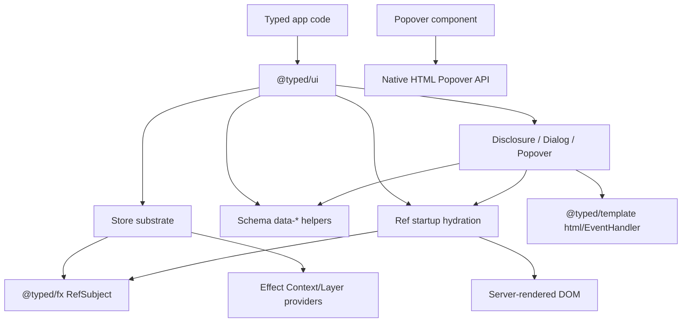
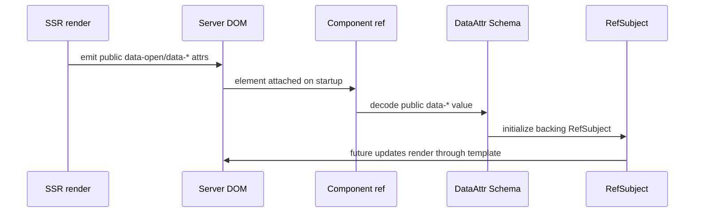

# Specification - Typed Native Ariakit Port

## System Context and Scope

`@typed/ui` becomes the first-party accessible component layer for Typed. It expands from router/template integration helpers into a headless component toolkit with Ariakit-like naming and capabilities.

The first implementation tranche covers the substrate plus a Disclosure, Dialog, and native-Popover vertical slice:

- Store substrate: explicit stores, provider helpers, focused reads/selectors, setter callbacks, and event-time reads.
- Public state attributes: Schema-backed helpers for public `data-*` styling/inspection state.
- Startup hydration: ref-based helpers that initialize backing `RefSubject`s from server-rendered DOM state.
- Disclosure: APG disclosure behavior.
- Dialog: APG modal dialog behavior.
- Popover: native HTML Popover API only.

Out of scope for this tranche:

- Custom Popover overlay mechanics.
- Custom Popover focus trapping.
- First-party CSS.
- Composite-heavy widgets such as Menu, Select, Combobox, Tabs, Toolbar, and Radio.
- Framework or virtual-module changes.

## Component Responsibilities and Interfaces

### Store Substrate

The store substrate provides Ariakit-like state composition in Typed terms.

Conceptual responsibilities:

- Create explicit store values, for example `DisclosureStore.make(...)`.
- Expose backing `RefSubject`s or computed refs for reactive reads.
- Support default state and controlled state.
- Support setter callbacks, such as `setOpen`.
- Support event-time state reads without forcing render subscriptions.
- Support focused selectors so components can update only when selected state changes.
- Provide store helpers through Effect Context/Layer for nested component ergonomics.

Conceptual interface:

```ts
const store = yield* DisclosureStore.make({
  defaultOpen: false,
  setOpen: (open) => Effect.void,
});

const view = Disclosure({
  store,
  content: DisclosureContent({ store, content: "Details" }),
});
```

Provider-style usage remains available:

```ts
DisclosureProvider({ store, content: DisclosureContent({ content: "Details" }) });
```

The exact function names may change during planning, but the public names should remain similar to Ariakit where practical.

### Public Data Attributes

`@typed/ui` exposes helpers for Schema-backed public `data-*` attributes.

Responsibilities:

- Encode typed public state into strings accepted by HTML `data-*` attributes.
- Decode public DOM `data-*` values back into typed state for tests, inspection, and startup.
- Keep `data-*` limited to public styling/inspection state.
- Avoid using public `data-*` as internal hydration payloads.

Conceptual examples:

```ts
const OpenAttr = DataAttr.schema("open", Schema.Boolean);
const PlacementAttr = DataAttr.schema("placement", Schema.Literal("top", "right", "bottom", "left"));
```

Rendered state should be stable enough for styling:

```html
<button data-open="true" aria-expanded="true">Toggle</button>
```

### Ref Startup Hydration

Components that need server-emitted startup state use a shared ref startup abstraction.

Responsibilities:

- Attach a DOM ref to a rendered element.
- Decode public DOM state through Schema-backed helpers.
- Initialize a backing `RefSubject`.
- Avoid per-component ad hoc DOM parsing.

Conceptual shape:

```ts
const open = yield* RefSubject.make(false);
const ref = hydrateRefFromDataAttr(open, OpenAttr);
```

### Disclosure

Disclosure owns a store with `open` state and renders a control plus controlled content.

Responsibilities:

- Toggle open state from Enter, Space, and activation/click.
- Emit `aria-expanded`.
- Support `aria-controls` when content id is known.
- Emit stable public `data-open`.
- Compose with explicit store and provider store lookup.

### Dialog

Dialog owns modal dialog behavior.

Responsibilities:

- Render dialog semantics with `role="dialog"` and label support.
- Mark modal dialogs with `aria-modal="true"` only when behavior is actually modal.
- Move initial focus according to configured policy.
- Close on Escape when enabled.
- Support visible close controls in tab sequence.
- Return focus to the invoking element when closed when that element still exists.
- Emit stable public `data-open` and related public state.

### Popover

Popover owns non-modal native popover behavior only.

Responsibilities:

- Render native `popover` attribute values: `auto`, `hint`, or `manual`.
- Prefer declarative native relationships through `popovertarget` and `popovertargetaction`.
- Mirror native state through refs/startup reads and native `beforetoggle`/`toggle` events.
- Expose helper methods that call native `showPopover`, `hidePopover`, and `togglePopover` only when imperative control is needed.
- Fail clearly or mark unsupported when native Popover API is absent; do not polyfill with custom overlay behavior.

## System Diagrams (Mermaid)





## Data and Control Flow

1. A component either receives an explicit store or reads a provider-backed store from Effect Context.
2. Store construction creates backing refs and computed selectors.
3. Rendering maps store state to ARIA attributes, public `data-*` attributes, and event handlers.
4. Schema-backed data helpers encode public state to string attributes.
5. On startup/hydration, refs can decode server-emitted DOM state and initialize backing `RefSubject`s.
6. Disclosure and Dialog own their state transitions through store APIs and event handlers.
7. Popover delegates visibility mechanics to native Popover API and synchronizes store state from native events.

## Failure Modes and Mitigations

| failure | mitigation |
| ------- | ---------- |
| Popover silently behaves as custom overlay | Require native API only and test absence of custom visibility/focus trap layer. |
| `data-*` becomes internal hydration channel | Limit helpers to public styling/inspection state and route startup through ref helpers. |
| Schema decoding accepts invalid public state | Use Schema decode failures in tests and expose typed failure paths. |
| Dialog marks `aria-modal` without true modal behavior | Acceptance tests must cover modal behavior before `aria-modal="true"` is emitted. |
| Store/provider APIs drift into React-like hook assumptions | Model stores as explicit Effect/Fx values, with providers as Context/Layer helpers. |
| Focus behavior differs between DOM implementations and browsers | Browser-level checks are required for Dialog and native Popover behavior. |

## Requirement Traceability

| requirement_id | design_element | notes |
| -------------- | -------------- | ----- |
| FR-1, NFR-5 | `@typed/ui` package scope | No new package or framework changes. |
| FR-2 | API naming policy | Ariakit-similar names where practical. |
| FR-3, FR-4 | tranche scope | Substrate plus Disclosure/Dialog/Popover. |
| FR-5, FR-6, FR-7 | store substrate | Explicit stores plus Effect provider helpers. |
| FR-8, FR-9, FR-10 | DataAttr helpers | Public state only, Schema-backed encode/decode. |
| FR-11, NFR-7 | ref startup hydration | Shared ref path initializes `RefSubject`s from DOM. |
| FR-12 | Disclosure | APG disclosure behavior. |
| FR-13, NFR-1, NFR-3 | Dialog | APG modal dialog behavior and browser verification. |
| FR-14, FR-15, FR-16, FR-17, FR-18, NFR-6 | Popover | Native Popover API only, non-modal. |
| FR-19 | headless styling | Stable public `data-*`, no CSS. |
| NFR-2 | test strategy | Property/state-machine tests for stores and data attrs. |
| NFR-4 | implementation style | Small composable Effect-native APIs. |

## References Consulted

- specs:
  - `.docs/specs/typed-framework-starter/spec.md`
  - `.docs/specs/router-virtual-module-plugin/spec.md`
  - `.docs/specs/httpapi-virtual-module-plugin/spec.md`
- adrs:
  - `.docs/adrs/20260516-1643-typed-framework-virtual-module-first.md`
- workflows:
  - `.docs/workflows/20260521-2247-typed-native-ariakit-port/intent.md`
  - `.docs/workflows/20260521-2247-typed-native-ariakit-port/scope.md`
  - `.docs/workflows/20260521-2247-typed-native-ariakit-port/02-research.md`
  - `.docs/workflows/20260521-2247-typed-native-ariakit-port/requirements.md`
- external:
  - Ariakit Component Stores
  - Ariakit `useDialogStore`
  - WAI-ARIA APG Disclosure Pattern
  - WAI-ARIA APG Dialog Modal Pattern
  - MDN Popover API
  - WHATWG HTML Popover
  - MDN `HTMLElement.dataset`

## ADR Links

- `.docs/workflows/20260521-2247-typed-native-ariakit-port/03-adr-native-popover-only.md`
