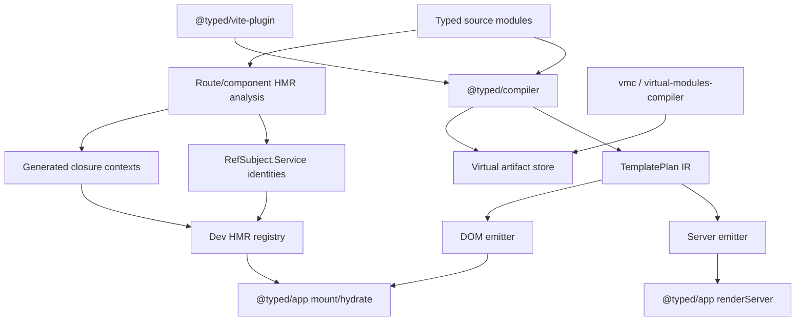
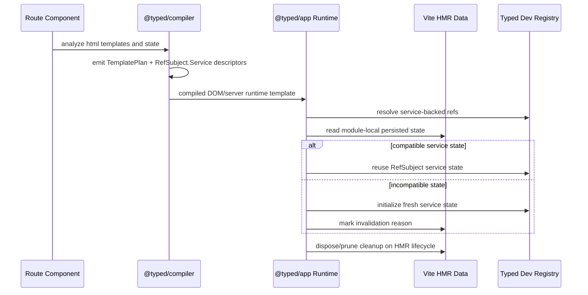

# Specification - Runtime Template Compiler

Status: draft, pending human approval.

## System Context and Scope

Typed will add a focused `@typed/compiler` package and first-class `@typed/app` runtime functions for template compilation, server rendering, DOM rendering/hydration, and stateful HMR.

The system keeps the existing architecture:

- `@typed/template` remains the authoring model for `html` templates and runtime fallback rendering.
- `@typed/compiler` owns template analysis, typed IR, target emitters, HMR eligibility analysis, and compiler/runtime handoff descriptions.
- `@typed/app` owns public app runtime functions and generated app-entrypoint integration.
- `@typed/fx` owns `Fx`, `Fx.fn`, and `RefSubject` primitives, including the new service-backed state pattern.
- `@typed/virtual-modules-compiler` remains `vmc`, the TypeScript compiler-host adapter.
- `@typed/vite-plugin` and `@typed/virtual-modules-vite` remain the Vite integration path.

All `html` templates are compiler optimization targets. Stateful HMR is narrower: route components and participating dependency modules with compiler-visible state/service/context boundaries.

Out of scope:

- actual filesystem routing
- replacing `vmc`
- arbitrary TypeScript optimization
- arbitrary closure serialization
- production-only HMR semantics

## Component Responsibilities and Interfaces

### `@typed/compiler`

`@typed/compiler` provides the compiler-facing package surface.

Primary responsibilities:

- discover `html` tagged templates in typed app/component modules
- parse templates through the existing `@typed/template` parser semantics
- produce a typed `TemplatePlan` IR
- emit server and DOM target implementations
- preserve `Renderable`, `Effect`, and `Fx` success/error/service typing
- analyze route components and participating dependencies for HMR eligibility
- describe service-backed `RefSubject` replacements and generated closure context objects
- produce deterministic fingerprints for compiled output and HMR compatibility checks

Conceptual API:

```ts
export interface TemplateCompileInput {
  readonly moduleId: string;
  readonly sourceText: string;
  readonly target: "server" | "dom";
  readonly hmr?: TemplateHmrOptions;
}

export interface TemplateCompileResult {
  readonly plan: TemplatePlan;
  readonly output: CompiledTemplateOutput;
  readonly diagnostics: readonly TemplateCompilerDiagnostic[];
  readonly fingerprints: TemplateCompilerFingerprints;
}

export function compileTemplate(input: TemplateCompileInput): TemplateCompileResult;
```

The exact API can be refined in planning, but the boundary is fixed: this package compiles templates/app components; it does not become the `vmc` CLI.

### Template IR

The compiler emits a `TemplatePlan` before target output.

The IR records:

- static node structure
- dynamic node/text/attribute/property/class/data parts
- event handlers
- ref parts
- sparse text/attribute/comment parts
- nested template boundaries
- target-independent type metadata for dynamic values
- hydration markers and template hash metadata
- HMR candidate state services and closure contexts when present

The IR must be deterministic for identical semantic input.

### Server Target Emitter

The server emitter produces optimized HTML output plans.

It should:

- precompute static chunks
- emit dynamic chunk functions for interpolations
- omit DOM-only ref/event work from HTML output
- preserve current placeholder behavior needed for hydration
- preserve static rendering mode where requested
- return output compatible with `@typed/app` server runtime functions

### DOM Target Emitter

The DOM emitter produces optimized mount/hydration output plans.

It should:

- precompute static fragment construction where possible
- emit dynamic part update instructions
- preserve event listener setup and scope cleanup
- preserve hydration lookup and fallback semantics
- avoid reparsing templates at runtime for compiled templates
- return output compatible with `@typed/app` DOM runtime functions

### `@typed/app` Runtime Functions

`@typed/app` exposes public runtime functions for normal app entrypoints.

Conceptual surface:

```ts
export function mount<A, E, R>(
  template: RuntimeTemplate<A, E, R>,
  options: MountOptions,
): Effect.Effect<MountedApp, E, R>;

export function hydrate<A, E, R>(
  template: RuntimeTemplate<A, E, R>,
  options: HydrateOptions,
): Effect.Effect<MountedApp, E, R>;

export function renderServer<A, E, R>(
  template: RuntimeTemplate<A, E, R>,
  options?: ServerRenderOptions,
): Effect.Effect<ServerRenderResult, E, R>;
```

`RuntimeTemplate` accepts compiled templates and runtime fallback templates. This keeps existing authoring compatible while making optimized output consumable.

### `RefSubject.Service`

`RefSubject.Service` is the identity-stable state primitive for HMR.

It should let code represent state as an injectable service-backed ref rather than an anonymous inline ref:

```ts
const Count = RefSubject.Service<number>()("@app/routes/counter/Count");
```

The service has:

- a stable id
- an initial value or initializer
- a shape/version fingerprint
- `Layer` construction for normal runtime
- dev/HMR registry integration for reuse

Eligible inline `RefSubject.make(...)` calls may be replaced by service-backed refs when the compiler can derive or receive stable identity.

### HMR Registry

The HMR registry is dev-only and namespaced.

Sources:

- `import.meta.hot.data` for Vite module-local persistence
- a Typed-owned global registry for cross-module service reuse when route components and dependencies need shared state

Registry entries include:

- service id
- module id
- dependency fingerprints
- state shape/version fingerprint
- current value or compatible state snapshot
- cleanup finalizers when applicable

If compatibility cannot be proven, the runtime initializes fresh state and requests HMR invalidation when needed.

### Route Component And Dependency HMR

Route components are the primary HMR boundary because router virtual modules provide stable component/module identity.

Participating dependencies are inferred from:

- route component imports
- route companion files
- compiler-visible component state usage
- service/context exports

Users can override inference:

- opt out when preservation is unwanted
- opt in when inference misses an eligible dependency

Dependency state is preserved only when the dependency exposes stable service/context identity.

### Closure Context Rewriting

Closure-to-context rewriting is specified now and implemented after service-backed HMR.

Eligible component-local closures can be rewritten from captured values into generated typed context objects:

```ts
type CounterContext = {
  readonly count: typeof Count;
  readonly increment: EventHandler.EventHandler<never, never>;
};
```

The rewrite is allowed only when the compiler can prove:

- closure capture identity
- context shape compatibility
- effect/fx error and service requirements
- HMR version compatibility

Unsupported closures keep the original runtime path or invalidate HMR.

## System Diagrams (Mermaid)





## Data and Control Flow

1. A route/component module contains `html` templates and optional stateful `Fx.gen` / `Fx.fn` programs.
2. `@typed/compiler` analyzes the module and relevant dependency modules.
3. The compiler parses every `html` template into a `TemplatePlan`.
4. The compiler emits server and DOM outputs from the shared plan.
5. For route components and participating dependencies, the compiler identifies eligible `RefSubject` state.
6. Eligible inline refs are rewritten to `RefSubject.Service` identities.
7. Eligible closures are staged for generated context-object rewriting after service-backed HMR lands.
8. Vite dev runtime reads/writes HMR state through `import.meta.hot.data` and the Typed dev registry.
9. Production runtime omits dev registry/HMR paths.
10. `vmc`, Vite, TS plugin, and VS Code continue to consume virtual modules through the existing virtual-module substrate.

## Failure Modes and Mitigations

| failure | mitigation |
| ------- | ---------- |
| Template shape unsupported by compiler | Emit fallback to existing `RenderTemplate` runtime path with a diagnostic. |
| Generated output loses `Effect` or `Fx` typing | Compile-time positive/negative tests block the task. |
| HMR restores incompatible state | Compare service id, state shape/version, and dependency fingerprints before reuse. |
| Dependency inference preserves too much | Provide explicit opt-out and diagnostics explaining inferred participation. |
| Dependency inference misses eligible state | Provide explicit opt-in. |
| Closure capture cannot be proven stable | Do not rewrite; keep original closure or invalidate HMR. |
| Registry leaks state/listeners | Register dispose/prune cleanup and scope finalizers. |
| Artifact cache returns stale compiled output | Use existing source/config/plugin/compiler fingerprint model and fail closed. |
| `@typed/compiler` overlaps with `vmc` | Keep `vmc` as host adapter; `@typed/compiler` owns template/app compilation only. |

## Requirement Traceability

| requirement_id | design_element | notes |
| -------------- | -------------- | ----- |
| FR-1, FR-10, FR-20 | `@typed/app` runtime functions | Mount/hydrate/server render consume compiled and fallback templates. |
| FR-2, FR-17, FR-19 | virtual-module architecture | No filesystem routing; existing plugin ordering preserved. |
| FR-3, FR-16 | `@typed/compiler` boundary | New focused package, not `vmc`. |
| FR-4, FR-5, FR-6 | TemplatePlan + emitters | All `html` templates compile to server and DOM target outputs. |
| FR-7, FR-8 | typed compiler metadata | Preserve `Renderable`, `Effect`, and `Fx` types. |
| FR-9 | fallback path | Unsupported shapes use existing runtime renderer. |
| FR-11 through FR-15 | HMR lifecycle | Vite HMR data, compatibility checks, cleanup. |
| FR-18, NFR-1, NFR-2 | artifact integration | Fingerprinted materialization where required. |
| FR-23 through FR-26 | `RefSubject.Service` | Service-first state identity and dev registry. |
| FR-27 through FR-29 | closure context rewriting | Specified now, implemented after service-backed HMR. |
| FR-30 through FR-36 | route/dependency HMR boundary | HMR state limited to route components and participating dependencies with overrides. |
| NFR-3, NFR-4 | implementation discipline | Small runtime functions; no broad TypeScript optimizer. |
| NFR-5, NFR-6, NFR-8, NFR-13 | dev-only registry safety | Inspectable, namespaced, versioned, omitted in production. |
| NFR-7 | lifecycle safety | Scope/fiber/event cleanup preserved. |
| NFR-9, NFR-12 | workflow traceability | Plan/execution links back to requirements and memories. |
| NFR-10 | host compatibility | Vite, vmc, LS plugin, VS Code remain compatible. |
| NFR-11 | test design | Property and compile-time tests preferred. |
| NFR-14 | closure safety | No arbitrary closure serialization. |

## References Consulted

- specs:
  - `.docs/specs/typed-framework-starter/spec.md`
  - `.docs/specs/virtual-modules/spec.md`
  - `.docs/specs/virtual-module-artifact-store/spec.md`
- adrs:
  - `.docs/adrs/20260516-1643-typed-framework-virtual-module-first.md`
  - `.docs/adrs/20260515-2018-virtual-module-artifact-store.md`
  - `.docs/adrs/20260516-1643-vavite-backed-typed-http-server.md`
- workflows:
  - `.docs/workflows/20260521-2320-runtime-template-compiler/intent.md`
  - `.docs/workflows/20260521-2320-runtime-template-compiler/scope.md`
  - `.docs/workflows/20260521-2320-runtime-template-compiler/02-research.md`
  - `.docs/workflows/20260521-2320-runtime-template-compiler/requirements.md`

## ADR Links

- Proposed durable decisions to promote after spec approval:
  - `@typed/compiler` package boundary: focused template/app compiler, not `vmc`.
  - Template optimization vs stateful HMR boundary.
  - Service-first `RefSubject` HMR identity.

## Memory Design

- Short-term workflow memory will be captured in `.docs/workflows/20260521-2320-runtime-template-compiler/memories.md` during execution.
- Durable lessons will be promoted only during finalization after evidence exists.
- Candidate durable lessons:
  - keep `@typed/compiler` separate from `vmc`
  - optimize all `html` templates but limit stateful HMR to route components/dependencies
  - prefer `RefSubject.Service` identity over lexical keys
