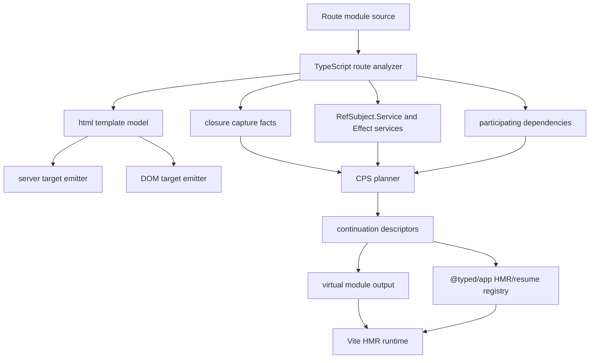
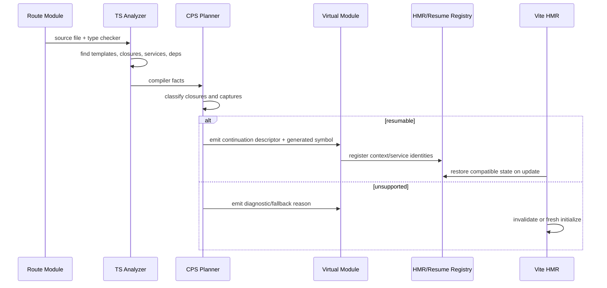

# Specification - Runtime Compiler Simplification And Route Resumability

Status: approved by human on 2026-05-22.

## System Context and Scope

`@typed/compiler` becomes the focused compiler substrate for two linked capabilities:

- optimize every `@typed/template` `html` template through one shared template compiler model;
- compile route modules into resumable continuations so HMR and future resume flows can restore behavior without replaying the whole route module.

This spec uses Qwik's resumability idea as inspiration, but not Qwik's wire format. Typed's equivalent of a QRL is a virtual-module continuation descriptor: a stable reference to generated code plus explicit Effect context captures and `RefSubject.Service` identities.

In scope:

- shared template model consumed by server and DOM targets;
- route-module source analysis through TypeScript AST/type checker;
- route closure classification and CPS lowering;
- generated continuation descriptors;
- Effect `Context` capture records;
- `RefSubject.Service` state identities;
- Vite HMR/runtime registry integration;
- deterministic fallback diagnostics.

Out of scope:

- replacing `vmc` or `@typed/virtual-modules-compiler`;
- filesystem routing;
- preserving heap-local closure state without compiler-visible lowering;
- adopting Qwik's QRL syntax or runtime;
- broad arbitrary TypeScript optimization outside Typed route/template surfaces.

## Component Responsibilities and Interfaces

### `@typed/compiler` Shared Template Compiler

Owns template analysis for all `html` templates. It converts parsed `@typed/template` output into a smaller shared template model that records:

- static structure;
- dynamic parts and part paths;
- target support requirements;
- referenced runtime values;
- template fingerprint.

Server and DOM emitters consume this model. They must not become independent semantic implementations.

### Route Module Analyzer

Uses TypeScript source files and type-checker facts to inspect route modules. It identifies:

- route entrypoints;
- closures used by route render functions, event handlers, effects, loaders, and local helpers;
- `html` templates;
- `RefSubject.Service` declarations and references;
- inline `RefSubject.make(...)` migration/diagnostic cases;
- Effect services required by captured values or returned programs;
- dependency modules that participate in the route boundary.
- transitive dependencies reachable from route modules, including helper/state modules that contribute closures, services, templates, or `RefSubject.Service` identities.

Regex scanning is not an accepted source of truth for this analyzer.

Dependency traversal is recursive across compiler-visible modules. It must:

- preserve stable traversal order;
- stop at explicit opt-out boundaries;
- track visited modules to terminate cycles deterministically;
- record why each dependency participates;
- emit diagnostics for anonymous state or unsupported captures in transitive dependencies.

### Closure CPS Planner

Classifies each compiler-visible route closure:

- `resumable`: captures are explicit and compatible with generated continuation descriptors;
- `context-required`: captures should lower into generated Effect `Context` records;
- `service-required`: captures are represented by existing `RefSubject.Service` identities or other stable services;
- `unsupported`: captures are mutable, anonymous, non-serializable, or otherwise not safely resumable.

Eligible closures lower into continuation descriptors. Unsupported closures produce diagnostics and force HMR invalidation or runtime fallback.

### Continuation Descriptor

Typed continuation descriptors are the durable compiler/runtime handoff for resumable route modules.

Required fields:

- `moduleId`;
- generated `symbolId`;
- closure kind;
- target environment;
- template fingerprints;
- capture records;
- Effect service requirements;
- `RefSubject.Service` identities;
- dependency fingerprints;
- compiler/runtime version;
- compatibility fingerprint.

Descriptors are suitable for virtual-module output, artifact-store metadata, and Vite HMR runtime glue.

### Effect Context Capture Records

Generated context records represent explicit closure captures that are not already stable services. They use Effect `Context` as the typed carrier and must preserve value, error, and service requirements.

Capture records are not a generic serialization escape hatch. If a capture cannot be represented through a typed context/service contract, the compiler rejects it with diagnostics.

### RefSubject Service Identity

`RefSubject.Service` is the primary carrier for resumable mutable state. Route HMR and resume flows preserve state by service identity plus compatibility fingerprints, not by anonymous lexical position alone.

Inline `RefSubject.make(...)` can be detected as a migration candidate, but it is not the preferred state identity model.

### Runtime HMR/Resume Registry

`@typed/app` exposes one canonical runtime registry. It stores entries by module, generated symbol, service/context identity, and compatibility fingerprint. It integrates with Vite `import.meta.hot.data` in dev and registers dispose/prune cleanup.

Duplicate `runtime` and `runtimeTemplates` registry implementations should collapse to one owner or forward through one canonical module.

### Vite Integration

Generated Vite HMR code:

- guards all `import.meta.hot` usage;
- marks route continuation modules as HMR boundaries when compatible;
- mutates `hot.data` rather than replacing it;
- disposes/prunes registry entries;
- invalidates or falls back when compatibility fails.

`handleHotUpdate` remains the plugin-side hook for filtering affected modules, custom events, or full reloads when compiler compatibility cannot be proven.

## System Diagrams (Mermaid)

## Data and Control Flow

1. The compiler receives route module source and virtual-module/compiler context.
2. The TypeScript analyzer builds route facts from AST and type-checker evidence.
3. Every `html` template is converted to the shared template model.
4. The analyzer recursively visits compiler-visible route dependencies in stable order.
5. Every compiler-visible route/dependency closure is classified.
6. Captures are mapped to one of:
   - generated Effect `Context` record;
   - existing `RefSubject.Service`;
   - dependency service identity;
   - unsupported diagnostic.
7. The CPS planner emits continuation descriptors for eligible closures.
8. Server and DOM targets emit optimized template output from the same template model.
9. Vite HMR glue registers descriptors and state/context identities with the canonical runtime registry.
10. On update, the runtime restores only entries whose compatibility fingerprints match.
11. If compatibility fails, the update invalidates or fresh-initializes rather than restoring stale heap state.

## Failure Modes and Mitigations

| failure | impact | mitigation |
| --- | --- | --- |
| Regex source scan misses a service or closure | incorrect HMR/resume eligibility | use TypeScript AST/type-checker-backed analysis as source of truth |
| Closure captures mutable local state | stale or unsound resume | reject with diagnostic; require context/service lowering |
| Inline `RefSubject.make(...)` is used in route closure | unstable state identity | diagnose migration to `RefSubject.Service`; preserve only when explicit compatible identity exists |
| Generated context type erases Effect error/service requirements | type unsound runtime API | compile-time tests for value/error/service preservation |
| Template server and DOM emitters drift | environment-specific behavior bugs | shared template model plus equivalence tests against runtime renderer |
| Dependency module changes shape | restored state no longer compatible | include dependency fingerprints in compatibility fingerprint |
| Recursive dependency graph contains a cycle | infinite analysis or nondeterministic descriptors | maintain visited module set and emit deterministic cycle metadata |
| Transitive dependency opts out | state unexpectedly preserved past boundary | stop traversal at opt-out and record boundary reason |
| Vite HMR accepts incompatible update | stale app behavior | generated runtime calls invalidate or fresh-initializes on mismatch |
| Runtime registry duplication diverges | inconsistent preserve/cleanup behavior | canonicalize registry implementation and test both public import paths |
| Materialized output is stale | editor/build mismatch | use virtual artifact-store fingerprints when output is persisted |

## Requirement Traceability

| requirement_id | design_element | notes |
| -------------- | -------------- | ----- |
| FR-1, FR-22, FR-23, FR-24, FR-25 | Shared Template Compiler | One template model feeds all environments. |
| FR-2, FR-14, FR-15, FR-15a | Route Module Analyzer, Dependency Participation | HMR boundary remains narrower than all-template optimization and dependency traversal is recursive with opt-out and cycle handling. |
| FR-3, FR-5, FR-6, FR-7, FR-8 | Closure CPS Planner, Continuation Descriptor | First tasks enable route resumability and HMR. |
| FR-4, NFR-3 | Route Module Analyzer | AST/type-checker facts replace regex source truth. |
| FR-9, FR-10, FR-21 | Effect Context Capture Records | Captures become explicit typed context records or diagnostics. |
| FR-11, FR-12, FR-20 | RefSubject Service Identity | Stable state identity model. |
| FR-13, FR-17 | Continuation Descriptor | Shared route/dependency/resumability model with compatibility fingerprints. |
| FR-16, FR-18, NFR-4, NFR-5, NFR-9 | Vite Integration, Runtime Registry | Dev-only restoration with cleanup and fail-closed compatibility. |
| FR-19 | Runtime HMR/Resume Registry | One canonical app runtime surface. |
| FR-26, FR-27, FR-28 | Vite Integration, Artifact Store Alignment | Preserves compiler and virtual-module boundaries. |
| FR-29 | Failure Modes | Unsupported paths produce structured fallback reasons. |
| NFR-1, NFR-2, NFR-10 | All Components | Simplification and traceability constraints. |
| NFR-6, NFR-7, NFR-8 | Testing Strategy | Equivalence, HMR, CPS, and type tests. |

## Memory Design

- Short-term lessons go in `.docs/workflows/20260522-1908-runtime-compiler-simplification/memories.md` during execution.
- Durable compiler heuristics are promoted only during finalization after tests prove them.
- Candidate durable memory:
  - route-module resumability means closure CPS lowering through explicit contexts/services, not heap preservation;
  - `RefSubject.Service` is the stable identity model for resumable mutable state;
  - regex HMR analysis is scaffolding only.

## References Consulted

- specs:
  - `.docs/specs/virtual-modules/spec.md`
  - `.docs/specs/virtual-module-artifact-store/spec.md`
  - `.docs/specs/typed-framework-starter/spec.md`
- adrs:
  - `.docs/adrs/20260516-1643-typed-framework-virtual-module-first.md`
  - `.docs/adrs/20260515-2018-virtual-module-artifact-store.md`
  - `.docs/adrs/20260521-2320-runtime-template-compiler-boundaries.md`
- workflows:
  - `.docs/workflows/20260522-1908-runtime-compiler-simplification/02-research.md`
  - `.docs/workflows/20260522-1908-runtime-compiler-simplification/requirements.md`

## ADR Links

- `.docs/workflows/20260522-1908-runtime-compiler-simplification/03-adr-route-module-resumability-cps.md`
