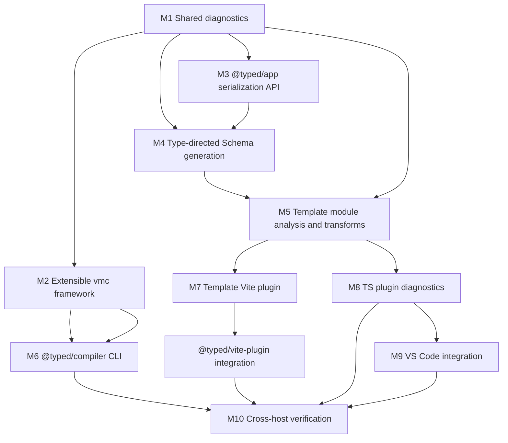

# Plan - Serializable Template Tooling

## Objective

Implement the approved serializable template tooling architecture in dependency order:

1. shared diagnostics;
2. extensible `vmc` compiler framework hooks;
3. `@typed/app` serialization API;
4. type-directed Schema generation;
5. template module analysis and direct transforms;
6. Vite, CLI, TS plugin, and VS Code host integration.

## Semantic Subgoal DAG

## Milestones

### M1 - Shared Diagnostics Substrate

Goal: Create one compiler diagnostic model and host adapters.

Tasks:

1. [completed] Add `packages/compiler/src/diagnostics/*` with:
   - `TypedCompilerDiagnostic`
   - `SourceSpan`
   - `DiagnosticRelatedInfo`
   - `DiagnosticFix`
   - helpers for sorting/deduping/stable snapshots
2. [completed] Add adapters:
   - compiler diagnostic to `ts.Diagnostic`
   - compiler diagnostic to virtual-module diagnostic
   - compiler diagnostic to Vite warning/error payload shape
3. [completed] Export the diagnostics surface from `@typed/compiler`.
4. [completed] Keep existing route/template diagnostics unchanged for compatibility in this first substrate slice.

Traceability:

- FR-01, NFR-01, NFR-05
- TS-01, TS-08

Validation:

- `pnpm --filter @typed/compiler test -- diagnostics`
- `pnpm --filter @typed/compiler build`

Rollback:

- Keep old route/template diagnostic exports as compatibility wrappers until downstream packages migrate.

### M2 - Extensible `vmc` Framework Hooks

Goal: Add extension points beneath existing `vmc` CLI behavior without breaking virtual modules.

Tasks:

1. [completed] Add extension interfaces to `@typed/virtual-modules-compiler`.
2. [completed] Thread extensions through normal compile, build mode, and watch mode.
3. [completed] Add direct source-transform hook support in compiler host flow.
4. [completed] Add extension diagnostic collection/reporting.
5. [completed] Prove compile works with an extension installed while default no-extension behavior remains compatible.

Traceability:

- FR-04, FR-05, NFR-03, NFR-05
- TS-05, TS-10

Validation:

- `pnpm --filter @typed/virtual-modules-compiler test`
- `pnpm --filter @typed/virtual-modules test`

Rollback:

- Feature-gate extension hooks behind optional params; existing CLI code path must work with no extensions.

### M3 - `@typed/app` Serialization API

Goal: Introduce public runtime serialization descriptors.

Tasks:

1. [completed] Add `packages/app/src/serialization/Serializable.ts`.
2. [completed] Export the API from `@typed/app`.
3. [completed] Support explicit schema descriptors.
4. [completed] Add generated descriptor placeholder shape used by compiler output.
5. [completed] Add docs/tests for user-provided schema precedence.

Traceability:

- FR-02, FR-03, NFR-02, NFR-05
- TS-02

Validation:

- `pnpm --filter @typed/app test -- Serializable`
- `pnpm --filter @typed/app build`

Rollback:

- Keep API additive; do not alter existing HttpApi schema behavior.

### M4 - Type-Directed Schema Generation

Goal: Convert compiler-visible `TypeNode` facts into deterministic schema plans.

Tasks:

1. [completed] Add `packages/compiler/src/schema/*` plan types.
2. [completed] Implement supported shape planning:
   - primitives
   - literals
   - objects
   - optional fields
   - arrays/tuples
   - simple unions
   - records/index signatures
3. [completed] Add unsupported-shape diagnostics:
   - functions
   - arbitrary classes
   - symbols
   - unresolved generics
   - recursive graphs
   - `any`/broad `unknown`
4. [completed] Add generated-source emitter that references `@typed/app` serialization API.

Traceability:

- FR-03, FR-04, NFR-02, NFR-04, NFR-05
- TS-03, TS-04

Validation:

- `pnpm --filter @typed/compiler test -- schema`
- property/table tests over `TypeNode` fixtures
- `pnpm --filter @typed/compiler build`

Rollback:

- Keep schema generation isolated from template transform until standalone tests pass.

### M5 - Template Module Analysis And Direct Transform Core

Goal: Move from `TemplateStringsArray`-only analysis to source-file module analysis with spans and expression facts.

Tasks:

1. [completed] Add `template-module-analysis` over TypeScript `SourceFile`.
2. [completed] Detect `@typed/template` `html` imports and local aliases.
3. [completed] Map every template literal quasi and expression to source spans.
4. [completed] Reuse `TemplatePlan` for parsed HTML facts.
5. [completed] Add `template-transform` that rewrites user modules through a generated runtime plan.
6. [completed] Preserve interpreted fallback when a template is not transformable.

Traceability:

- FR-01, FR-07, FR-09, NFR-01, NFR-04, NFR-05
- TS-07, TS-08

Validation:

- `pnpm --filter @typed/compiler test -- template`
- equivalence tests comparing interpreted and transformed output for representative templates
- `pnpm --filter @typed/compiler build`

Rollback:

- Transform opt-out flag at core function level; diagnostics can run without code transformation.

### M6 - `@typed/compiler` CLI

Goal: Add CLI wrapper around `vmc` with Typed compiler extensions installed.

Tasks:

1. [completed] Add bin entry to `@typed/compiler`.
2. [completed] Delegate argument parsing/compile/build/watch to `vmc` framework APIs.
3. [completed] Install template transform and serialization diagnostics extension.
4. [completed] Emit shared diagnostics through TypeScript formatting.
5. [completed] Add CLI integration tests for `--noEmit`, `--build`, and watch entrypoint initialization.

Traceability:

- FR-05, FR-06, NFR-01, NFR-03, NFR-05
- TS-06, TS-10

Validation:

- `pnpm --filter @typed/compiler test -- cli`
- `pnpm --filter @typed/virtual-modules-compiler test`
- `pnpm --filter @typed/compiler build`

Rollback:

- CLI remains additive; no package script should switch from `vmc` to `@typed/compiler` until this milestone is green.

### M7 - Template Vite Plugin And `@typed/vite-plugin`

Goal: Make template compilation available in runtime applications during Vite builds.

Tasks:

1. [completed] Add `typedTemplateVitePlugin()` in `@typed/compiler` or an approved subpath.
2. [completed] Implement direct `transform` hook.
3. [completed] Wire shared diagnostics to Vite warnings/errors.
4. [completed] Add options for enable/disable and diagnostic mode.
5. [completed] Register plugin in `typedVitePlugin()` before virtual module Vite plugin.
6. [completed] Add Vite plugin order and transform tests.

Traceability:

- FR-07, FR-08, NFR-01, NFR-03, NFR-05
- TS-07, TS-10

Validation:

- `pnpm --filter @typed/compiler test -- vite`
- `pnpm --filter @typed/vite-plugin test`
- `pnpm --filter @typed/vite-plugin build`

Rollback:

- Add `templates: false` option in `typedVitePlugin()` for emergency disable without removing plugin code.

### M8 - Template TS Plugin Diagnostics

Goal: Surface compiler diagnostics in-editor through the TypeScript plugin.

Tasks:

1. [completed] Add a template diagnostic service in `@typed/compiler`.
2. [completed] Extend `@typed/virtual-modules-ts-plugin` to call it for normal source files.
3. [completed] Reuse existing TypeInfo/session setup.
4. [completed] Append diagnostics to semantic diagnostics.
5. [completed] Add fixture proving invalid template diagnostics match CLI/Vite snapshots.

Traceability:

- FR-01, FR-04, FR-09, NFR-01, NFR-05
- TS-08, TS-10

Validation:

- `pnpm --filter @typed/virtual-modules-ts-plugin test`
- `pnpm --filter @typed/compiler test -- diagnostics template`

Rollback:

- Add plugin option to disable template diagnostics while preserving virtual-module diagnostics.

### M9 - VS Code Extension Cooperation

Goal: Keep VS Code as UX/config layer over TS plugin diagnostics.

Tasks:

1. [completed] Configure TS plugin through VS Code TypeScript extension API.
2. [completed] Document template diagnostics support in extension README.
3. [completed] Add code-action provider only for compiler diagnostics carrying fix metadata.
4. [completed] Preserve virtual-module navigation/tree behavior.

Traceability:

- FR-10, NFR-01, NFR-03, NFR-05
- TS-09, TS-10

Validation:

- `pnpm --filter @typed/virtual-modules-vscode build`
- focused tests for configuration helper if testable

Rollback:

- Extension config path is additive; virtual-module providers remain unchanged.

### M10 - Cross-Host Verification And Memory

Goal: Prove the tranche is coherent and record durable follow-up context.

Tasks:

1. [completed] Add shared invalid-template fixture used by CLI/TS plugin/Vite tests.
2. [completed] Run final validation hooks.
3. [completed] Update workflow memory notes.
4. [completed] Update package AGENTS docs if new package responsibilities are created.

Traceability:

- FR-01 through FR-10
- NFR-01 through NFR-05
- TS-01 through TS-10

Validation:

- `pnpm --filter @typed/compiler test`
- `pnpm --filter @typed/app test`
- `pnpm --filter @typed/vite-plugin test`
- `pnpm --filter @typed/virtual-modules-compiler test`
- `pnpm --filter @typed/virtual-modules-ts-plugin test`
- `pnpm --filter @typed/virtual-modules-vscode build`
- package builds for touched packages
- `git diff --check`

Rollback:

- If final cross-host diagnostics drift, block finalization and loop back to the smallest failing host adapter.

## Tactical Replanning Triggers

- A shared diagnostic cannot map cleanly to one host: replan M1 adapters before continuing.
- `vmc` extension hooks require too much host churn: split M2 into lifecycle hooks first, transforms second.
- Type-directed schema generation needs unsupported recursive semantics: keep recursion rejected and proceed.
- Direct Vite transform cannot obtain type facts reliably: keep syntax transform/diagnostics first and route typed checks through CLI/TS plugin.
- Existing virtual-module tests fail: pause feature work and restore compatibility before continuing.

## Mutating-Action Safeguards

- Stage and commit each milestone independently.
- Do not stage unrelated worktree changes.
- Keep new APIs additive until final integration.
- Preserve current `vmc` CLI behavior with zero extensions.
- Run focused tests before broader package tests after each implementation milestone.

## Memory Plan

Capture in this workflow:

- implementation decisions that refine the spec;
- commands that become reliable verification gates;
- unsupported type/template cases intentionally deferred;
- host-specific diagnostic mapping gotchas.

Promotion candidates:

- stable `vmc` extension API shape;
- final compiler diagnostic model;
- final `@typed/app` serialization API shape;
- final cross-host verification command set.

Recall targets:

- `.docs/specs/serializable-template-tooling/spec.md`
- `.docs/specs/serializable-template-tooling/testing-strategy.md`
- `.docs/adrs/20260522-2124-compiler-direct-transforms-and-extensible-vmc.md`
- prior memory on virtual-module-first framework constraints and strict workflow.

## Approval Gate

Planning exits only after explicit human approval of this `plan.md`.
