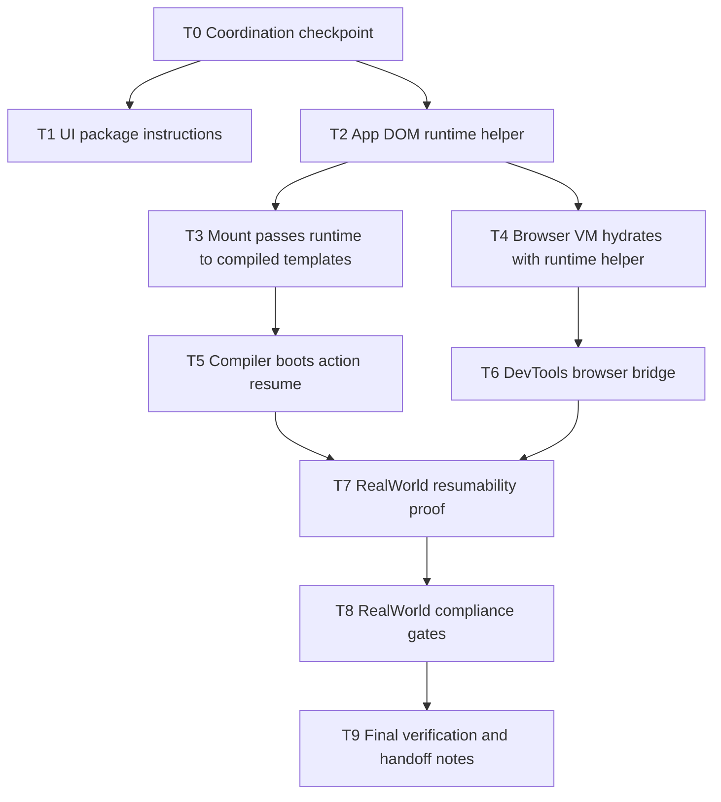

# Cohesion Remediation Implementation Plan

> **For agentic workers:** REQUIRED SUB-SKILL: Use `superpowers:subagent-driven-development` after explicit human approval if subagents are available; otherwise use `superpowers:executing-plans` task-by-task. Steps use checkbox (`- [ ]`) syntax for tracking.

**Goal:** Wire compiled-template resumability and DevTools through the app/browser runtime, align UI package instructions, and end with a fully functional, RealWorld-spec-compliant, 100% resumable RealWorld example while coordinating developer-tooling-owned work with the other active agent.

**Architecture:** `@typed/template` remains the compiled DOM runtime contract. `@typed/app` becomes the integration boundary that composes route resume, action resume, and devtools observers before calling compiled `renderInto`. `@typed/storybook` continues to consume app virtual modules and RealWorld runtime defaults rather than owning a second framework path.

**Tech Stack:** TypeScript, Effect, `@typed/template`, `@typed/app`, `@typed/compiler`, `@typed/devtools-runtime`, `@typed/devtools-chrome`, `@typed/storybook`, Vitest, Vite/Storybook build gates.

---

## Coordination Guardrail

Another agent is still working through `.docs/workflows/20260522-2104-serializable-template-tooling/`. Do not edit tooling-owned surfaces until handoff:

- `packages/virtual-modules-*`
- `packages/vite-plugin` unless required only to consume an app runtime API
- `packages/compiler` CLI, diagnostics, host extension, TS plugin, or VS Code integration
- null-byte virtual id handling

Allowed compiler work in this plan is limited to compiled-template action-resume bootstrapping in `packages/compiler/src/template/transformTemplateModule.ts` and RealWorld resumability proof. If RealWorld compliance requires null-byte virtual-id fixes, browser externalization fixes, Vite host changes, TS plugin changes, or VS Code changes, stop and get developer-tooling handoff before editing those surfaces.

## Subgoal DAG



## File Structure

- Create: `packages/app/src/runtime/domTemplateRuntime.ts` - compose route/action resume and optional devtools DOM observer.
- Create: `packages/app/src/runtime/domTemplateRuntime.test.ts` - runtime helper unit tests.
- Modify: `packages/app/src/runtime/RuntimeTemplate.ts` - add `runtime` to `MountOptions`.
- Modify: `packages/app/src/runtime/mount.ts` - pass runtime into compiled `renderInto`.
- Modify: `packages/app/src/runtime/index.ts` - export the helper.
- Modify: `packages/app/src/internal/emitBrowserSource.ts` - emit browser hydration through the helper.
- Modify: `packages/app/src/BrowserVirtualModulePlugin.test.ts` - snapshot generated runtime source.
- Modify: `packages/compiler/src/template/transformTemplateModule.ts` - import/emit `bootActionResume` when a compiled template has action descriptors.
- Modify: `packages/compiler/src/template/transformTemplateModule.test.ts` - prove action resume is emitted.
- Modify: `packages/devtools-runtime/src/*` only if the bridge needs a reusable installer; avoid transport/protocol redesign.
- Modify: `packages/devtools-chrome/src/transport/inspectedWindow.ts` tests only if bridge contract needs stricter coverage.
- Modify: `packages/storybook` or `examples/realworld` for generated-runtime Storybook proof, RealWorld resumability proof, and RealWorld compliance fixes.
- Modify: `packages/ui/AGENTS.md` - align package instructions with README.
- Modify: this workflow's `plan.md` and later `memories.md` during execution.

## Tasks

### Task 0: Coordination Checkpoint

**Files:**
- Modify: `.docs/workflows/20260524-1047-cohesion-remediation-plan/plan.md`
- Create: `.docs/workflows/20260524-1047-cohesion-remediation-plan/developer-tooling-handoff.md`

- [x] **Step 1: Capture current worktree and tooling workflow status**

Run:

```bash
git status -sb
sed -n '1,260p' .docs/workflows/20260522-2104-serializable-template-tooling/plan.md
```

Expected: worktree changes are either this workflow's docs or explicitly identified external-agent changes.

- [x] **Step 2: Write the handoff note**

Create `developer-tooling-handoff.md`:

```markdown
# Developer Tooling Handoff

- status: another agent is still working through `.docs/workflows/20260522-2104-serializable-template-tooling/`
- blocked_surfaces:
  - virtual-module host/plugin/VS Code/TS plugin diagnostics
  - compiler CLI and vmc extension hooks
  - null-byte virtual id cleanup
- allowed_overlap:
  - app runtime helper consumed by generated browser source
  - compiled-template action-resume bootstrapping only
- required_before_tooling_edits: explicit handoff from the developer-tooling agent or human approval
```

- [x] **Step 3: Commit**

Commit message:

```text
docs: record cohesion remediation coordination
```

### Task 1: Align `@typed/ui` Package Instructions

**Files:**
- Modify: `packages/ui/AGENTS.md`

- [x] **Step 1: Update instructions**

Replace the Link/SSR-only intent with this package-local contract:

```markdown
`@typed/ui` is the web integration and headless component layer for `@typed/router` and `@typed/template`. It owns Link, SSR wiring, RefSubject-backed state primitives, Schema-backed `data-*` state, StartupRef hydration, Collection/Composite substrate, and native Dialog/Popover-first layered widgets.
```

- [x] **Step 2: Verify no stale wording remains**

Run:

```bash
rg -n "web integration layer|Link components that avoid full page reloads|SSR wiring" packages/ui/AGENTS.md
```

Expected: no Link/SSR-only framing remains; Link and SSR can still appear as capabilities.

- [x] **Step 3: Run package docs-adjacent gate**

Run:

```bash
pnpm --filter @typed/ui test
```

Expected: pass.

- [x] **Step 4: Commit**

Commit message:

```text
docs(ui): align package instructions with headless primitives
```

### Task 2: Add App DOM Runtime Helper

**Files:**
- Create: `packages/app/src/runtime/domTemplateRuntime.ts`
- Create: `packages/app/src/runtime/domTemplateRuntime.test.ts`
- Modify: `packages/app/src/runtime/index.ts`

- [x] **Step 1: Write failing tests**

Test that the helper includes route resume, action resume, and devtools observer when enabled:

```ts
import { makeDomBindingId } from "@typed/devtools-protocol";
import { makeDomRegistry } from "@typed/devtools-runtime";
import { describe, expect, it } from "vitest";
import {
  createAppDomTemplateRuntime,
  createActionResumeRegistry,
  createRouteResumeRegistry,
} from "../index.js";

describe("createAppDomTemplateRuntime", () => {
  it("composes route resume, action resume, and devtools observer", () => {
    const domRegistry = makeDomRegistry();
    const runtime = createAppDomTemplateRuntime({
      routeRegistry: createRouteResumeRegistry(),
      actionRegistry: createActionResumeRegistry(),
      devtools: { enabled: true, domRegistry },
    });

    expect(runtime.resumeRoute).toEqual(expect.any(Function));
    expect(runtime.resumeAction).toEqual(expect.any(Function));
    expect(runtime.devtools).toBe(domRegistry.observer);
  });

  it("omits devtools observer when disabled", () => {
    const runtime = createAppDomTemplateRuntime({
      routeRegistry: createRouteResumeRegistry(),
      actionRegistry: createActionResumeRegistry(),
      devtools: { enabled: false },
    });

    expect(runtime.devtools).toBeUndefined();
  });
});
```

Run:

```bash
pnpm --filter @typed/app exec vitest run src/runtime/domTemplateRuntime.test.ts
```

Expected: fail because `createAppDomTemplateRuntime` is missing.

- [x] **Step 2: Implement helper**

Implement a narrow helper that returns `Omit<DomTemplateRuntime, "scope">`:

```ts
import type { DomTemplateRuntime } from "@typed/template/compiler-runtime/renderable";
import type { DomRegistry } from "@typed/devtools-runtime";
import {
  createActionResumeRuntime,
  createRouteResumeRuntime,
  getDefaultActionResumeRegistry,
  getDefaultRouteResumeRegistry,
  type ActionResumeRegistry,
  type RouteResumeRegistry,
} from "../resumability.js";

export interface AppDomTemplateRuntimeOptions {
  readonly actionRegistry?: ActionResumeRegistry;
  readonly routeRegistry?: RouteResumeRegistry;
  readonly devtools?: false | { readonly enabled: false } | {
    readonly enabled: true;
    readonly domRegistry: DomRegistry;
  };
}

export function createAppDomTemplateRuntime(
  options: AppDomTemplateRuntimeOptions = {},
): Omit<DomTemplateRuntime, "scope"> {
  const route = createRouteResumeRuntime(options.routeRegistry ?? getDefaultRouteResumeRegistry());
  const action = createActionResumeRuntime(
    options.actionRegistry ?? getDefaultActionResumeRegistry(),
  );
  const devtools =
    options.devtools && options.devtools.enabled ? options.devtools.domRegistry.observer : undefined;
  return {
    resumeRoute: route.resumeRoute,
    resumeAction: action.resumeAction,
    ...(devtools && { devtools }),
  };
}
```

- [x] **Step 3: Export helper**

Add to `packages/app/src/runtime/index.ts`:

```ts
export * from "./domTemplateRuntime.js";
```

- [x] **Step 4: Verify**

Run:

```bash
pnpm --filter @typed/app exec vitest run src/runtime/domTemplateRuntime.test.ts
pnpm --filter @typed/app build
```

Expected: pass.

- [ ] **Step 5: Commit**

Commit message:

```text
feat(app): compose dom template runtime
```

### Task 3: Pass Runtime Through Compiled Mounts

**Files:**
- Modify: `packages/app/src/runtime/RuntimeTemplate.ts`
- Modify: `packages/app/src/runtime/mount.ts`
- Add or modify: `packages/app/src/runtime/mount.test.ts`

- [ ] **Step 1: Write failing mount test**

Add a compiled-template test where `renderInto` receives the runtime object:

```ts
import { describe, expect, it } from "vitest";
import { mount } from "./mount.js";

describe("mount compiled templates", () => {
  it("passes the DOM runtime to compiled renderInto", async () => {
    const root = document.createElement("main");
    const runtime = { resumeAction: () => Effect.void };
    const calls: unknown[] = [];
    const template = {
      renderInto: async (_root: HTMLElement, _values?: ArrayLike<unknown>, received?: unknown) => {
        calls.push(received);
        root.replaceChildren(document.createTextNode("ok"));
        return Array.from(root.childNodes);
      },
    };

    await Effect.runPromise(mount(template, { root, runtime }));

    expect(calls).toEqual([runtime]);
  });
});
```

Run:

```bash
pnpm --filter @typed/app exec vitest run src/runtime/mount.test.ts
```

Expected: fail because `MountOptions` has no `runtime` and `mountCompiled` does not pass it.

- [ ] **Step 2: Add runtime option**

In `RuntimeTemplate.ts`, add:

```ts
import type { DomTemplateRuntime } from "@typed/template/compiler-runtime/renderable";

export interface MountOptions<Values extends ReadonlyArray<Renderable.Any> = readonly Renderable.Any[]> {
  readonly root: HTMLElement;
  readonly values?: Values;
  readonly runtime?: Omit<DomTemplateRuntime, "scope">;
}
```

- [ ] **Step 3: Pass runtime to compiled render**

In `mountCompiled`:

```ts
const nodes = await template.renderInto(
  options.root,
  options.values ?? emptyValues(),
  options.runtime,
);
```

- [ ] **Step 4: Verify**

Run:

```bash
pnpm --filter @typed/app exec vitest run src/runtime/mount.test.ts
pnpm --filter @typed/app test
```

Expected: pass.

- [ ] **Step 5: Commit**

Commit message:

```text
feat(app): pass dom runtime through compiled mounts
```

### Task 4: Hydrate Browser Virtual Modules With The App DOM Runtime

**Files:**
- Modify: `packages/app/src/internal/emitBrowserSource.ts`
- Modify: `packages/app/src/BrowserVirtualModulePlugin.test.ts`

- [ ] **Step 1: Update generated-source snapshot expectation first**

Expected generated source should import and use the helper:

```ts
import {
  composeWithLayers,
  createAppDomTemplateRuntime,
  mount as mountRuntime,
  type ComputeLayers,
  type LayerOrGroup,
} from "@typed/app/runtime";
```

and:

```ts
function makeRenderLayer(win: Window, root: HTMLElement) {
  const domRuntime = createAppDomTemplateRuntime();
  return Layer.effectDiscard(mountRuntime(Routes, { root, runtime: domRuntime })).pipe(
    Layer.provideMerge(TypedRouter.BrowserRouter(win)),
  );
}
```

Run:

```bash
pnpm --filter @typed/app exec vitest run src/BrowserVirtualModulePlugin.test.ts
```

Expected: fail snapshot mismatch before implementation.

- [ ] **Step 2: Implement emitted source change**

Update the generated import and `makeRenderLayer` body in `emitBrowserSource.ts` to match the snapshot.

- [ ] **Step 3: Verify generated source typechecks**

Run:

```bash
pnpm --filter @typed/app exec vitest run src/BrowserVirtualModulePlugin.test.ts
pnpm --filter @typed/app build
```

Expected: pass.

- [ ] **Step 4: Commit**

Commit message:

```text
feat(app): hydrate browser templates with dom runtime
```

### Task 5: Boot Action Resume In Compiled Templates

**Files:**
- Modify: `packages/compiler/src/template/transformTemplateModule.ts`
- Modify: `packages/compiler/src/template/transformTemplateModule.test.ts`

- [ ] **Step 1: Write failing compiler snapshot**

Add or update a transform test with an action descriptor. Expected generated DOM runtime imports include:

```ts
import {
  bindAttr,
  bindBoolean,
  bindClass,
  bindData,
  bindEvent,
  bindNode,
  bindProperty,
  bindRef,
  bindText,
  bootActionResume,
  bootRouteResume,
  defineDomTemplate,
  getCommentAtPath,
  getElementAtPath,
  getNodeAtPath,
  mountDomTemplateBindings
} from "@typed/template/compiler-runtime/dom";
```

Expected mount includes:

```ts
Effect.all([
  bindEvent(getElementAtPath(instance.root, [0]), "click", values[0], {
    "component": "component-id",
    "event": "click",
    "id": "action-id"
  }),
  bootActionResume(instance.root, runtime)
], { concurrency: "unbounded" })
```

Run:

```bash
pnpm --filter @typed/compiler exec vitest run src/template/transformTemplateModule.test.ts
```

Expected: fail because `bootActionResume` is not emitted.

- [ ] **Step 2: Implement action-resume detection**

Add a helper that checks whether any template event part resolves to an action descriptor:

```ts
function hasActionResumeDescriptor(
  template: TemplateModuleTemplate,
  descriptors: ReadonlyMap<string, object>,
): boolean {
  return template.plan.parts.some(
    (part) =>
      part.kind === "event" &&
      actionDescriptorForValue(template, part.valueIndex, descriptors) !== undefined,
  );
}
```

Use it to include `bootActionResume` in imports and mount effects for direct and table-driven declarations.

- [ ] **Step 3: Verify compiler/template gates**

Run:

```bash
pnpm --filter @typed/compiler exec vitest run src/template/transformTemplateModule.test.ts
pnpm --filter @typed/template test
pnpm --filter @typed/compiler build
```

Expected: pass.

- [ ] **Step 4: Commit**

Commit message:

```text
feat(compiler): boot action resume for compiled templates
```

### Task 6: Install The Browser DevTools Bridge

**Files:**
- Create or modify: `packages/app/src/runtime/devtoolsBridge.ts`
- Create or modify: `packages/app/src/runtime/devtoolsBridge.test.ts`
- Modify: `packages/app/src/runtime/domTemplateRuntime.ts`
- Modify: `packages/app/src/runtime/index.ts`
- Touch `packages/devtools-runtime` only if a reusable bridge helper already belongs there after coordination.

- [ ] **Step 1: Write failing bridge tests**

Test enabled and disabled behavior:

```ts
import { makeDomRegistry } from "@typed/devtools-runtime";
import { describe, expect, it } from "vitest";
import { installTypedDevtoolsBridge } from "./devtoolsBridge.js";

describe("installTypedDevtoolsBridge", () => {
  it("installs selected element resolution when enabled", () => {
    const element = document.createElement("button");
    const registry = makeDomRegistry();
    const globalObject: Record<string, unknown> = {};

    registry.observer.onTemplateMounted?.({
      nodes: [element],
      root: document.createElement("main"),
      templateHash: "template",
    });

    installTypedDevtoolsBridge({ enabled: true, domRegistry: registry, globalObject });

    const api = globalObject.__TYPED_DEVTOOLS__ as {
      resolveSelectedElement: (node: Node) => unknown;
    };
    expect(api.resolveSelectedElement(element)).toMatchObject({ _tag: "Bound" });
  });

  it("does not install the bridge when disabled", () => {
    const globalObject: Record<string, unknown> = {};
    installTypedDevtoolsBridge({ enabled: false, globalObject });
    expect(globalObject.__TYPED_DEVTOOLS__).toBeUndefined();
  });
});
```

Run:

```bash
pnpm --filter @typed/app exec vitest run src/runtime/devtoolsBridge.test.ts
```

Expected: fail because the bridge installer is missing.

- [ ] **Step 2: Implement bridge installer**

Implement the smallest global contract Chrome already expects:

```ts
import type { DomRegistry } from "@typed/devtools-runtime";

export interface TypedDevtoolsBridgeOptions {
  readonly enabled: boolean;
  readonly domRegistry?: DomRegistry;
  readonly globalObject?: Record<PropertyKey, unknown>;
}

export function installTypedDevtoolsBridge(options: TypedDevtoolsBridgeOptions): void {
  const globalObject = options.globalObject ?? (globalThis as Record<PropertyKey, unknown>);
  if (!options.enabled || !options.domRegistry) {
    delete globalObject.__TYPED_DEVTOOLS__;
    return;
  }
  globalObject.__TYPED_DEVTOOLS__ = {
    resolveSelectedElement: (node: Node) => options.domRegistry!.resolveNode(node),
  };
}
```

- [ ] **Step 3: Compose bridge with runtime helper**

Update `createAppDomTemplateRuntime` only if the helper owns devtools setup in browser contexts. Otherwise keep bridge installation explicit in emitted browser source.

- [ ] **Step 4: Verify app and Chrome transport tests**

Run:

```bash
pnpm --filter @typed/app exec vitest run src/runtime/devtoolsBridge.test.ts src/runtime/domTemplateRuntime.test.ts
pnpm --filter @typed/devtools-chrome test
pnpm --filter @typed/devtools-runtime test
```

Expected: pass.

- [ ] **Step 5: Commit**

Commit message:

```text
feat(app): install typed devtools browser bridge
```

### Task 7: Prove RealWorld Resumability Through The Generated Runtime

**Files:**
- Modify or create focused tests under `examples/realworld/src/tests/presentation`.
- Modify RealWorld route/UI code only where tests prove an app path is not resumable.
- Do not add broad Storybook features.

- [ ] **Step 1: Add a failing RealWorld resumability test**

Add a focused test that server-renders a RealWorld page containing both a route resume marker and an `EventHandler.action(...)` descriptor, hydrates it through the generated browser runtime, and proves both paths run through the same app DOM runtime.

The test must assert:

```ts
expect(serverHtml).toContain("data-typed-resume");
expect(serverHtml).toContain("data-typed-route-resume-id");
expect(serverHtml).toContain("data-typed-action-");
```

Then after hydration:

```ts
expect(routeResumeObserved).toBe(true);
expect(actionResumeObserved).toBe(true);
```

Run:

```bash
pnpm --filter typed-realworld exec vitest run src/tests/presentation/resumability.test.ts
```

Expected: fail before the browser runtime handoff and action boot fixes are complete.

- [ ] **Step 2: Fix RealWorld non-resumable paths**

For any route or component path the test exposes:

- replace non-resumable event handlers with `EventHandler.action(...)`
- keep serializable route resume values explicit
- preserve existing user-facing behavior
- add assertions for fail-closed diagnostics when a path cannot be made resumable

- [ ] **Step 3: Verify compiler resumability coverage**

Run:

```bash
pnpm --filter @typed/compiler exec vitest run src/resumability/coverageMatrix.test.ts src/route/classifyRouteCaptures.test.ts src/route/transformRouteModule.test.ts src/template/transformTemplateModule.test.ts
pnpm --filter typed-realworld exec vitest run src/tests/presentation/resumability.test.ts
```

Expected: all pass, with no known non-resumable RealWorld route/action path.

- [ ] **Step 4: Commit**

Commit message:

```text
test(realworld): prove generated runtime resumability
```

### Task 8: Prove RealWorld Functional Compliance

**Files:**
- Modify `examples/realworld` only for compliance failures surfaced by the gates.
- Update `.docs/workflows/20260524-1047-cohesion-remediation-plan/developer-tooling-handoff.md` if compliance depends on tooling-owned fixes.

- [ ] **Step 1: Run the local RealWorld app gates**

Run:

```bash
pnpm --filter typed-realworld check
pnpm --filter typed-realworld build
pnpm --filter typed-realworld test
pnpm --filter typed-realworld storybook:build
```

Expected: pass without hiding warnings that affect runtime correctness.

- [ ] **Step 2: Ensure local acceptance prerequisites are present**

Run:

```bash
command -v hurl
pnpm --filter typed-realworld exec playwright install chromium
```

Expected: Hurl is installed and Chromium is available for Playwright. If Hurl is absent, document the blocker and ask for installation approval before claiming compliance.

- [ ] **Step 3: Run upstream local acceptance**

Run:

```bash
pnpm --filter typed-realworld test:acceptance:local
```

Expected: pass. This resets/seeds the local database, starts the full app server, runs upstream Hurl API acceptance, runs upstream Playwright browser E2E acceptance, and tears the server down.

- [ ] **Step 4: Run local HMR/resumability gate**

Run:

```bash
pnpm --filter typed-realworld test:hmr:local
```

Expected: pass.

- [ ] **Step 5: Resolve or hand off tooling-owned blockers**

If these gates expose browser externalization, null-byte virtual-id, Vite host, TS plugin, or VS Code integration defects:

```markdown
- blocker:
- owner: developer-tooling workflow or cohesion remediation
- handoff status:
- failing command:
- exact error:
- required next action:
```

Do not finalize until the blocker is either fixed here after handoff or explicitly resolved by the developer-tooling agent.

- [ ] **Step 6: Commit**

Commit message:

```text
test(realworld): verify functional compliance
```

### Task 9: Add Storybook/RealWorld Runtime Smoke

**Files:**
- Modify or create focused Storybook smoke tests under `packages/storybook` or `examples/realworld`.
- Do not add broad Storybook features.

- [ ] **Step 1: Add a smoke that exercises generated runtime defaults**

The smoke should import:

```ts
import { Routes, makeStoryRuntime } from "typed:storybook/runtime?path=/";
```

and verify the story renders through the same runtime path as `examples/realworld/src/Home.stories.ts`.

- [ ] **Step 2: Run Storybook gates**

Run:

```bash
pnpm --filter @typed/storybook test
pnpm --filter @typed/storybook build
pnpm --filter typed-realworld storybook:build
```

Expected: pass. Existing browser-externalization warnings may remain unless the developer-tooling handoff explicitly includes them.

- [ ] **Step 3: Commit**

Commit message:

```text
test(storybook): smoke generated typed runtime
```

### Task 10: Final Verification And Handoff Notes

**Files:**
- Modify: `.docs/workflows/20260524-1047-cohesion-remediation-plan/plan.md`
- Create or modify: `.docs/workflows/20260524-1047-cohesion-remediation-plan/memories.md`
- Modify: `.docs/workflows/20260524-1047-cohesion-remediation-plan/developer-tooling-handoff.md`

- [ ] **Step 1: Run focused gates**

Run:

```bash
pnpm --filter @typed/ui test
pnpm --filter @typed/app test
pnpm --filter @typed/compiler test
pnpm --filter @typed/template test
pnpm --filter @typed/devtools-runtime test
pnpm --filter @typed/devtools-chrome test
pnpm --filter @typed/storybook test
pnpm --filter typed-realworld check
pnpm --filter typed-realworld build
pnpm --filter typed-realworld test
pnpm --filter typed-realworld storybook:build
pnpm --filter typed-realworld test:acceptance:local
pnpm --filter typed-realworld test:hmr:local
```

Expected: pass.

- [ ] **Step 2: Run final gates**

Run:

```bash
pnpm build
git diff --check
git status -sb
```

Expected: build and diff check pass; status contains only intended branch changes.

- [ ] **Step 3: Record residual developer-tooling items**

If no handoff happened, record the following as external-agent or follow-up items:

```markdown
- null-byte virtual id warning: resolved, or owned by developer-tooling workflow with no RealWorld compliance impact
- browser externalization warnings: resolved, or owned by developer-tooling workflow with no RealWorld compliance impact
- Vite/TS plugin/VS Code diagnostics: untouched
```

- [ ] **Step 4: Commit**

Commit message:

```text
chore: finalize cohesion remediation plan
```

## Approval Gate

Do not execute Task 0 or later implementation tasks until the human explicitly approves this plan and confirms whether the developer-tooling agent owns the null-byte and browser-externalization warnings. Regardless of ownership, finalization cannot claim a 100% functional/compliant RealWorld example or 100% resumability until the RealWorld acceptance and resumability gates pass.
