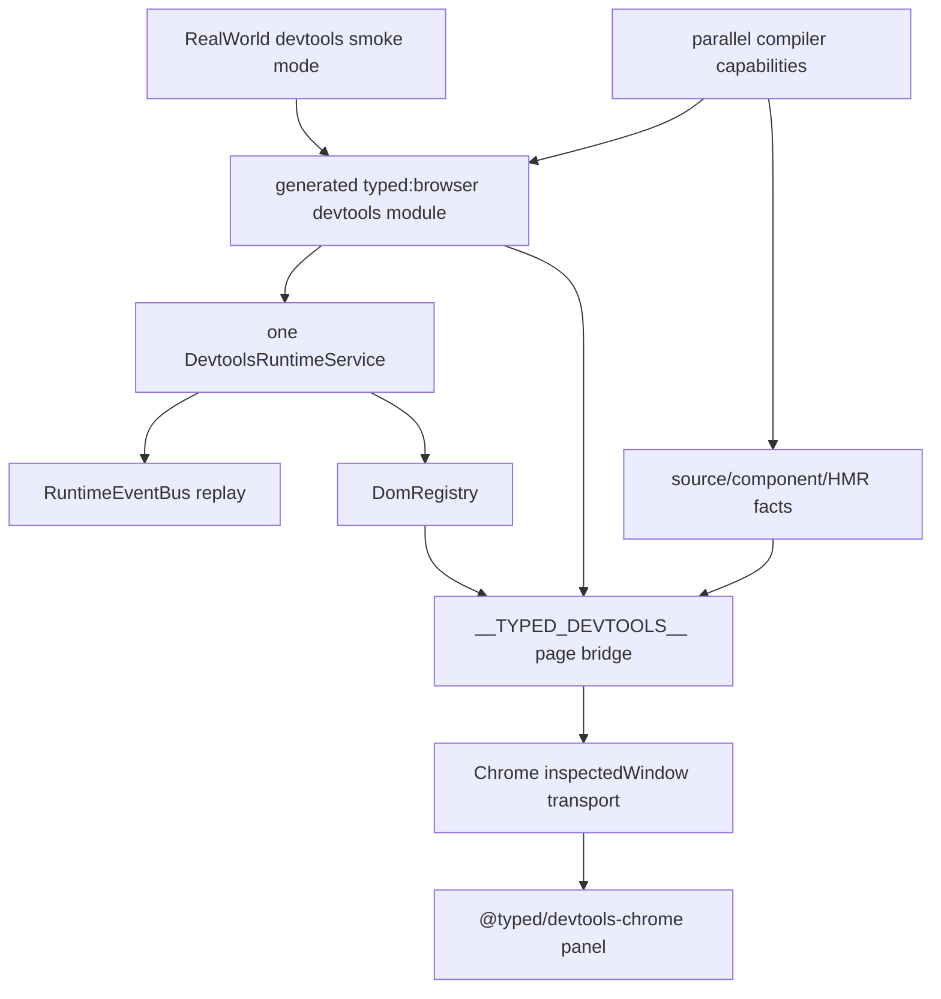
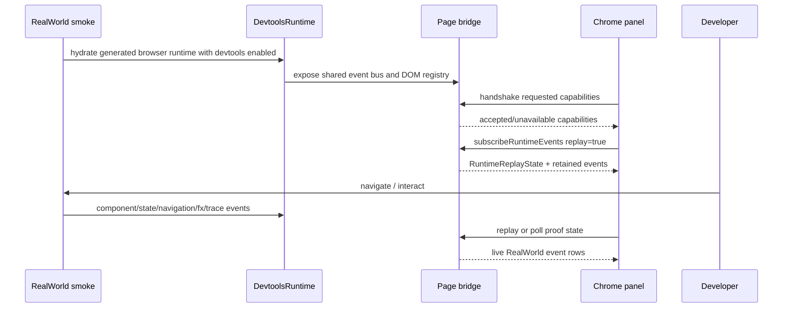

# Specification - DevTools RealWorld End-To-End Proof

Status: approved on 2026-05-26 after production-grade review.

## System Context and Scope

This workflow proves the accepted Typed DevTools architecture against `examples/realworld`.

The proof system is not a new DevTools architecture. It is a RealWorld acceptance lane over the existing protocol/runtime/Chrome boundaries:

- `@typed/devtools-protocol` remains the host-neutral source of truth.
- `@typed/devtools-runtime` owns runtime event bus, replay, DOM registry, Fx capture, RefSubject capture, Navigation capture, HMR, and OTEL correlation helpers.
- `@typed/app` generated browser runtime owns RealWorld devtools opt-in wiring and page bridge installation.
- `@typed/devtools-chrome` owns Chrome DevTools panel, inspected-window transport, and unavailable-state rendering.
- compiler capability output remains a dependency owned by the parallel compiler-capability lane unless this workflow receives explicit expanded ownership.

The first proof target is a devtools smoke mode for RealWorld. Normal RealWorld builds must continue to prove devtools is disabled by default.

Production-grade means every named capability is live against RealWorld, deterministic to verify, bounded in memory, fail-closed at untrusted boundaries, and represented by a first-class panel view. An unavailable state is acceptable during development and for optional host features, but it is not a final acceptance state for Components, DOM links, Source links, Fx Graph, RefSubject States, HMR, Navigation, or OTEL in this workflow.

## Component Responsibilities and Interfaces

### RealWorld Devtools Smoke Mode

Responsibilities:

- Provide an explicit command or environment flag that generates/imports `typed:browser?...&devtools=1`.
- Keep default RealWorld `typed.config.ts`, app entry, and presentation tests devtools-disabled.
- Exercise a real route interaction that can produce component, Navigation, RefSubject, Fx, HMR, and OTEL evidence where wired.

Interface:

- command or env flag documented in the workflow plan;
- browser URL and port for local smoke;
- expected bridge global: `globalThis.__TYPED_DEVTOOLS__` only when enabled.

### Generated Browser Runtime And App Bridge

Responsibilities:

- Create one enabled `DevtoolsRuntimeService`.
- Pass that runtime into `makeDomRegistry({ runtime })`.
- Install the app bridge with the same runtime and registry.
- Create `createAppDomTemplateRuntime({ devtools: { enabled: true, domRegistry } })`.
- Preserve the no-devtools default path.

Interface:

- `installTypedDevtoolsBridge({ enabled, domRegistry, runtime, globalObject })`;
- bridge methods: `handshake`, `subscribeRuntimeEvents`, `resolveDomBinding`, `resolveSelectedElement`, `inspectDomBinding`, `analyzeSource`.

### Runtime Event Bus

Responsibilities:

- Replay retained RealWorld runtime events.
- Include explicit replay state before runtime events.
- Filter or advertise capabilities truthfully.
- Keep instrumentation diagnostic-only.

Runtime event families:

- `ComponentMounted` and `ComponentUnmounted`;
- `FxNodeEvent`;
- `RefSubjectSnapshot` and `RefSubjectUpdated`;
- `HmrStatus`;
- `NavigationEvent`;
- `OtelSpan`.

The event bus must retain bounded replay state with explicit `RuntimeReplayState` metadata. Replay state must report retained events, dropped events, reconnectability, session id, and session mismatch rather than silently returning partial history.

### Capability Data Contracts

Production-grade proof requires these minimum live contracts:

| capability | required live data |
| ---------- | ------------------ |
| Component Tree | component id, display name, template hash when available, source location when available, DOM binding ids, Fx ids, RefSubject ids, HMR boundary id |
| DOM Links | binding id, component id, template part id when available, and inspect action result |
| Sources | resource path, line, column, source location id, and panel action that opens the RealWorld source target |
| Fx Graph | stable node id, label, owner id, edges, lifecycle phase, timestamp, last value/error summary |
| RefSubject States | stable id, owner/service identity, current value summary, version, subscriber count, update timestamp, bounded history |
| HMR | boundary id, module id, template optimization, stateful status, service ids, rejection reasons, timestamp |
| Navigation | event id, type, origin when available, destination, entry id when available, timestamp, correlation ids when available |
| OTEL | trace id, span id, parent span id when available, name, start/end or duration, status, attributes summary, events count, links count, Typed correlation ids |

### Chrome Panel And Inspected-Window Transport

Responsibilities:

- Prefer live inspected-window bridge data for RealWorld proof.
- Avoid fixture-backed rows in connected RealWorld proof mode.
- Render unavailable states for missing DOM/source/runtime capabilities.
- Keep Chrome APIs inside `@typed/devtools-chrome`.

Interface:

- inspected-window RPC expressions call `globalThis.__TYPED_DEVTOOLS__`;
- panel state is derived from `RuntimeEventStreamItem` replay plus live event envelopes;
- source and DOM actions use protocol ids and Chrome DevTools APIs only at the Chrome boundary.

The panel must expose first-class views for Component Tree, Fx Graph, RefSubject States, HMR, Navigation, OTEL, and Sources. Generic runtime event rows are useful for diagnostics but cannot satisfy production-grade acceptance for these capabilities.

### Extension Artifact And Reconnect Behavior

Responsibilities:

- Build a complete load-unpacked extension artifact with manifest, devtools page, panel assets, and background/service-worker assets.
- Prove panel connection to RealWorld after first load.
- Prove page reload followed by panel replay without stale fixture rows.
- Prove the disabled RealWorld build exposes no page bridge.

### Compiler Capability Dependency

Responsibilities:

- Provide stable component/source/template/HMR ownership facts when available.
- Leave missing facts as explicit blockers with reproducible proof commands.
- Avoid duplicate compiler ownership in this workflow unless the human expands scope.

## System Diagrams (Mermaid)

## Data and Control Flow

1. RealWorld starts normally with devtools disabled.
2. The smoke command starts RealWorld with an explicit devtools browser module opt-in.
3. Generated browser source creates one devtools runtime and one DOM registry.
4. Generated browser source installs `__TYPED_DEVTOOLS__` on the inspected page global.
5. The Chrome panel calls inspected-window RPC expressions against that bridge.
6. The bridge handshakes accepted capabilities from actual runtime services.
7. The bridge returns replay state and runtime event envelopes from the shared event bus.
8. RealWorld interactions produce events through mounted components, route navigation, state updates, HMR smoke, Fx capture, and OTEL spans.
9. The panel renders live rows or explicit unavailable states.
10. Missing compiler facts become dependency records with exact missing id/event/fact.

## Failure Modes and Mitigations

| failure_mode | mitigation |
| ------------ | ---------- |
| Devtools appears in default RealWorld build | Keep default tests asserting bridge imports and globals are absent. |
| Panel shows fixture rows while connected to RealWorld | Add connected-state assertions that fixture ids are absent unless the runtime source is a fixture. |
| Multiple runtimes fragment replay state | Test that DOM registry, bridge, and replay share one `DevtoolsRuntimeService`. |
| Handshake advertises unwired capabilities | Derive accepted capabilities from installed runtime/registry/analyzer support. |
| Source links are missing | Treat as a production-grade blocker; source-analyzer unavailable is only an intermediate diagnostic state. |
| Fx events exist but graph topology does not | Treat as a production-grade blocker unless the graph has a single real node and a protocol-backed no-edge reason. |
| RefSubject values are too large or sensitive | Serialize through bounded protocol helpers before crossing the bridge. |
| HMR status collapses to a boolean | Keep template optimization and stateful-HMR status as separate facts. |
| OTEL proof invents a trace model | Preserve OpenTelemetry trace/span ids and add Typed correlations as metadata. |
| RealWorld gates are blocked by environment | Record blocker, exact command, and error instead of claiming pass. |
| Bridge receives malformed payload | Decode through protocol schemas, return fail-closed unavailable/error result, and do not crash RealWorld. |
| Event history grows without bound | Enforce retention limits and expose dropped-event metadata in replay state. |
| Chrome panel reconnects after reload with stale state | Reset stale session state and require fresh replay from the inspected runtime. |

## Requirement Traceability

| requirement_id | design_element | notes |
| -------------- | -------------- | ----- |
| FR-1, NFR-1, NFR-2, NFR-8 | RealWorld Devtools Smoke Mode | Explicit opt-in while preserving default disabled behavior. |
| FR-2, FR-3, NFR-3, NFR-5 | Generated Browser Runtime And App Bridge | Shared runtime/event bus plus truthful capability negotiation. |
| FR-4, FR-5, NFR-6, NFR-7 | Chrome Panel And Inspected-Window Transport | Live RealWorld data or explicit unavailable states; no fixture proof. |
| FR-6, FR-7 | Runtime Event Bus and DOM Registry | Component tree and DOM binding resolution. |
| FR-8, FR-19, NFR-10 | Compiler Capability Dependency | Source facts are consumed when available; gaps are coordinated. |
| FR-9, FR-10, NFR-3 | Fx event capture | Event capture is first proof; topology remains separate if unavailable. |
| FR-11, FR-12 | RefSubject capture | Snapshot/update rows with bounded serialization. |
| FR-13, FR-14 | HMR facts | Template optimization remains separate from stateful-HMR status/reasons. |
| FR-15, FR-16 | Navigation capture | Real route transitions produce panel-visible events. |
| FR-17, FR-18 | OTEL correlation | Span identity is preserved with optional Typed correlations. |
| FR-20, NFR-11, NFR-12, NFR-13 | Verification and memory | Commands, blockers, and task traceability are persisted. |
| FR-21, NFR-14 | Production-grade completion definition | All named capabilities must be live against RealWorld before final success. |
| FR-22 through FR-29 | Capability Data Contracts | Minimum field-level contracts for each panel view. |
| FR-30 through FR-35, NFR-15 through NFR-20 | Extension, smoke, security, and plan completeness | Deterministic automation, artifact completeness, fail-closed bridge behavior, and exact implementation tasks. |

## Memory Design

- Short-term memory lives in this workflow folder.
- Phase 4 tasks must update `memories.md` or a workflow memory note with proof commands, blocker details, and cross-agent dependency facts.
- Promote only stable, reusable findings after verification: RealWorld devtools smoke command, known environment blockers, and exact compiler fact dependency boundaries.
- Do not promote speculative implementation details or data from a dirty worktree without verification.

## References Consulted

- specs:
  - `.docs/specs/typed-devtools/spec.md`
  - `.docs/specs/typed-devtools/testing-strategy.md`
- adrs:
  - `.docs/adrs/20260523-1703-typed-devtools-protocol-boundaries.md`
- workflows:
  - `.docs/workflows/20260526-1924-devtools-realworld-proof/intent.md`
  - `.docs/workflows/20260526-1924-devtools-realworld-proof/scope.md`
  - `.docs/workflows/20260526-1924-devtools-realworld-proof/requirements.md`
  - `.docs/workflows/20260524-1047-cohesion-remediation-plan/developer-tooling-handoff.md`
- external:
  - Chrome DevTools extension docs
  - Chrome inspectedWindow docs
  - Chrome extension messaging docs
  - OpenTelemetry specification overview
  - OpenTelemetry JavaScript docs

## ADR Links

- `.docs/adrs/20260523-1703-typed-devtools-protocol-boundaries.md`

No new ADR is required for this stage because the proof lane does not change the accepted protocol/runtime/Chrome boundary decision.
