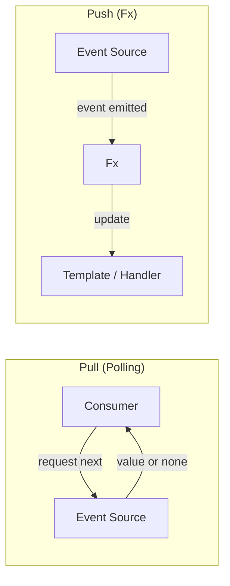

# Typed

> **Beta:** This repository and all packages are in **beta**. APIs may change without notice and breaking changes are possible. Use with that in mind and feedback is welcome.

**Typed** is the only truly **Effect-native UI library** — built from the ground up to harness Effect's abstractions for typed, reliable, and blazingly fast web applications.

Unlike UI frameworks that bolt Effect support onto existing paradigms, Typed is architected entirely around Effect's ecosystem. We **extend the Effect model with one Push-based abstraction: `Fx`**. `Fx` is the backbone for realtime events and time-varying UI, while preserving Effect-native error handling, resource safety, and composition.

## Core Architecture

### Effect + `Fx` (Push-Based)
Typed adds exactly one new runtime abstraction to Effect: **`Fx`**.

- **`Effect`** handles one-shot and scoped computations.
- **`Fx`** handles push-driven values/events over time.
- **Template rendering, routing, and UI event processing** all share this same model.

### Pull vs Push (Event Reality)
- **Pull-based** streams require consumers to ask for the next value (often by polling).
- **Push-based** streams deliver values when producers have something to emit.
- Browser systems are naturally push-driven: click, keydown, timer, and websocket events arrive over time.
- `Fx` models this push behavior directly, so UI updates and event handling align with how the platform actually works.



#### Tradeoffs: Backpressure and Processing
- **Pacing control:** Pull gives the consumer control over pace; push gives the producer control over emission timing.
- **Backpressure:** Pull has natural backpressure (consumer requests next when ready). Push needs an explicit strategy when producers outrun consumers (buffering, dropping, sampling, or latest-only semantics).
- **Processing model:** Pull tends to be demand-driven and often batch/sequential; push tends to be event-driven and continuous over time.
- **Latency profile:** Pull can add wait/poll intervals; push reacts immediately to incoming events, which maps better to interactive UIs.
- **Why `Fx` here:** UI events are producer-driven by nature, so `Fx` lets Typed coordinate push streams declaratively while still using Effect for cancellation, errors, and resource safety.

### Type-Safe Routing
Our **Router** builds on the battle-tested `find-my-way-ts` (the same routing foundation behind Effect's HTTP abstractions for maximum compatibility). You get:

- **Type-level literal parsing** — routes are verified at compile time
- **Schema-based decoding** — automatic validation and error handling for URL parameters
- **find-my-way-ts URL syntax compatibility** — familiar patterns like `/:id`, wildcards, and query-style routes

See `packages/router/README.md` and `examples/todomvc` for real matcher-based route definitions used in this repo.

### `@typed/template`: UI Rendering

Our template system is where Typed truly shines. Rather than forcing you into component models or virtual DOM abstractions, we give you **direct control**:

- **Embed Fx, Stream, or Effect directly** — reactive values flow natively into your templates
- **Surface errors from event handlers via templates** — error handling is declarative, not buried in callbacks
- **Streaming HTML with built-in hydration** — send complete HTML to the client, then hydrate with minimal overhead
- **Native event delegation** — no synthetic event system, just browser APIs
- **Type-safe event handling** — handlers are checked at compile time

### UI Update Cost Model
- **Targeted text and attribute updates are `O(1)`** — updates write directly to bound DOM references.
- **`Fx`/`Stream` bindings can target attributes and text content directly** — each emission updates only the bound target.
- **`many(...)` list updates are `O(n)`** — keyed diffing over list items uses DOM references and strict equality (`===`) fast paths for as-fast-as-possible comparison.

## New with Effect v4

- **Native `Stream` in templates** — Stream is no longer 50kb in your bundle by default, so we can now embed `Stream` values directly without an adapter layer.
- **Fiber-cost shift + runtime throughput** — rendering and event processing are **15x faster than v3** as Fibers became cheap; `Fx` always was and will be a declarative API for coordinating Fibers over time.
- **Router URL syntax** — route definitions align with `find-my-way-ts` URL conventions for compatibility with Effect's HTTP ecosystem.

## Packages

| Package | Description |
|---------|-------------|
| [async-data](packages/async-data/README.md) | Async data states (NoData, Loading, Success, Failure, Optimistic) with Effect Schema and helpers |
| [fx](packages/fx/README.md) | **`Fx`**: Typed's Push-based abstraction that extends Effect for realtime updates, plus RefSubject/Subject/Sink/Versioned utilities. |
| [guard](packages/guard/README.md) | Effect-based guards (input → Option) with Schema decode/encode and composition |
| [id](packages/id/README.md) | ID generation: Cuid, Ksuid, NanoId, Ulid, Uuid4/5/7, date-based, random |
| [navigation](packages/navigation/README.md) | Navigation (browser/memory) and routing-related types |
| [router](packages/router/README.md) | **Type-safe routing** with type-level literal parsing, Schema-based decoding, and find-my-way-ts compatibility |
| [template](packages/template/README.md) | **Streaming templates** with native Fx/Stream/Effect integration, error handling, hydration, and event delegation |
| [ui](packages/ui/README.md) | Web integration: HttpRouter, Link (builds on router + template + navigation) |

## Requirements

- [Node.js](https://nodejs.org/)
- [pnpm](https://pnpm.io/) (workspace uses `pnpm@10.0.0`)

## Setup

From the repo root:

```bash
pnpm install
pnpm build
```

## Examples

- **[Counter](examples/counter/README.md)** — Minimal app using `@typed/fx` and `@typed/template` (reactive state + DOM rendering).
- **[TodoMVC](examples/todomvc/README.md)** — TodoMVC-style app using `@typed/fx`, `@typed/router`, `@typed/template`, and `@typed/ui`.

**Run an example** (after `pnpm install` and `pnpm build` at root):

- **Counter:** `cd examples/counter && pnpm dev` (then `pnpm build`, `pnpm preview` as needed)
- **TodoMVC:** `cd examples/todomvc && pnpm dev` (then `pnpm build`, `pnpm preview` as needed)

## Scripts

From the repo root:

- `pnpm build` — Build all packages
- `pnpm test` — Run tests in all packages
- `pnpm lint` — Lint (oxlint)
- `pnpm format` — Format (oxfmt)


_All packages are in beta; APIs are subject to change._

## Releases

Current beta versions (first public beta release; future betas will use `-beta.1`, `-beta.2`, etc.):

| Package    | Version      |
| ---------- | ------------ |
| fx         | 2.0.0-beta.0 |
| async-data | 1.0.0-beta.0 |
| guard      | 1.0.0-beta.0 |
| id         | 1.0.0-beta.0 |
| navigation | 1.0.0-beta.0 |
| router     | 1.0.0-beta.0 |
| template   | 1.0.0-beta.0 |
| ui         | 1.0.0-beta.0 |

Install with the `beta` tag, e.g. `pnpm add @typed/fx@beta`.
