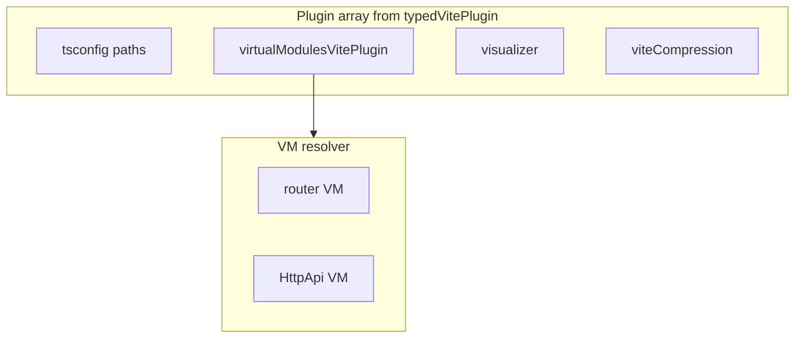

# @typed/vite-plugin

> **Beta:** This package is in beta; APIs may change.

`@typed/vite-plugin` provides a **one-stop Vite preset**: tsconfig path resolution, virtual modules (router + HttpApi from @typed/app), optional bundle analyzer, and Brotli compression. Use it as the main plugin array for typed-smol Vite projects.

## Purpose

`typedVitePlugin` is the recommended way to configure Vite for typed-smol apps. One call gives you: path resolution from `tsconfig.json`, virtual `router:` and `api:` imports that generate typed route matchers and API clients from convention-based source, optional bundle analysis, and Brotli compression for build output.

## Capabilities

| Area | What you get |
|------|--------------|
| **Router VM** | `router:./path` → typed Matcher from route files |
| **HttpApi VM** | `api:./path` → typed Api + Client + OpenAPI (when `apiVmOptions` set) |
| **TypeInfo** | Structural type-checking of route/endpoint contracts (when `createTypeInfoApiSession` provided) |
| **tsconfig paths** | Path alias resolution (default: on) |
| **Analyzer** | `dist/stats.html` treemap when `ANALYZE=1` |
| **Compression** | Brotli `.br` for build output (default: on) |

## Architecture



## Dependencies

- `@typed/app`
- `@typed/virtual-modules`
- `@typed/virtual-modules-vite`

Peer: `vite` (>=5).

## Installation

```bash
pnpm add @typed/vite-plugin @typed/app
```

## Usage

```ts
import { defineConfig } from "vite";
import { typedVitePlugin } from "@typed/vite-plugin";

export default defineConfig({
  plugins: typedVitePlugin(),
});
```

For router VM type-checking, pass `createTypeInfoApiSession` (e.g. from a custom Vite plugin that builds a TypeScript program):

```ts
import { typedVitePlugin } from "@typed/vite-plugin";
import { createTypeInfoApiSessionForApp } from "@typed/app";

export default defineConfig({
  plugins: typedVitePlugin({
    createTypeInfoApiSession: ({ ts, program }) =>
      createTypeInfoApiSessionForApp({ ts, program }),
    routerVmOptions: {},
    apiVmOptions: {},
  }),
});
```

## API overview

- **`typedVitePlugin(options)`** — Returns an array of Vite plugins.
- **`createTypedViteResolver(options)`** — Builds the virtual-module resolver (for tests or custom compositions).

## Options

| Option | Type | Default | Description |
| ------ | ---- | ------- | ----------- |
| `routerVmOptions` | `RouterVirtualModulePluginOptions` | `{}` | Options for the router VM plugin. |
| `apiVmOptions` | `HttpApiVirtualModulePluginOptions` | — | When set, enables the HttpApi VM plugin. |
| `createTypeInfoApiSession` | `CreateTypeInfoApiSession` | — | Required for router VM type-checking in dev. |
| `tsconfig` | `string` | — | Path to `tsconfig.json` (relative to cwd or absolute). When set, both the Language Service session and vite-tsconfig-paths use this tsconfig. Default: auto-discovered from project root. |
| `tsconfigPaths` | `boolean \| object` | `true` | Enable tsconfig path resolution. |
| `analyze` | `boolean \| object` | `process.env.ANALYZE === '1'` | Enable bundle analyzer (dist/stats.html). |
| `warnOnError` | `boolean` | `true` | Log virtual module resolution errors. |
| `compression` | `boolean \| object` | `true` | Brotli compression for build output. |

